cola Report for Hierarchical Partitioning - 'Ritz_ALL'
==================

**Date**: 2021-07-22 16:07:29 CEST, **cola version**: 1.9.4

----------------------------------------------------------------

<style type='text/css'>

body, td, th {
   font-family: Arial,Helvetica,sans-serif;
   background-color: white;
   font-size: 13px;
  max-width: 800px;
  margin: auto;
  margin-left:210px;
  padding: 0px 10px 0px 10px;
  border-left: 1px solid #EEEEEE;
  line-height: 150%;
}

tt, code, pre {
   font-family: 'DejaVu Sans Mono', 'Droid Sans Mono', 'Lucida Console', Consolas, Monaco, 

monospace;
}

h1 {
   font-size:2.2em;
}

h2 {
   font-size:1.8em;
}

h3 {
   font-size:1.4em;
}

h4 {
   font-size:1.0em;
}

h5 {
   font-size:0.9em;
}

h6 {
   font-size:0.8em;
}

a {
  text-decoration: none;
  color: #0366d6;
}

a:hover {
  text-decoration: underline;
}

a:visited {
   color: #0366d6;
}

pre, img {
  max-width: 100%;
}
pre {
  overflow-x: auto;
}
pre code {
   display: block; padding: 0.5em;
}

code {
  font-size: 92%;
  border: 1px solid #ccc;
}

code[class] {
  background-color: #F8F8F8;
}

table, td, th {
  border: 1px solid #ccc;
}

blockquote {
   color:#666666;
   margin:0;
   padding-left: 1em;
   border-left: 0.5em #EEE solid;
}

hr {
   height: 0px;
   border-bottom: none;
   border-top-width: thin;
   border-top-style: dotted;
   border-top-color: #999999;
}

@media print {
   * {
      background: transparent !important;
      color: black !important;
      filter:none !important;
      -ms-filter: none !important;
   }

   body {
      font-size:12pt;
      max-width:100%;
   }

   a, a:visited {
      text-decoration: underline;
   }

   hr {
      visibility: hidden;
      page-break-before: always;
   }

   pre, blockquote {
      padding-right: 1em;
      page-break-inside: avoid;
   }

   tr, img {
      page-break-inside: avoid;
   }

   img {
      max-width: 100% !important;
   }

   @page :left {
      margin: 15mm 20mm 15mm 10mm;
   }

   @page :right {
      margin: 15mm 10mm 15mm 20mm;
   }

   p, h2, h3 {
      orphans: 3; widows: 3;
   }

   h2, h3 {
      page-break-after: avoid;
   }
}
</style>


## Summary


First the variable is renamed to `res_rh`.


```r
res_rh = rh
```


The partition hierarchy and all available functions which can be applied to `res_rh` object.


```r
res_rh
```

```
#> A 'HierarchicalPartition' object with 'ATC:skmeans' method.
#>   On a matrix with 11993 rows and 128 columns.
#>   Performed in total 3300 partitions.
#>   There are 15 groups under the following parameters:
#>     - min_samples: 6
#>     - mean_silhouette_cutoff: 0.9
#>     - min_n_signatures: 448 (signatures are selected based on:)
#>       - fdr_cutoff: 0.05
#>       - group_diff (scaled values): 0.5
#> 
#> Hierarchy of the partition:
#>   0, 128 cols
#>   |-- 01, 58 cols, 4791 signatures
#>   |   |-- 011, 32 cols, 1901 signatures
#>   |   |   |-- 0111, 9 cols (b)
#>   |   |   |-- 0112, 9 cols (b)
#>   |   |   |-- 0113, 8 cols (b)
#>   |   |   `-- 0114, 6 cols (b)
#>   |   |-- 012, 13 cols, 1224 signatures
#>   |   |   |-- 0121, 7 cols (b)
#>   |   |   |-- 0122, 4 cols (b)
#>   |   |   `-- 0123, 2 cols (b)
#>   |   `-- 013, 13 cols, 129 signatures (c)
#>   |-- 02, 39 cols, 5639 signatures
#>   |   |-- 021, 14 cols, 137 signatures (c)
#>   |   |-- 022, 18 cols, 561 signatures
#>   |   |   |-- 0221, 8 cols (b)
#>   |   |   `-- 0222, 10 cols (b)
#>   |   `-- 023, 7 cols (b)
#>   `-- 03, 31 cols, 1726 signatures
#>       |-- 031, 14 cols, 4 signatures (c)
#>       |-- 032, 9 cols (b)
#>       `-- 033, 8 cols (b)
#> Stop reason:
#>   b) Subgroup had too few columns.
#>   c) There were too few signatures.
#> 
#> Following methods can be applied to this 'HierarchicalPartition' object:
#>  [1] "all_leaves"            "all_nodes"             "cola_report"           "collect_classes"      
#>  [5] "colnames"              "compare_signatures"    "dimension_reduction"   "functional_enrichment"
#>  [9] "get_anno_col"          "get_anno"              "get_children_nodes"    "get_classes"          
#> [13] "get_matrix"            "get_signatures"        "is_leaf_node"          "max_depth"            
#> [17] "merge_node"            "ncol"                  "node_info"             "node_level"           
#> [21] "nrow"                  "rownames"              "show"                  "split_node"           
#> [25] "suggest_best_k"        "test_to_known_factors" "top_rows_heatmap"      "top_rows_overlap"     
#> 
#> You can get result for a single node by e.g. object["01"]
```

The call of `hierarchical_partition()` was:


```
#> hierarchical_partition(data = m, anno = anno, cores = 4)
```

Dimension of the input matrix:


```r
mat = get_matrix(res_rh)
dim(mat)
```

```
#> [1] 11993   128
```

All the methods that were tried:


```r
res_rh@param$combination_method
```

```
#> [[1]]
#> [1] "ATC"     "skmeans"
```

### Density distribution

The density distribution for each sample is visualized as one column in the following heatmap.
The clustering is based on the distance which is the Kolmogorov-Smirnov statistic between two distributions.


```r
library(ComplexHeatmap)
densityHeatmap(mat, top_annotation = HeatmapAnnotation(df = get_anno(res_rh), 
    col = get_anno_col(res_rh)), ylab = "value", cluster_columns = TRUE, show_column_names = FALSE,
    mc.cores = 1)
```

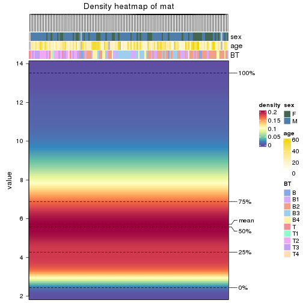


Some values about the hierarchy:


```r
all_nodes(res_rh)
```

```
#>  [1] "0"    "01"   "011"  "0111" "0112" "0113" "0114" "012"  "0121" "0122" "0123" "013"  "02"  
#> [14] "021"  "022"  "0221" "0222" "023"  "03"   "031"  "032"  "033"
```

```r
all_leaves(res_rh)
```

```
#>  [1] "0111" "0112" "0113" "0114" "0121" "0122" "0123" "013"  "021"  "0221" "0222" "023"  "031" 
#> [14] "032"  "033"
```

```r
node_info(res_rh)
```

```
#>      id best_method depth best_k n_columns n_signatures p_signatures is_leaf
#> 1     0 ATC:skmeans     1      3       128         8975     0.748353   FALSE
#> 2    01 ATC:skmeans     2      3        58         4791     0.399483   FALSE
#> 3   011 ATC:skmeans     3      4        32         1901     0.158509   FALSE
#> 4  0111 not applied     4     NA         9           NA           NA    TRUE
#> 5  0112 not applied     4     NA         9           NA           NA    TRUE
#> 6  0113 not applied     4     NA         8           NA           NA    TRUE
#> 7  0114 not applied     4     NA         6           NA           NA    TRUE
#> 8   012 ATC:skmeans     3      3        13         1224     0.102060   FALSE
#> 9  0121 not applied     4     NA         7           NA           NA    TRUE
#> 10 0122 not applied     4     NA         4           NA           NA    TRUE
#> 11 0123 not applied     4     NA         2           NA           NA    TRUE
#> 12  013 ATC:skmeans     3      2        13          129     0.010756    TRUE
#> 13   02 ATC:skmeans     2      3        39         5639     0.470191   FALSE
#> 14  021 ATC:skmeans     3      2        14          137     0.011423    TRUE
#> 15  022 ATC:skmeans     3      2        18          561     0.046777   FALSE
#> 16 0221 not applied     4     NA         8           NA           NA    TRUE
#> 17 0222 not applied     4     NA        10           NA           NA    TRUE
#> 18  023 not applied     3     NA         7           NA           NA    TRUE
#> 19   03 ATC:skmeans     2      3        31         1726     0.143917   FALSE
#> 20  031 ATC:skmeans     3      2        14            4     0.000334    TRUE
#> 21  032 not applied     3     NA         9           NA           NA    TRUE
#> 22  033 not applied     3     NA         8           NA           NA    TRUE
```

In the output from `node_info()`, there are the following columns:

- `id`: The node id.
- `best_method`: The best method selected.
- `depth`: Depth of the node in the hierarchy.
- `best_k`: Best number of groups of the partition on that node.
- `n_columns`: Number of columns in the submatrix.
- `n_signatures`: Number of signatures with the `best_k`.
- `p_signatures`: Proportion of hte signatures in total number of rows in the matrix.
- `is_leaf`: Whether the node is a leaf.

Labels of nodes are encoded in a special way. The number of digits
correspond to the depth of the node in the hierarchy and the value of the
digits correspond to the index of the subgroup in the current node, E.g. a label
of “012” means the node is the second subgroup of the partition which is the
first subgroup of the root node.

### Suggest the best k


Following table shows the best `k` (number of partitions) for each node in the
partition hierarchy. Clicking on the node name in the table goes to the
corresponding section for the partitioning on that node.

[The cola vignette](https://jokergoo.github.io/cola_vignettes/cola.html#toc_13)
explains the definition of the metrics used for determining the best
number of partitions.


```r
suggest_best_k(res_rh)
```


|Node                |Best method                                         |Is leaf   |Best k |1-PAC |Mean silhouette |Concordance | #samples|   |
|:-------------------|:---------------------------------------------------|:---------|:------|:-----|:---------------|:-----------|--------:|:--|
|[Node0](#Node0)     |ATC:skmeans                                         |          |3      |1.00  |0.95            |0.98        |      128|** |
|[Node01](#Node01)   |ATC:skmeans                                         |          |3      |1.00  |0.98            |0.99        |       58|** |
|[Node011](#Node011) |ATC:skmeans                                         |          |4      |1.00  |0.98            |0.98        |       32|** |
|Node0111-leaf       |<span style='color:grey;'><i>not applied</i></span> |✓ (b)     |       |      |                |            |        9|   |
|Node0112-leaf       |<span style='color:grey;'><i>not applied</i></span> |✓ (b)     |       |      |                |            |        9|   |
|Node0113-leaf       |<span style='color:grey;'><i>not applied</i></span> |✓ (b)     |       |      |                |            |        8|   |
|Node0114-leaf       |<span style='color:grey;'><i>not applied</i></span> |✓ (b)     |       |      |                |            |        6|   |
|[Node012](#Node012) |ATC:skmeans                                         |          |3      |1.00  |1.00            |1.00        |       13|** |
|Node0121-leaf       |<span style='color:grey;'><i>not applied</i></span> |✓ (b)     |       |      |                |            |        7|   |
|Node0122-leaf       |<span style='color:grey;'><i>not applied</i></span> |✓ (b)     |       |      |                |            |        4|   |
|Node0123-leaf       |<span style='color:grey;'><i>not applied</i></span> |✓ (b)     |       |      |                |            |        2|   |
|Node013-leaf        |ATC:skmeans                                         |✓ (&#99;) |2      |1.00  |1.00            |1.00        |       13|** |
|[Node02](#Node02)   |ATC:skmeans                                         |          |3      |1.00  |1.00            |1.00        |       39|** |
|Node021-leaf        |ATC:skmeans                                         |✓ (&#99;) |4      |0.92  |0.95            |0.97        |       14|*  |
|[Node022](#Node022) |ATC:skmeans                                         |          |2      |1.00  |1.00            |1.00        |       18|** |
|Node0221-leaf       |<span style='color:grey;'><i>not applied</i></span> |✓ (b)     |       |      |                |            |        8|   |
|Node0222-leaf       |<span style='color:grey;'><i>not applied</i></span> |✓ (b)     |       |      |                |            |       10|   |
|Node023-leaf        |<span style='color:grey;'><i>not applied</i></span> |✓ (b)     |       |      |                |            |        7|   |
|[Node03](#Node03)   |ATC:skmeans                                         |          |3      |1.00  |0.99            |0.99        |       31|** |
|Node031-leaf        |ATC:skmeans                                         |✓ (&#99;) |2      |1.00  |1.00            |1.00        |       14|** |
|Node032-leaf        |<span style='color:grey;'><i>not applied</i></span> |✓ (b)     |       |      |                |            |        9|   |
|Node033-leaf        |<span style='color:grey;'><i>not applied</i></span> |✓ (b)     |       |      |                |            |        8|   |


Stop reason: b) Subgroup had too few columns. c) There were too few signatures. 

\*\*: 1-PAC > 0.95, \*: 1-PAC > 0.9


### Partition hierarchy

The nodes of the hierarchy can be merged by setting the `merge_node` parameters. Here we 
control the hierarchy with the `min_n_signatures` parameter. The value of `min_n_signatures` is
from `node_info()`.


<style type='text/css'>


.ui-helper-hidden {
	display: none;
}
.ui-helper-hidden-accessible {
	border: 0;
	clip: rect(0 0 0 0);
	height: 1px;
	margin: -1px;
	overflow: hidden;
	padding: 0;
	position: absolute;
	width: 1px;
}
.ui-helper-reset {
	margin: 0;
	padding: 0;
	border: 0;
	outline: 0;
	line-height: 1.3;
	text-decoration: none;
	font-size: 100%;
	list-style: none;
}
.ui-helper-clearfix:before,
.ui-helper-clearfix:after {
	content: "";
	display: table;
	border-collapse: collapse;
}
.ui-helper-clearfix:after {
	clear: both;
}
.ui-helper-zfix {
	width: 100%;
	height: 100%;
	top: 0;
	left: 0;
	position: absolute;
	opacity: 0;
	filter:Alpha(Opacity=0); 
}

.ui-front {
	z-index: 100;
}


.ui-state-disabled {
	cursor: default !important;
	pointer-events: none;
}


.ui-icon {
	display: inline-block;
	vertical-align: middle;
	margin-top: -.25em;
	position: relative;
	text-indent: -99999px;
	overflow: hidden;
	background-repeat: no-repeat;
}

.ui-widget-icon-block {
	left: 50%;
	margin-left: -8px;
	display: block;
}


.ui-widget-overlay {
	position: fixed;
	top: 0;
	left: 0;
	width: 100%;
	height: 100%;
}
.ui-accordion .ui-accordion-header {
	display: block;
	cursor: pointer;
	position: relative;
	margin: 2px 0 0 0;
	padding: .5em .5em .5em .7em;
	font-size: 100%;
}
.ui-accordion .ui-accordion-content {
	padding: 1em 2.2em;
	border-top: 0;
	overflow: auto;
}
.ui-autocomplete {
	position: absolute;
	top: 0;
	left: 0;
	cursor: default;
}
.ui-menu {
	list-style: none;
	padding: 0;
	margin: 0;
	display: block;
	outline: 0;
}
.ui-menu .ui-menu {
	position: absolute;
}
.ui-menu .ui-menu-item {
	margin: 0;
	cursor: pointer;
	
	list-style-image: url("data:image/gif;base64,R0lGODlhAQABAIAAAAAAAP///yH5BAEAAAAALAAAAAABAAEAAAIBRAA7");
}
.ui-menu .ui-menu-item-wrapper {
	position: relative;
	padding: 3px 1em 3px .4em;
}
.ui-menu .ui-menu-divider {
	margin: 5px 0;
	height: 0;
	font-size: 0;
	line-height: 0;
	border-width: 1px 0 0 0;
}
.ui-menu .ui-state-focus,
.ui-menu .ui-state-active {
	margin: -1px;
}


.ui-menu-icons {
	position: relative;
}
.ui-menu-icons .ui-menu-item-wrapper {
	padding-left: 2em;
}


.ui-menu .ui-icon {
	position: absolute;
	top: 0;
	bottom: 0;
	left: .2em;
	margin: auto 0;
}


.ui-menu .ui-menu-icon {
	left: auto;
	right: 0;
}
.ui-button {
	padding: .4em 1em;
	display: inline-block;
	position: relative;
	line-height: normal;
	margin-right: .1em;
	cursor: pointer;
	vertical-align: middle;
	text-align: center;
	-webkit-user-select: none;
	-moz-user-select: none;
	-ms-user-select: none;
	user-select: none;

	
	overflow: visible;
}

.ui-button,
.ui-button:link,
.ui-button:visited,
.ui-button:hover,
.ui-button:active {
	text-decoration: none;
}


.ui-button-icon-only {
	width: 2em;
	box-sizing: border-box;
	text-indent: -9999px;
	white-space: nowrap;
}


input.ui-button.ui-button-icon-only {
	text-indent: 0;
}


.ui-button-icon-only .ui-icon {
	position: absolute;
	top: 50%;
	left: 50%;
	margin-top: -8px;
	margin-left: -8px;
}

.ui-button.ui-icon-notext .ui-icon {
	padding: 0;
	width: 2.1em;
	height: 2.1em;
	text-indent: -9999px;
	white-space: nowrap;

}

input.ui-button.ui-icon-notext .ui-icon {
	width: auto;
	height: auto;
	text-indent: 0;
	white-space: normal;
	padding: .4em 1em;
}


input.ui-button::-moz-focus-inner,
button.ui-button::-moz-focus-inner {
	border: 0;
	padding: 0;
}
.ui-controlgroup {
	vertical-align: middle;
	display: inline-block;
}
.ui-controlgroup > .ui-controlgroup-item {
	float: left;
	margin-left: 0;
	margin-right: 0;
}
.ui-controlgroup > .ui-controlgroup-item:focus,
.ui-controlgroup > .ui-controlgroup-item.ui-visual-focus {
	z-index: 9999;
}
.ui-controlgroup-vertical > .ui-controlgroup-item {
	display: block;
	float: none;
	width: 100%;
	margin-top: 0;
	margin-bottom: 0;
	text-align: left;
}
.ui-controlgroup-vertical .ui-controlgroup-item {
	box-sizing: border-box;
}
.ui-controlgroup .ui-controlgroup-label {
	padding: .4em 1em;
}
.ui-controlgroup .ui-controlgroup-label span {
	font-size: 80%;
}
.ui-controlgroup-horizontal .ui-controlgroup-label + .ui-controlgroup-item {
	border-left: none;
}
.ui-controlgroup-vertical .ui-controlgroup-label + .ui-controlgroup-item {
	border-top: none;
}
.ui-controlgroup-horizontal .ui-controlgroup-label.ui-widget-content {
	border-right: none;
}
.ui-controlgroup-vertical .ui-controlgroup-label.ui-widget-content {
	border-bottom: none;
}


.ui-controlgroup-vertical .ui-spinner-input {

	
	width: 75%;
	width: calc( 100% - 2.4em );
}
.ui-controlgroup-vertical .ui-spinner .ui-spinner-up {
	border-top-style: solid;
}

.ui-checkboxradio-label .ui-icon-background {
	box-shadow: inset 1px 1px 1px #ccc;
	border-radius: .12em;
	border: none;
}
.ui-checkboxradio-radio-label .ui-icon-background {
	width: 16px;
	height: 16px;
	border-radius: 1em;
	overflow: visible;
	border: none;
}
.ui-checkboxradio-radio-label.ui-checkboxradio-checked .ui-icon,
.ui-checkboxradio-radio-label.ui-checkboxradio-checked:hover .ui-icon {
	background-image: none;
	width: 8px;
	height: 8px;
	border-width: 4px;
	border-style: solid;
}
.ui-checkboxradio-disabled {
	pointer-events: none;
}
.ui-datepicker {
	width: 17em;
	padding: .2em .2em 0;
	display: none;
}
.ui-datepicker .ui-datepicker-header {
	position: relative;
	padding: .2em 0;
}
.ui-datepicker .ui-datepicker-prev,
.ui-datepicker .ui-datepicker-next {
	position: absolute;
	top: 2px;
	width: 1.8em;
	height: 1.8em;
}
.ui-datepicker .ui-datepicker-prev-hover,
.ui-datepicker .ui-datepicker-next-hover {
	top: 1px;
}
.ui-datepicker .ui-datepicker-prev {
	left: 2px;
}
.ui-datepicker .ui-datepicker-next {
	right: 2px;
}
.ui-datepicker .ui-datepicker-prev-hover {
	left: 1px;
}
.ui-datepicker .ui-datepicker-next-hover {
	right: 1px;
}
.ui-datepicker .ui-datepicker-prev span,
.ui-datepicker .ui-datepicker-next span {
	display: block;
	position: absolute;
	left: 50%;
	margin-left: -8px;
	top: 50%;
	margin-top: -8px;
}
.ui-datepicker .ui-datepicker-title {
	margin: 0 2.3em;
	line-height: 1.8em;
	text-align: center;
}
.ui-datepicker .ui-datepicker-title select {
	font-size: 1em;
	margin: 1px 0;
}
.ui-datepicker select.ui-datepicker-month,
.ui-datepicker select.ui-datepicker-year {
	width: 45%;
}
.ui-datepicker table {
	width: 100%;
	font-size: .9em;
	border-collapse: collapse;
	margin: 0 0 .4em;
}
.ui-datepicker th {
	padding: .7em .3em;
	text-align: center;
	font-weight: bold;
	border: 0;
}
.ui-datepicker td {
	border: 0;
	padding: 1px;
}
.ui-datepicker td span,
.ui-datepicker td a {
	display: block;
	padding: .2em;
	text-align: right;
	text-decoration: none;
}
.ui-datepicker .ui-datepicker-buttonpane {
	background-image: none;
	margin: .7em 0 0 0;
	padding: 0 .2em;
	border-left: 0;
	border-right: 0;
	border-bottom: 0;
}
.ui-datepicker .ui-datepicker-buttonpane button {
	float: right;
	margin: .5em .2em .4em;
	cursor: pointer;
	padding: .2em .6em .3em .6em;
	width: auto;
	overflow: visible;
}
.ui-datepicker .ui-datepicker-buttonpane button.ui-datepicker-current {
	float: left;
}


.ui-datepicker.ui-datepicker-multi {
	width: auto;
}
.ui-datepicker-multi .ui-datepicker-group {
	float: left;
}
.ui-datepicker-multi .ui-datepicker-group table {
	width: 95%;
	margin: 0 auto .4em;
}
.ui-datepicker-multi-2 .ui-datepicker-group {
	width: 50%;
}
.ui-datepicker-multi-3 .ui-datepicker-group {
	width: 33.3%;
}
.ui-datepicker-multi-4 .ui-datepicker-group {
	width: 25%;
}
.ui-datepicker-multi .ui-datepicker-group-last .ui-datepicker-header,
.ui-datepicker-multi .ui-datepicker-group-middle .ui-datepicker-header {
	border-left-width: 0;
}
.ui-datepicker-multi .ui-datepicker-buttonpane {
	clear: left;
}
.ui-datepicker-row-break {
	clear: both;
	width: 100%;
	font-size: 0;
}


.ui-datepicker-rtl {
	direction: rtl;
}
.ui-datepicker-rtl .ui-datepicker-prev {
	right: 2px;
	left: auto;
}
.ui-datepicker-rtl .ui-datepicker-next {
	left: 2px;
	right: auto;
}
.ui-datepicker-rtl .ui-datepicker-prev:hover {
	right: 1px;
	left: auto;
}
.ui-datepicker-rtl .ui-datepicker-next:hover {
	left: 1px;
	right: auto;
}
.ui-datepicker-rtl .ui-datepicker-buttonpane {
	clear: right;
}
.ui-datepicker-rtl .ui-datepicker-buttonpane button {
	float: left;
}
.ui-datepicker-rtl .ui-datepicker-buttonpane button.ui-datepicker-current,
.ui-datepicker-rtl .ui-datepicker-group {
	float: right;
}
.ui-datepicker-rtl .ui-datepicker-group-last .ui-datepicker-header,
.ui-datepicker-rtl .ui-datepicker-group-middle .ui-datepicker-header {
	border-right-width: 0;
	border-left-width: 1px;
}


.ui-datepicker .ui-icon {
	display: block;
	text-indent: -99999px;
	overflow: hidden;
	background-repeat: no-repeat;
	left: .5em;
	top: .3em;
}
.ui-dialog {
	position: absolute;
	top: 0;
	left: 0;
	padding: .2em;
	outline: 0;
}
.ui-dialog .ui-dialog-titlebar {
	padding: .4em 1em;
	position: relative;
}
.ui-dialog .ui-dialog-title {
	float: left;
	margin: .1em 0;
	white-space: nowrap;
	width: 90%;
	overflow: hidden;
	text-overflow: ellipsis;
}
.ui-dialog .ui-dialog-titlebar-close {
	position: absolute;
	right: .3em;
	top: 50%;
	width: 20px;
	margin: -10px 0 0 0;
	padding: 1px;
	height: 20px;
}
.ui-dialog .ui-dialog-content {
	position: relative;
	border: 0;
	padding: .5em 1em;
	background: none;
	overflow: auto;
}
.ui-dialog .ui-dialog-buttonpane {
	text-align: left;
	border-width: 1px 0 0 0;
	background-image: none;
	margin-top: .5em;
	padding: .3em 1em .5em .4em;
}
.ui-dialog .ui-dialog-buttonpane .ui-dialog-buttonset {
	float: right;
}
.ui-dialog .ui-dialog-buttonpane button {
	margin: .5em .4em .5em 0;
	cursor: pointer;
}
.ui-dialog .ui-resizable-n {
	height: 2px;
	top: 0;
}
.ui-dialog .ui-resizable-e {
	width: 2px;
	right: 0;
}
.ui-dialog .ui-resizable-s {
	height: 2px;
	bottom: 0;
}
.ui-dialog .ui-resizable-w {
	width: 2px;
	left: 0;
}
.ui-dialog .ui-resizable-se,
.ui-dialog .ui-resizable-sw,
.ui-dialog .ui-resizable-ne,
.ui-dialog .ui-resizable-nw {
	width: 7px;
	height: 7px;
}
.ui-dialog .ui-resizable-se {
	right: 0;
	bottom: 0;
}
.ui-dialog .ui-resizable-sw {
	left: 0;
	bottom: 0;
}
.ui-dialog .ui-resizable-ne {
	right: 0;
	top: 0;
}
.ui-dialog .ui-resizable-nw {
	left: 0;
	top: 0;
}
.ui-draggable .ui-dialog-titlebar {
	cursor: move;
}
.ui-draggable-handle {
	-ms-touch-action: none;
	touch-action: none;
}
.ui-resizable {
	position: relative;
}
.ui-resizable-handle {
	position: absolute;
	font-size: 0.1px;
	display: block;
	-ms-touch-action: none;
	touch-action: none;
}
.ui-resizable-disabled .ui-resizable-handle,
.ui-resizable-autohide .ui-resizable-handle {
	display: none;
}
.ui-resizable-n {
	cursor: n-resize;
	height: 7px;
	width: 100%;
	top: -5px;
	left: 0;
}
.ui-resizable-s {
	cursor: s-resize;
	height: 7px;
	width: 100%;
	bottom: -5px;
	left: 0;
}
.ui-resizable-e {
	cursor: e-resize;
	width: 7px;
	right: -5px;
	top: 0;
	height: 100%;
}
.ui-resizable-w {
	cursor: w-resize;
	width: 7px;
	left: -5px;
	top: 0;
	height: 100%;
}
.ui-resizable-se {
	cursor: se-resize;
	width: 12px;
	height: 12px;
	right: 1px;
	bottom: 1px;
}
.ui-resizable-sw {
	cursor: sw-resize;
	width: 9px;
	height: 9px;
	left: -5px;
	bottom: -5px;
}
.ui-resizable-nw {
	cursor: nw-resize;
	width: 9px;
	height: 9px;
	left: -5px;
	top: -5px;
}
.ui-resizable-ne {
	cursor: ne-resize;
	width: 9px;
	height: 9px;
	right: -5px;
	top: -5px;
}
.ui-progressbar {
	height: 2em;
	text-align: left;
	overflow: hidden;
}
.ui-progressbar .ui-progressbar-value {
	margin: -1px;
	height: 100%;
}
.ui-progressbar .ui-progressbar-overlay {
	background: url("");
	height: 100%;
	filter: alpha(opacity=25); 
	opacity: 0.25;
}
.ui-progressbar-indeterminate .ui-progressbar-value {
	background-image: none;
}
.ui-selectable {
	-ms-touch-action: none;
	touch-action: none;
}
.ui-selectable-helper {
	position: absolute;
	z-index: 100;
	border: 1px dotted black;
}
.ui-selectmenu-menu {
	padding: 0;
	margin: 0;
	position: absolute;
	top: 0;
	left: 0;
	display: none;
}
.ui-selectmenu-menu .ui-menu {
	overflow: auto;
	overflow-x: hidden;
	padding-bottom: 1px;
}
.ui-selectmenu-menu .ui-menu .ui-selectmenu-optgroup {
	font-size: 1em;
	font-weight: bold;
	line-height: 1.5;
	padding: 2px 0.4em;
	margin: 0.5em 0 0 0;
	height: auto;
	border: 0;
}
.ui-selectmenu-open {
	display: block;
}
.ui-selectmenu-text {
	display: block;
	margin-right: 20px;
	overflow: hidden;
	text-overflow: ellipsis;
}
.ui-selectmenu-button.ui-button {
	text-align: left;
	white-space: nowrap;
	width: 14em;
}
.ui-selectmenu-icon.ui-icon {
	float: right;
	margin-top: 0;
}
.ui-slider {
	position: relative;
	text-align: left;
}
.ui-slider .ui-slider-handle {
	position: absolute;
	z-index: 2;
	width: 1.2em;
	height: 1.2em;
	cursor: default;
	-ms-touch-action: none;
	touch-action: none;
}
.ui-slider .ui-slider-range {
	position: absolute;
	z-index: 1;
	font-size: .7em;
	display: block;
	border: 0;
	background-position: 0 0;
}


.ui-slider.ui-state-disabled .ui-slider-handle,
.ui-slider.ui-state-disabled .ui-slider-range {
	filter: inherit;
}

.ui-slider-horizontal {
	height: .8em;
}
.ui-slider-horizontal .ui-slider-handle {
	top: -.3em;
	margin-left: -.6em;
}
.ui-slider-horizontal .ui-slider-range {
	top: 0;
	height: 100%;
}
.ui-slider-horizontal .ui-slider-range-min {
	left: 0;
}
.ui-slider-horizontal .ui-slider-range-max {
	right: 0;
}

.ui-slider-vertical {
	width: .8em;
	height: 100px;
}
.ui-slider-vertical .ui-slider-handle {
	left: -.3em;
	margin-left: 0;
	margin-bottom: -.6em;
}
.ui-slider-vertical .ui-slider-range {
	left: 0;
	width: 100%;
}
.ui-slider-vertical .ui-slider-range-min {
	bottom: 0;
}
.ui-slider-vertical .ui-slider-range-max {
	top: 0;
}
.ui-sortable-handle {
	-ms-touch-action: none;
	touch-action: none;
}
.ui-spinner {
	position: relative;
	display: inline-block;
	overflow: hidden;
	padding: 0;
	vertical-align: middle;
}
.ui-spinner-input {
	border: none;
	background: none;
	color: inherit;
	padding: .222em 0;
	margin: .2em 0;
	vertical-align: middle;
	margin-left: .4em;
	margin-right: 2em;
}
.ui-spinner-button {
	width: 1.6em;
	height: 50%;
	font-size: .5em;
	padding: 0;
	margin: 0;
	text-align: center;
	position: absolute;
	cursor: default;
	display: block;
	overflow: hidden;
	right: 0;
}

.ui-spinner a.ui-spinner-button {
	border-top-style: none;
	border-bottom-style: none;
	border-right-style: none;
}
.ui-spinner-up {
	top: 0;
}
.ui-spinner-down {
	bottom: 0;
}
.ui-tabs {
	position: relative;
	padding: .2em;
}
.ui-tabs .ui-tabs-nav {
	margin: 0;
	padding: .2em .2em 0;
}
.ui-tabs .ui-tabs-nav li {
	list-style: none;
	float: left;
	position: relative;
	top: 0;
	margin: 1px .2em 0 0;
	border-bottom-width: 0;
	padding: 0;
	white-space: nowrap;
}
.ui-tabs .ui-tabs-nav .ui-tabs-anchor {
	float: left;
	padding: .5em 1em;
	text-decoration: none;
}
.ui-tabs .ui-tabs-nav li.ui-tabs-active {
	margin-bottom: -1px;
	padding-bottom: 1px;
}
.ui-tabs .ui-tabs-nav li.ui-tabs-active .ui-tabs-anchor,
.ui-tabs .ui-tabs-nav li.ui-state-disabled .ui-tabs-anchor,
.ui-tabs .ui-tabs-nav li.ui-tabs-loading .ui-tabs-anchor {
	cursor: text;
}
.ui-tabs-collapsible .ui-tabs-nav li.ui-tabs-active .ui-tabs-anchor {
	cursor: pointer;
}
.ui-tabs .ui-tabs-panel {
	display: block;
	border-width: 0;
	padding: 1em 1.4em;
	background: none;
}
.ui-tooltip {
	padding: 8px;
	position: absolute;
	z-index: 9999;
	max-width: 300px;
}
body .ui-tooltip {
	border-width: 2px;
}

.ui-widget {
	font-family: Arial,Helvetica,sans-serif;
	font-size: 1em;
}
.ui-widget .ui-widget {
	font-size: 1em;
}
.ui-widget input,
.ui-widget select,
.ui-widget textarea,
.ui-widget button {
	font-family: Arial,Helvetica,sans-serif;
	font-size: 1em;
}
.ui-widget.ui-widget-content {
	border: 1px solid #c5c5c5;
}
.ui-widget-content {
	border: 1px solid #dddddd;
	background: #ffffff;
	color: #333333;
}
.ui-widget-content a {
	color: #333333;
}
.ui-widget-header {
	border: 1px solid #dddddd;
	background: #e9e9e9;
	color: #333333;
	font-weight: bold;
}
.ui-widget-header a {
	color: #333333;
}


.ui-state-default,
.ui-widget-content .ui-state-default,
.ui-widget-header .ui-state-default,
.ui-button,


html .ui-button.ui-state-disabled:hover,
html .ui-button.ui-state-disabled:active {
	border: 1px solid #c5c5c5;
	background: #f6f6f6;
	font-weight: normal;
	color: #454545;
}
.ui-state-default a,
.ui-state-default a:link,
.ui-state-default a:visited,
a.ui-button,
a:link.ui-button,
a:visited.ui-button,
.ui-button {
	color: #454545;
	text-decoration: none;
}
.ui-state-hover,
.ui-widget-content .ui-state-hover,
.ui-widget-header .ui-state-hover,
.ui-state-focus,
.ui-widget-content .ui-state-focus,
.ui-widget-header .ui-state-focus,
.ui-button:hover,
.ui-button:focus {
	border: 1px solid #cccccc;
	background: #ededed;
	font-weight: normal;
	color: #2b2b2b;
}
.ui-state-hover a,
.ui-state-hover a:hover,
.ui-state-hover a:link,
.ui-state-hover a:visited,
.ui-state-focus a,
.ui-state-focus a:hover,
.ui-state-focus a:link,
.ui-state-focus a:visited,
a.ui-button:hover,
a.ui-button:focus {
	color: #2b2b2b;
	text-decoration: none;
}

.ui-visual-focus {
	box-shadow: 0 0 3px 1px rgb(94, 158, 214);
}
.ui-state-active,
.ui-widget-content .ui-state-active,
.ui-widget-header .ui-state-active,
a.ui-button:active,
.ui-button:active,
.ui-button.ui-state-active:hover {
	border: 1px solid #003eff;
	background: #007fff;
	font-weight: normal;
	color: #ffffff;
}
.ui-icon-background,
.ui-state-active .ui-icon-background {
	border: #003eff;
	background-color: #ffffff;
}
.ui-state-active a,
.ui-state-active a:link,
.ui-state-active a:visited {
	color: #ffffff;
	text-decoration: none;
}


.ui-state-highlight,
.ui-widget-content .ui-state-highlight,
.ui-widget-header .ui-state-highlight {
	border: 1px solid #dad55e;
	background: #fffa90;
	color: #777620;
}
.ui-state-checked {
	border: 1px solid #dad55e;
	background: #fffa90;
}
.ui-state-highlight a,
.ui-widget-content .ui-state-highlight a,
.ui-widget-header .ui-state-highlight a {
	color: #777620;
}
.ui-state-error,
.ui-widget-content .ui-state-error,
.ui-widget-header .ui-state-error {
	border: 1px solid #f1a899;
	background: #fddfdf;
	color: #5f3f3f;
}
.ui-state-error a,
.ui-widget-content .ui-state-error a,
.ui-widget-header .ui-state-error a {
	color: #5f3f3f;
}
.ui-state-error-text,
.ui-widget-content .ui-state-error-text,
.ui-widget-header .ui-state-error-text {
	color: #5f3f3f;
}
.ui-priority-primary,
.ui-widget-content .ui-priority-primary,
.ui-widget-header .ui-priority-primary {
	font-weight: bold;
}
.ui-priority-secondary,
.ui-widget-content .ui-priority-secondary,
.ui-widget-header .ui-priority-secondary {
	opacity: .7;
	filter:Alpha(Opacity=70); 
	font-weight: normal;
}
.ui-state-disabled,
.ui-widget-content .ui-state-disabled,
.ui-widget-header .ui-state-disabled {
	opacity: .35;
	filter:Alpha(Opacity=35); 
	background-image: none;
}
.ui-state-disabled .ui-icon {
	filter:Alpha(Opacity=35); 
}


.ui-icon {
	width: 16px;
	height: 16px;
}
.ui-icon,
.ui-widget-content .ui-icon {
	background-image: url("images/ui-icons_444444_256x240.png");
}
.ui-widget-header .ui-icon {
	background-image: url("images/ui-icons_444444_256x240.png");
}
.ui-state-hover .ui-icon,
.ui-state-focus .ui-icon,
.ui-button:hover .ui-icon,
.ui-button:focus .ui-icon {
	background-image: url("images/ui-icons_555555_256x240.png");
}
.ui-state-active .ui-icon,
.ui-button:active .ui-icon {
	background-image: url("images/ui-icons_ffffff_256x240.png");
}
.ui-state-highlight .ui-icon,
.ui-button .ui-state-highlight.ui-icon {
	background-image: url("images/ui-icons_777620_256x240.png");
}
.ui-state-error .ui-icon,
.ui-state-error-text .ui-icon {
	background-image: url("images/ui-icons_cc0000_256x240.png");
}
.ui-button .ui-icon {
	background-image: url("images/ui-icons_777777_256x240.png");
}


.ui-icon-blank { background-position: 16px 16px; }
.ui-icon-caret-1-n { background-position: 0 0; }
.ui-icon-caret-1-ne { background-position: -16px 0; }
.ui-icon-caret-1-e { background-position: -32px 0; }
.ui-icon-caret-1-se { background-position: -48px 0; }
.ui-icon-caret-1-s { background-position: -65px 0; }
.ui-icon-caret-1-sw { background-position: -80px 0; }
.ui-icon-caret-1-w { background-position: -96px 0; }
.ui-icon-caret-1-nw { background-position: -112px 0; }
.ui-icon-caret-2-n-s { background-position: -128px 0; }
.ui-icon-caret-2-e-w { background-position: -144px 0; }
.ui-icon-triangle-1-n { background-position: 0 -16px; }
.ui-icon-triangle-1-ne { background-position: -16px -16px; }
.ui-icon-triangle-1-e { background-position: -32px -16px; }
.ui-icon-triangle-1-se { background-position: -48px -16px; }
.ui-icon-triangle-1-s { background-position: -65px -16px; }
.ui-icon-triangle-1-sw { background-position: -80px -16px; }
.ui-icon-triangle-1-w { background-position: -96px -16px; }
.ui-icon-triangle-1-nw { background-position: -112px -16px; }
.ui-icon-triangle-2-n-s { background-position: -128px -16px; }
.ui-icon-triangle-2-e-w { background-position: -144px -16px; }
.ui-icon-arrow-1-n { background-position: 0 -32px; }
.ui-icon-arrow-1-ne { background-position: -16px -32px; }
.ui-icon-arrow-1-e { background-position: -32px -32px; }
.ui-icon-arrow-1-se { background-position: -48px -32px; }
.ui-icon-arrow-1-s { background-position: -65px -32px; }
.ui-icon-arrow-1-sw { background-position: -80px -32px; }
.ui-icon-arrow-1-w { background-position: -96px -32px; }
.ui-icon-arrow-1-nw { background-position: -112px -32px; }
.ui-icon-arrow-2-n-s { background-position: -128px -32px; }
.ui-icon-arrow-2-ne-sw { background-position: -144px -32px; }
.ui-icon-arrow-2-e-w { background-position: -160px -32px; }
.ui-icon-arrow-2-se-nw { background-position: -176px -32px; }
.ui-icon-arrowstop-1-n { background-position: -192px -32px; }
.ui-icon-arrowstop-1-e { background-position: -208px -32px; }
.ui-icon-arrowstop-1-s { background-position: -224px -32px; }
.ui-icon-arrowstop-1-w { background-position: -240px -32px; }
.ui-icon-arrowthick-1-n { background-position: 1px -48px; }
.ui-icon-arrowthick-1-ne { background-position: -16px -48px; }
.ui-icon-arrowthick-1-e { background-position: -32px -48px; }
.ui-icon-arrowthick-1-se { background-position: -48px -48px; }
.ui-icon-arrowthick-1-s { background-position: -64px -48px; }
.ui-icon-arrowthick-1-sw { background-position: -80px -48px; }
.ui-icon-arrowthick-1-w { background-position: -96px -48px; }
.ui-icon-arrowthick-1-nw { background-position: -112px -48px; }
.ui-icon-arrowthick-2-n-s { background-position: -128px -48px; }
.ui-icon-arrowthick-2-ne-sw { background-position: -144px -48px; }
.ui-icon-arrowthick-2-e-w { background-position: -160px -48px; }
.ui-icon-arrowthick-2-se-nw { background-position: -176px -48px; }
.ui-icon-arrowthickstop-1-n { background-position: -192px -48px; }
.ui-icon-arrowthickstop-1-e { background-position: -208px -48px; }
.ui-icon-arrowthickstop-1-s { background-position: -224px -48px; }
.ui-icon-arrowthickstop-1-w { background-position: -240px -48px; }
.ui-icon-arrowreturnthick-1-w { background-position: 0 -64px; }
.ui-icon-arrowreturnthick-1-n { background-position: -16px -64px; }
.ui-icon-arrowreturnthick-1-e { background-position: -32px -64px; }
.ui-icon-arrowreturnthick-1-s { background-position: -48px -64px; }
.ui-icon-arrowreturn-1-w { background-position: -64px -64px; }
.ui-icon-arrowreturn-1-n { background-position: -80px -64px; }
.ui-icon-arrowreturn-1-e { background-position: -96px -64px; }
.ui-icon-arrowreturn-1-s { background-position: -112px -64px; }
.ui-icon-arrowrefresh-1-w { background-position: -128px -64px; }
.ui-icon-arrowrefresh-1-n { background-position: -144px -64px; }
.ui-icon-arrowrefresh-1-e { background-position: -160px -64px; }
.ui-icon-arrowrefresh-1-s { background-position: -176px -64px; }
.ui-icon-arrow-4 { background-position: 0 -80px; }
.ui-icon-arrow-4-diag { background-position: -16px -80px; }
.ui-icon-extlink { background-position: -32px -80px; }
.ui-icon-newwin { background-position: -48px -80px; }
.ui-icon-refresh { background-position: -64px -80px; }
.ui-icon-shuffle { background-position: -80px -80px; }
.ui-icon-transfer-e-w { background-position: -96px -80px; }
.ui-icon-transferthick-e-w { background-position: -112px -80px; }
.ui-icon-folder-collapsed { background-position: 0 -96px; }
.ui-icon-folder-open { background-position: -16px -96px; }
.ui-icon-document { background-position: -32px -96px; }
.ui-icon-document-b { background-position: -48px -96px; }
.ui-icon-note { background-position: -64px -96px; }
.ui-icon-mail-closed { background-position: -80px -96px; }
.ui-icon-mail-open { background-position: -96px -96px; }
.ui-icon-suitcase { background-position: -112px -96px; }
.ui-icon-comment { background-position: -128px -96px; }
.ui-icon-person { background-position: -144px -96px; }
.ui-icon-print { background-position: -160px -96px; }
.ui-icon-trash { background-position: -176px -96px; }
.ui-icon-locked { background-position: -192px -96px; }
.ui-icon-unlocked { background-position: -208px -96px; }
.ui-icon-bookmark { background-position: -224px -96px; }
.ui-icon-tag { background-position: -240px -96px; }
.ui-icon-home { background-position: 0 -112px; }
.ui-icon-flag { background-position: -16px -112px; }
.ui-icon-calendar { background-position: -32px -112px; }
.ui-icon-cart { background-position: -48px -112px; }
.ui-icon-pencil { background-position: -64px -112px; }
.ui-icon-clock { background-position: -80px -112px; }
.ui-icon-disk { background-position: -96px -112px; }
.ui-icon-calculator { background-position: -112px -112px; }
.ui-icon-zoomin { background-position: -128px -112px; }
.ui-icon-zoomout { background-position: -144px -112px; }
.ui-icon-search { background-position: -160px -112px; }
.ui-icon-wrench { background-position: -176px -112px; }
.ui-icon-gear { background-position: -192px -112px; }
.ui-icon-heart { background-position: -208px -112px; }
.ui-icon-star { background-position: -224px -112px; }
.ui-icon-link { background-position: -240px -112px; }
.ui-icon-cancel { background-position: 0 -128px; }
.ui-icon-plus { background-position: -16px -128px; }
.ui-icon-plusthick { background-position: -32px -128px; }
.ui-icon-minus { background-position: -48px -128px; }
.ui-icon-minusthick { background-position: -64px -128px; }
.ui-icon-close { background-position: -80px -128px; }
.ui-icon-closethick { background-position: -96px -128px; }
.ui-icon-key { background-position: -112px -128px; }
.ui-icon-lightbulb { background-position: -128px -128px; }
.ui-icon-scissors { background-position: -144px -128px; }
.ui-icon-clipboard { background-position: -160px -128px; }
.ui-icon-copy { background-position: -176px -128px; }
.ui-icon-contact { background-position: -192px -128px; }
.ui-icon-image { background-position: -208px -128px; }
.ui-icon-video { background-position: -224px -128px; }
.ui-icon-script { background-position: -240px -128px; }
.ui-icon-alert { background-position: 0 -144px; }
.ui-icon-info { background-position: -16px -144px; }
.ui-icon-notice { background-position: -32px -144px; }
.ui-icon-help { background-position: -48px -144px; }
.ui-icon-check { background-position: -64px -144px; }
.ui-icon-bullet { background-position: -80px -144px; }
.ui-icon-radio-on { background-position: -96px -144px; }
.ui-icon-radio-off { background-position: -112px -144px; }
.ui-icon-pin-w { background-position: -128px -144px; }
.ui-icon-pin-s { background-position: -144px -144px; }
.ui-icon-play { background-position: 0 -160px; }
.ui-icon-pause { background-position: -16px -160px; }
.ui-icon-seek-next { background-position: -32px -160px; }
.ui-icon-seek-prev { background-position: -48px -160px; }
.ui-icon-seek-end { background-position: -64px -160px; }
.ui-icon-seek-start { background-position: -80px -160px; }

.ui-icon-seek-first { background-position: -80px -160px; }
.ui-icon-stop { background-position: -96px -160px; }
.ui-icon-eject { background-position: -112px -160px; }
.ui-icon-volume-off { background-position: -128px -160px; }
.ui-icon-volume-on { background-position: -144px -160px; }
.ui-icon-power { background-position: 0 -176px; }
.ui-icon-signal-diag { background-position: -16px -176px; }
.ui-icon-signal { background-position: -32px -176px; }
.ui-icon-battery-0 { background-position: -48px -176px; }
.ui-icon-battery-1 { background-position: -64px -176px; }
.ui-icon-battery-2 { background-position: -80px -176px; }
.ui-icon-battery-3 { background-position: -96px -176px; }
.ui-icon-circle-plus { background-position: 0 -192px; }
.ui-icon-circle-minus { background-position: -16px -192px; }
.ui-icon-circle-close { background-position: -32px -192px; }
.ui-icon-circle-triangle-e { background-position: -48px -192px; }
.ui-icon-circle-triangle-s { background-position: -64px -192px; }
.ui-icon-circle-triangle-w { background-position: -80px -192px; }
.ui-icon-circle-triangle-n { background-position: -96px -192px; }
.ui-icon-circle-arrow-e { background-position: -112px -192px; }
.ui-icon-circle-arrow-s { background-position: -128px -192px; }
.ui-icon-circle-arrow-w { background-position: -144px -192px; }
.ui-icon-circle-arrow-n { background-position: -160px -192px; }
.ui-icon-circle-zoomin { background-position: -176px -192px; }
.ui-icon-circle-zoomout { background-position: -192px -192px; }
.ui-icon-circle-check { background-position: -208px -192px; }
.ui-icon-circlesmall-plus { background-position: 0 -208px; }
.ui-icon-circlesmall-minus { background-position: -16px -208px; }
.ui-icon-circlesmall-close { background-position: -32px -208px; }
.ui-icon-squaresmall-plus { background-position: -48px -208px; }
.ui-icon-squaresmall-minus { background-position: -64px -208px; }
.ui-icon-squaresmall-close { background-position: -80px -208px; }
.ui-icon-grip-dotted-vertical { background-position: 0 -224px; }
.ui-icon-grip-dotted-horizontal { background-position: -16px -224px; }
.ui-icon-grip-solid-vertical { background-position: -32px -224px; }
.ui-icon-grip-solid-horizontal { background-position: -48px -224px; }
.ui-icon-gripsmall-diagonal-se { background-position: -64px -224px; }
.ui-icon-grip-diagonal-se { background-position: -80px -224px; }


.ui-corner-all,
.ui-corner-top,
.ui-corner-left,
.ui-corner-tl {
	border-top-left-radius: 3px;
}
.ui-corner-all,
.ui-corner-top,
.ui-corner-right,
.ui-corner-tr {
	border-top-right-radius: 3px;
}
.ui-corner-all,
.ui-corner-bottom,
.ui-corner-left,
.ui-corner-bl {
	border-bottom-left-radius: 3px;
}
.ui-corner-all,
.ui-corner-bottom,
.ui-corner-right,
.ui-corner-br {
	border-bottom-right-radius: 3px;
}


.ui-widget-overlay {
	background: #aaaaaa;
	opacity: .3;
	filter: Alpha(Opacity=30); 
}
.ui-widget-shadow {
	-webkit-box-shadow: 0px 0px 5px #666666;
	box-shadow: 0px 0px 5px #666666;
} 
</style>
<script src='js/jquery-1.12.4.js'></script>
<script src='js/jquery-ui.js'></script>

<script>
$( function() {
	$( '#tabs-collect-classes-from-hierarchical-partition' ).tabs();
} );
</script>
<div id='tabs-collect-classes-from-hierarchical-partition'>
<ul>
<li><a href='#tab-collect-classes-from-hierarchical-partition-1'>n_signatures ≥ 561</a></li>
<li><a href='#tab-collect-classes-from-hierarchical-partition-2'>n_signatures ≥ 1224</a></li>
<li><a href='#tab-collect-classes-from-hierarchical-partition-3'>n_signatures ≥ 1726</a></li>
<li><a href='#tab-collect-classes-from-hierarchical-partition-4'>n_signatures ≥ 1901</a></li>
<li><a href='#tab-collect-classes-from-hierarchical-partition-5'>n_signatures ≥ 4791</a></li>
<li><a href='#tab-collect-classes-from-hierarchical-partition-6'>n_signatures ≥ 5639</a></li>
<li><a href='#tab-collect-classes-from-hierarchical-partition-7'>n_signatures ≥ 8975</a></li>
</ul>
<div id='tab-collect-classes-from-hierarchical-partition-1'>
<pre><code class="r">collect_classes(res_rh, merge_node = merge_node_param(min_n_signatures = 561))
</code></pre>

<p>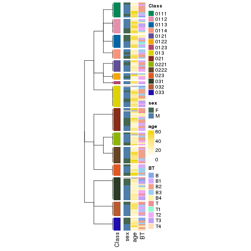</p>

</div>
<div id='tab-collect-classes-from-hierarchical-partition-2'>
<pre><code class="r">collect_classes(res_rh, merge_node = merge_node_param(min_n_signatures = 1224))
</code></pre>

<p>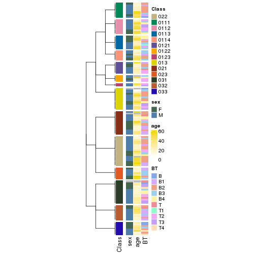</p>

</div>
<div id='tab-collect-classes-from-hierarchical-partition-3'>
<pre><code class="r">collect_classes(res_rh, merge_node = merge_node_param(min_n_signatures = 1726))
</code></pre>

<p>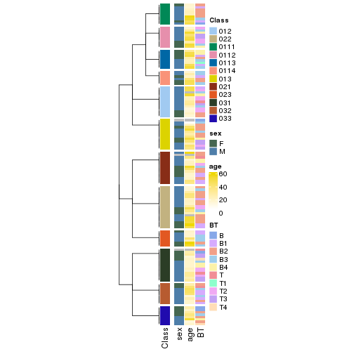</p>

</div>
<div id='tab-collect-classes-from-hierarchical-partition-4'>
<pre><code class="r">collect_classes(res_rh, merge_node = merge_node_param(min_n_signatures = 1901))
</code></pre>

<p>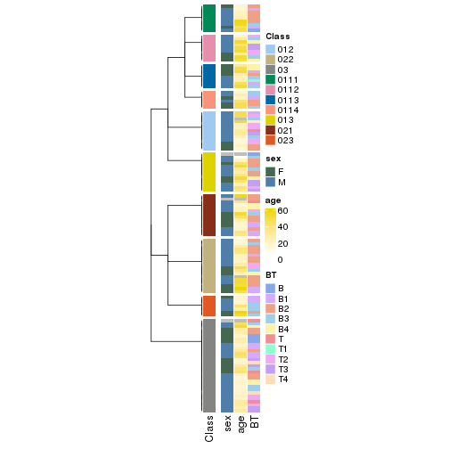</p>

</div>
<div id='tab-collect-classes-from-hierarchical-partition-5'>
<pre><code class="r">collect_classes(res_rh, merge_node = merge_node_param(min_n_signatures = 4791))
</code></pre>

<p>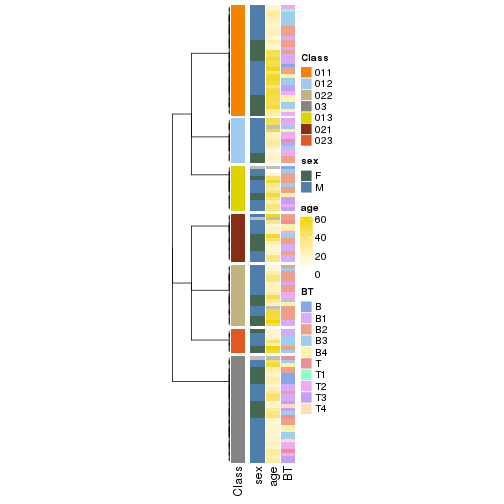</p>

</div>
<div id='tab-collect-classes-from-hierarchical-partition-6'>
<pre><code class="r">collect_classes(res_rh, merge_node = merge_node_param(min_n_signatures = 5639))
</code></pre>

<p>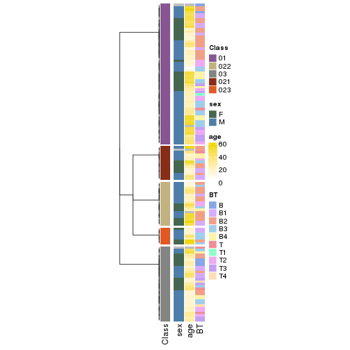</p>

</div>
<div id='tab-collect-classes-from-hierarchical-partition-7'>
<pre><code class="r">collect_classes(res_rh, merge_node = merge_node_param(min_n_signatures = 8975))
</code></pre>

<p>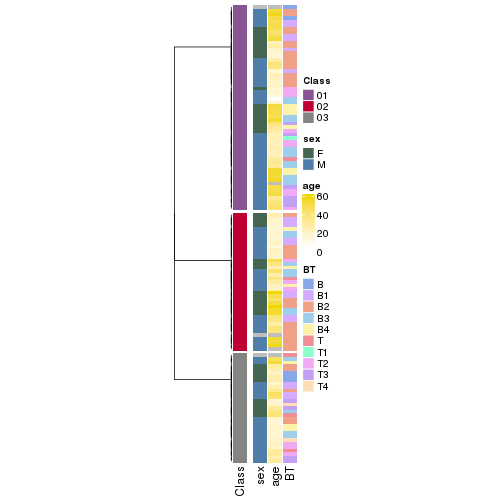</p>

</div>
</div>

Following shows the table of the partitions (You need to click the **show/hide
code output** link to see it).


<script>
$( function() {
	$( '#tabs-get-classes-from-hierarchical-partition' ).tabs();
} );
</script>
<div id='tabs-get-classes-from-hierarchical-partition'>
<ul>
<li><a href='#tab-get-classes-from-hierarchical-partition-1'>n_signatures ≥ 561</a></li>
<li><a href='#tab-get-classes-from-hierarchical-partition-2'>n_signatures ≥ 1224</a></li>
<li><a href='#tab-get-classes-from-hierarchical-partition-3'>n_signatures ≥ 1726</a></li>
<li><a href='#tab-get-classes-from-hierarchical-partition-4'>n_signatures ≥ 1901</a></li>
<li><a href='#tab-get-classes-from-hierarchical-partition-5'>n_signatures ≥ 4791</a></li>
<li><a href='#tab-get-classes-from-hierarchical-partition-6'>n_signatures ≥ 5639</a></li>
<li><a href='#tab-get-classes-from-hierarchical-partition-7'>n_signatures ≥ 8975</a></li>
</ul>

<div id='tab-get-classes-from-hierarchical-partition-1'>
<p><a id='tab-get-classes-from-hierarchical-partition-1-a' style='color:#0366d6' href='#'>show/hide code output</a></p>
<pre><code class="r">get_classes(res_rh, merge_node = merge_node_param(min_n_signatures = 561))
</code></pre>

<pre><code>#&gt;  01005  01010  03002  04006  04007  04008  04010  04016  06002  08001  08011  08012  08018  08024 
#&gt;  &quot;013&quot;  &quot;021&quot;  &quot;013&quot;  &quot;021&quot; &quot;0111&quot;  &quot;023&quot;  &quot;021&quot; &quot;0111&quot; &quot;0222&quot; &quot;0114&quot;  &quot;013&quot; &quot;0111&quot;  &quot;013&quot;  &quot;032&quot; 
#&gt;  09008  09017  11005  12006  12007  12012  12019  12026  14016  15001  15004  15005  16004  16009 
#&gt;  &quot;023&quot;  &quot;033&quot;  &quot;013&quot;  &quot;032&quot;  &quot;013&quot; &quot;0222&quot; &quot;0222&quot; &quot;0222&quot; &quot;0222&quot; &quot;0222&quot;  &quot;032&quot; &quot;0221&quot; &quot;0222&quot;  &quot;021&quot; 
#&gt;  19005  20002  22009  22010  22011  22013  24001  24005  24008  24010  24011  24017  24018  24019 
#&gt; &quot;0221&quot;  &quot;023&quot;  &quot;033&quot;  &quot;031&quot;  &quot;013&quot;  &quot;033&quot; &quot;0111&quot; &quot;0111&quot; &quot;0121&quot; &quot;0121&quot; &quot;0222&quot;  &quot;021&quot;  &quot;033&quot;  &quot;021&quot; 
#&gt;  24022  25003  25006  26001  26003  26005  26008  27003  27004  28001  28003  28005  28006  28007 
#&gt; &quot;0113&quot;  &quot;033&quot;  &quot;021&quot; &quot;0222&quot; &quot;0113&quot; &quot;0222&quot;  &quot;021&quot;  &quot;032&quot; &quot;0114&quot;  &quot;032&quot;  &quot;031&quot; &quot;0114&quot; &quot;0121&quot; &quot;0114&quot; 
#&gt;  28019  28021  28023  28024  28028  28031  28032  28035  28036  28037  28042  28043  28044  28047 
#&gt;  &quot;021&quot;  &quot;023&quot; &quot;0114&quot; &quot;0114&quot; &quot;0113&quot;  &quot;032&quot; &quot;0113&quot;  &quot;023&quot; &quot;0113&quot;  &quot;023&quot;  &quot;031&quot; &quot;0113&quot; &quot;0221&quot; &quot;0122&quot; 
#&gt;  30001  31007  31011  33005  36001  36002  37013  43001  43004  43007  43012  48001  49006  57001 
#&gt;  &quot;021&quot;  &quot;032&quot; &quot;0112&quot;  &quot;023&quot; &quot;0221&quot; &quot;0111&quot; &quot;0221&quot;  &quot;032&quot;  &quot;033&quot; &quot;0122&quot;  &quot;031&quot; &quot;0221&quot;  &quot;013&quot; &quot;0112&quot; 
#&gt;  62001  62002  62003  63001  64001  64002  65005  68001  68003  84004   LAL5  01003  01007  02020 
#&gt; &quot;0112&quot; &quot;0112&quot;  &quot;033&quot; &quot;0121&quot; &quot;0111&quot;  &quot;021&quot; &quot;0111&quot;  &quot;021&quot; &quot;0113&quot; &quot;0111&quot;  &quot;013&quot;  &quot;031&quot;  &quot;031&quot; &quot;0221&quot; 
#&gt;  04018  09002  10005  11002  12008  15006  16002  16007  17003  18001  19002  19008  19014  19017 
#&gt; &quot;0112&quot;  &quot;013&quot; &quot;0121&quot; &quot;0121&quot;  &quot;033&quot;  &quot;021&quot; &quot;0112&quot; &quot;0112&quot;  &quot;032&quot; &quot;0112&quot;  &quot;031&quot; &quot;0122&quot;  &quot;031&quot; &quot;0122&quot; 
#&gt;  20005  24006  26009  28008  28009  31015  37001  43006  43015  44001  49004  56007  64005  65003 
#&gt; &quot;0113&quot;  &quot;031&quot;  &quot;021&quot; &quot;0121&quot;  &quot;031&quot; &quot;0123&quot;  &quot;031&quot;  &quot;013&quot; &quot;0112&quot; &quot;0123&quot;  &quot;013&quot;  &quot;013&quot;  &quot;031&quot;  &quot;031&quot; 
#&gt;  83001   LAL4 
#&gt; &quot;0221&quot;  &quot;031&quot;
</code></pre>

<script>
$('#tab-get-classes-from-hierarchical-partition-1-a').parent().next().next().hide();
$('#tab-get-classes-from-hierarchical-partition-1-a').click(function(){
  $('#tab-get-classes-from-hierarchical-partition-1-a').parent().next().next().toggle();
  return(false);
});
</script>
</div>

<div id='tab-get-classes-from-hierarchical-partition-2'>
<p><a id='tab-get-classes-from-hierarchical-partition-2-a' style='color:#0366d6' href='#'>show/hide code output</a></p>
<pre><code class="r">get_classes(res_rh, merge_node = merge_node_param(min_n_signatures = 1224))
</code></pre>

<pre><code>#&gt;  01005  01010  03002  04006  04007  04008  04010  04016  06002  08001  08011  08012  08018  08024 
#&gt;  &quot;013&quot;  &quot;021&quot;  &quot;013&quot;  &quot;021&quot; &quot;0111&quot;  &quot;023&quot;  &quot;021&quot; &quot;0111&quot;  &quot;022&quot; &quot;0114&quot;  &quot;013&quot; &quot;0111&quot;  &quot;013&quot;  &quot;032&quot; 
#&gt;  09008  09017  11005  12006  12007  12012  12019  12026  14016  15001  15004  15005  16004  16009 
#&gt;  &quot;023&quot;  &quot;033&quot;  &quot;013&quot;  &quot;032&quot;  &quot;013&quot;  &quot;022&quot;  &quot;022&quot;  &quot;022&quot;  &quot;022&quot;  &quot;022&quot;  &quot;032&quot;  &quot;022&quot;  &quot;022&quot;  &quot;021&quot; 
#&gt;  19005  20002  22009  22010  22011  22013  24001  24005  24008  24010  24011  24017  24018  24019 
#&gt;  &quot;022&quot;  &quot;023&quot;  &quot;033&quot;  &quot;031&quot;  &quot;013&quot;  &quot;033&quot; &quot;0111&quot; &quot;0111&quot; &quot;0121&quot; &quot;0121&quot;  &quot;022&quot;  &quot;021&quot;  &quot;033&quot;  &quot;021&quot; 
#&gt;  24022  25003  25006  26001  26003  26005  26008  27003  27004  28001  28003  28005  28006  28007 
#&gt; &quot;0113&quot;  &quot;033&quot;  &quot;021&quot;  &quot;022&quot; &quot;0113&quot;  &quot;022&quot;  &quot;021&quot;  &quot;032&quot; &quot;0114&quot;  &quot;032&quot;  &quot;031&quot; &quot;0114&quot; &quot;0121&quot; &quot;0114&quot; 
#&gt;  28019  28021  28023  28024  28028  28031  28032  28035  28036  28037  28042  28043  28044  28047 
#&gt;  &quot;021&quot;  &quot;023&quot; &quot;0114&quot; &quot;0114&quot; &quot;0113&quot;  &quot;032&quot; &quot;0113&quot;  &quot;023&quot; &quot;0113&quot;  &quot;023&quot;  &quot;031&quot; &quot;0113&quot;  &quot;022&quot; &quot;0122&quot; 
#&gt;  30001  31007  31011  33005  36001  36002  37013  43001  43004  43007  43012  48001  49006  57001 
#&gt;  &quot;021&quot;  &quot;032&quot; &quot;0112&quot;  &quot;023&quot;  &quot;022&quot; &quot;0111&quot;  &quot;022&quot;  &quot;032&quot;  &quot;033&quot; &quot;0122&quot;  &quot;031&quot;  &quot;022&quot;  &quot;013&quot; &quot;0112&quot; 
#&gt;  62001  62002  62003  63001  64001  64002  65005  68001  68003  84004   LAL5  01003  01007  02020 
#&gt; &quot;0112&quot; &quot;0112&quot;  &quot;033&quot; &quot;0121&quot; &quot;0111&quot;  &quot;021&quot; &quot;0111&quot;  &quot;021&quot; &quot;0113&quot; &quot;0111&quot;  &quot;013&quot;  &quot;031&quot;  &quot;031&quot;  &quot;022&quot; 
#&gt;  04018  09002  10005  11002  12008  15006  16002  16007  17003  18001  19002  19008  19014  19017 
#&gt; &quot;0112&quot;  &quot;013&quot; &quot;0121&quot; &quot;0121&quot;  &quot;033&quot;  &quot;021&quot; &quot;0112&quot; &quot;0112&quot;  &quot;032&quot; &quot;0112&quot;  &quot;031&quot; &quot;0122&quot;  &quot;031&quot; &quot;0122&quot; 
#&gt;  20005  24006  26009  28008  28009  31015  37001  43006  43015  44001  49004  56007  64005  65003 
#&gt; &quot;0113&quot;  &quot;031&quot;  &quot;021&quot; &quot;0121&quot;  &quot;031&quot; &quot;0123&quot;  &quot;031&quot;  &quot;013&quot; &quot;0112&quot; &quot;0123&quot;  &quot;013&quot;  &quot;013&quot;  &quot;031&quot;  &quot;031&quot; 
#&gt;  83001   LAL4 
#&gt;  &quot;022&quot;  &quot;031&quot;
</code></pre>

<script>
$('#tab-get-classes-from-hierarchical-partition-2-a').parent().next().next().hide();
$('#tab-get-classes-from-hierarchical-partition-2-a').click(function(){
  $('#tab-get-classes-from-hierarchical-partition-2-a').parent().next().next().toggle();
  return(false);
});
</script>
</div>

<div id='tab-get-classes-from-hierarchical-partition-3'>
<p><a id='tab-get-classes-from-hierarchical-partition-3-a' style='color:#0366d6' href='#'>show/hide code output</a></p>
<pre><code class="r">get_classes(res_rh, merge_node = merge_node_param(min_n_signatures = 1726))
</code></pre>

<pre><code>#&gt;  01005  01010  03002  04006  04007  04008  04010  04016  06002  08001  08011  08012  08018  08024 
#&gt;  &quot;013&quot;  &quot;021&quot;  &quot;013&quot;  &quot;021&quot; &quot;0111&quot;  &quot;023&quot;  &quot;021&quot; &quot;0111&quot;  &quot;022&quot; &quot;0114&quot;  &quot;013&quot; &quot;0111&quot;  &quot;013&quot;  &quot;032&quot; 
#&gt;  09008  09017  11005  12006  12007  12012  12019  12026  14016  15001  15004  15005  16004  16009 
#&gt;  &quot;023&quot;  &quot;033&quot;  &quot;013&quot;  &quot;032&quot;  &quot;013&quot;  &quot;022&quot;  &quot;022&quot;  &quot;022&quot;  &quot;022&quot;  &quot;022&quot;  &quot;032&quot;  &quot;022&quot;  &quot;022&quot;  &quot;021&quot; 
#&gt;  19005  20002  22009  22010  22011  22013  24001  24005  24008  24010  24011  24017  24018  24019 
#&gt;  &quot;022&quot;  &quot;023&quot;  &quot;033&quot;  &quot;031&quot;  &quot;013&quot;  &quot;033&quot; &quot;0111&quot; &quot;0111&quot;  &quot;012&quot;  &quot;012&quot;  &quot;022&quot;  &quot;021&quot;  &quot;033&quot;  &quot;021&quot; 
#&gt;  24022  25003  25006  26001  26003  26005  26008  27003  27004  28001  28003  28005  28006  28007 
#&gt; &quot;0113&quot;  &quot;033&quot;  &quot;021&quot;  &quot;022&quot; &quot;0113&quot;  &quot;022&quot;  &quot;021&quot;  &quot;032&quot; &quot;0114&quot;  &quot;032&quot;  &quot;031&quot; &quot;0114&quot;  &quot;012&quot; &quot;0114&quot; 
#&gt;  28019  28021  28023  28024  28028  28031  28032  28035  28036  28037  28042  28043  28044  28047 
#&gt;  &quot;021&quot;  &quot;023&quot; &quot;0114&quot; &quot;0114&quot; &quot;0113&quot;  &quot;032&quot; &quot;0113&quot;  &quot;023&quot; &quot;0113&quot;  &quot;023&quot;  &quot;031&quot; &quot;0113&quot;  &quot;022&quot;  &quot;012&quot; 
#&gt;  30001  31007  31011  33005  36001  36002  37013  43001  43004  43007  43012  48001  49006  57001 
#&gt;  &quot;021&quot;  &quot;032&quot; &quot;0112&quot;  &quot;023&quot;  &quot;022&quot; &quot;0111&quot;  &quot;022&quot;  &quot;032&quot;  &quot;033&quot;  &quot;012&quot;  &quot;031&quot;  &quot;022&quot;  &quot;013&quot; &quot;0112&quot; 
#&gt;  62001  62002  62003  63001  64001  64002  65005  68001  68003  84004   LAL5  01003  01007  02020 
#&gt; &quot;0112&quot; &quot;0112&quot;  &quot;033&quot;  &quot;012&quot; &quot;0111&quot;  &quot;021&quot; &quot;0111&quot;  &quot;021&quot; &quot;0113&quot; &quot;0111&quot;  &quot;013&quot;  &quot;031&quot;  &quot;031&quot;  &quot;022&quot; 
#&gt;  04018  09002  10005  11002  12008  15006  16002  16007  17003  18001  19002  19008  19014  19017 
#&gt; &quot;0112&quot;  &quot;013&quot;  &quot;012&quot;  &quot;012&quot;  &quot;033&quot;  &quot;021&quot; &quot;0112&quot; &quot;0112&quot;  &quot;032&quot; &quot;0112&quot;  &quot;031&quot;  &quot;012&quot;  &quot;031&quot;  &quot;012&quot; 
#&gt;  20005  24006  26009  28008  28009  31015  37001  43006  43015  44001  49004  56007  64005  65003 
#&gt; &quot;0113&quot;  &quot;031&quot;  &quot;021&quot;  &quot;012&quot;  &quot;031&quot;  &quot;012&quot;  &quot;031&quot;  &quot;013&quot; &quot;0112&quot;  &quot;012&quot;  &quot;013&quot;  &quot;013&quot;  &quot;031&quot;  &quot;031&quot; 
#&gt;  83001   LAL4 
#&gt;  &quot;022&quot;  &quot;031&quot;
</code></pre>

<script>
$('#tab-get-classes-from-hierarchical-partition-3-a').parent().next().next().hide();
$('#tab-get-classes-from-hierarchical-partition-3-a').click(function(){
  $('#tab-get-classes-from-hierarchical-partition-3-a').parent().next().next().toggle();
  return(false);
});
</script>
</div>

<div id='tab-get-classes-from-hierarchical-partition-4'>
<p><a id='tab-get-classes-from-hierarchical-partition-4-a' style='color:#0366d6' href='#'>show/hide code output</a></p>
<pre><code class="r">get_classes(res_rh, merge_node = merge_node_param(min_n_signatures = 1901))
</code></pre>

<pre><code>#&gt;  01005  01010  03002  04006  04007  04008  04010  04016  06002  08001  08011  08012  08018  08024 
#&gt;  &quot;013&quot;  &quot;021&quot;  &quot;013&quot;  &quot;021&quot; &quot;0111&quot;  &quot;023&quot;  &quot;021&quot; &quot;0111&quot;  &quot;022&quot; &quot;0114&quot;  &quot;013&quot; &quot;0111&quot;  &quot;013&quot;   &quot;03&quot; 
#&gt;  09008  09017  11005  12006  12007  12012  12019  12026  14016  15001  15004  15005  16004  16009 
#&gt;  &quot;023&quot;   &quot;03&quot;  &quot;013&quot;   &quot;03&quot;  &quot;013&quot;  &quot;022&quot;  &quot;022&quot;  &quot;022&quot;  &quot;022&quot;  &quot;022&quot;   &quot;03&quot;  &quot;022&quot;  &quot;022&quot;  &quot;021&quot; 
#&gt;  19005  20002  22009  22010  22011  22013  24001  24005  24008  24010  24011  24017  24018  24019 
#&gt;  &quot;022&quot;  &quot;023&quot;   &quot;03&quot;   &quot;03&quot;  &quot;013&quot;   &quot;03&quot; &quot;0111&quot; &quot;0111&quot;  &quot;012&quot;  &quot;012&quot;  &quot;022&quot;  &quot;021&quot;   &quot;03&quot;  &quot;021&quot; 
#&gt;  24022  25003  25006  26001  26003  26005  26008  27003  27004  28001  28003  28005  28006  28007 
#&gt; &quot;0113&quot;   &quot;03&quot;  &quot;021&quot;  &quot;022&quot; &quot;0113&quot;  &quot;022&quot;  &quot;021&quot;   &quot;03&quot; &quot;0114&quot;   &quot;03&quot;   &quot;03&quot; &quot;0114&quot;  &quot;012&quot; &quot;0114&quot; 
#&gt;  28019  28021  28023  28024  28028  28031  28032  28035  28036  28037  28042  28043  28044  28047 
#&gt;  &quot;021&quot;  &quot;023&quot; &quot;0114&quot; &quot;0114&quot; &quot;0113&quot;   &quot;03&quot; &quot;0113&quot;  &quot;023&quot; &quot;0113&quot;  &quot;023&quot;   &quot;03&quot; &quot;0113&quot;  &quot;022&quot;  &quot;012&quot; 
#&gt;  30001  31007  31011  33005  36001  36002  37013  43001  43004  43007  43012  48001  49006  57001 
#&gt;  &quot;021&quot;   &quot;03&quot; &quot;0112&quot;  &quot;023&quot;  &quot;022&quot; &quot;0111&quot;  &quot;022&quot;   &quot;03&quot;   &quot;03&quot;  &quot;012&quot;   &quot;03&quot;  &quot;022&quot;  &quot;013&quot; &quot;0112&quot; 
#&gt;  62001  62002  62003  63001  64001  64002  65005  68001  68003  84004   LAL5  01003  01007  02020 
#&gt; &quot;0112&quot; &quot;0112&quot;   &quot;03&quot;  &quot;012&quot; &quot;0111&quot;  &quot;021&quot; &quot;0111&quot;  &quot;021&quot; &quot;0113&quot; &quot;0111&quot;  &quot;013&quot;   &quot;03&quot;   &quot;03&quot;  &quot;022&quot; 
#&gt;  04018  09002  10005  11002  12008  15006  16002  16007  17003  18001  19002  19008  19014  19017 
#&gt; &quot;0112&quot;  &quot;013&quot;  &quot;012&quot;  &quot;012&quot;   &quot;03&quot;  &quot;021&quot; &quot;0112&quot; &quot;0112&quot;   &quot;03&quot; &quot;0112&quot;   &quot;03&quot;  &quot;012&quot;   &quot;03&quot;  &quot;012&quot; 
#&gt;  20005  24006  26009  28008  28009  31015  37001  43006  43015  44001  49004  56007  64005  65003 
#&gt; &quot;0113&quot;   &quot;03&quot;  &quot;021&quot;  &quot;012&quot;   &quot;03&quot;  &quot;012&quot;   &quot;03&quot;  &quot;013&quot; &quot;0112&quot;  &quot;012&quot;  &quot;013&quot;  &quot;013&quot;   &quot;03&quot;   &quot;03&quot; 
#&gt;  83001   LAL4 
#&gt;  &quot;022&quot;   &quot;03&quot;
</code></pre>

<script>
$('#tab-get-classes-from-hierarchical-partition-4-a').parent().next().next().hide();
$('#tab-get-classes-from-hierarchical-partition-4-a').click(function(){
  $('#tab-get-classes-from-hierarchical-partition-4-a').parent().next().next().toggle();
  return(false);
});
</script>
</div>

<div id='tab-get-classes-from-hierarchical-partition-5'>
<p><a id='tab-get-classes-from-hierarchical-partition-5-a' style='color:#0366d6' href='#'>show/hide code output</a></p>
<pre><code class="r">get_classes(res_rh, merge_node = merge_node_param(min_n_signatures = 4791))
</code></pre>

<pre><code>#&gt; 01005 01010 03002 04006 04007 04008 04010 04016 06002 08001 08011 08012 08018 08024 09008 09017 
#&gt; &quot;013&quot; &quot;021&quot; &quot;013&quot; &quot;021&quot; &quot;011&quot; &quot;023&quot; &quot;021&quot; &quot;011&quot; &quot;022&quot; &quot;011&quot; &quot;013&quot; &quot;011&quot; &quot;013&quot;  &quot;03&quot; &quot;023&quot;  &quot;03&quot; 
#&gt; 11005 12006 12007 12012 12019 12026 14016 15001 15004 15005 16004 16009 19005 20002 22009 22010 
#&gt; &quot;013&quot;  &quot;03&quot; &quot;013&quot; &quot;022&quot; &quot;022&quot; &quot;022&quot; &quot;022&quot; &quot;022&quot;  &quot;03&quot; &quot;022&quot; &quot;022&quot; &quot;021&quot; &quot;022&quot; &quot;023&quot;  &quot;03&quot;  &quot;03&quot; 
#&gt; 22011 22013 24001 24005 24008 24010 24011 24017 24018 24019 24022 25003 25006 26001 26003 26005 
#&gt; &quot;013&quot;  &quot;03&quot; &quot;011&quot; &quot;011&quot; &quot;012&quot; &quot;012&quot; &quot;022&quot; &quot;021&quot;  &quot;03&quot; &quot;021&quot; &quot;011&quot;  &quot;03&quot; &quot;021&quot; &quot;022&quot; &quot;011&quot; &quot;022&quot; 
#&gt; 26008 27003 27004 28001 28003 28005 28006 28007 28019 28021 28023 28024 28028 28031 28032 28035 
#&gt; &quot;021&quot;  &quot;03&quot; &quot;011&quot;  &quot;03&quot;  &quot;03&quot; &quot;011&quot; &quot;012&quot; &quot;011&quot; &quot;021&quot; &quot;023&quot; &quot;011&quot; &quot;011&quot; &quot;011&quot;  &quot;03&quot; &quot;011&quot; &quot;023&quot; 
#&gt; 28036 28037 28042 28043 28044 28047 30001 31007 31011 33005 36001 36002 37013 43001 43004 43007 
#&gt; &quot;011&quot; &quot;023&quot;  &quot;03&quot; &quot;011&quot; &quot;022&quot; &quot;012&quot; &quot;021&quot;  &quot;03&quot; &quot;011&quot; &quot;023&quot; &quot;022&quot; &quot;011&quot; &quot;022&quot;  &quot;03&quot;  &quot;03&quot; &quot;012&quot; 
#&gt; 43012 48001 49006 57001 62001 62002 62003 63001 64001 64002 65005 68001 68003 84004  LAL5 01003 
#&gt;  &quot;03&quot; &quot;022&quot; &quot;013&quot; &quot;011&quot; &quot;011&quot; &quot;011&quot;  &quot;03&quot; &quot;012&quot; &quot;011&quot; &quot;021&quot; &quot;011&quot; &quot;021&quot; &quot;011&quot; &quot;011&quot; &quot;013&quot;  &quot;03&quot; 
#&gt; 01007 02020 04018 09002 10005 11002 12008 15006 16002 16007 17003 18001 19002 19008 19014 19017 
#&gt;  &quot;03&quot; &quot;022&quot; &quot;011&quot; &quot;013&quot; &quot;012&quot; &quot;012&quot;  &quot;03&quot; &quot;021&quot; &quot;011&quot; &quot;011&quot;  &quot;03&quot; &quot;011&quot;  &quot;03&quot; &quot;012&quot;  &quot;03&quot; &quot;012&quot; 
#&gt; 20005 24006 26009 28008 28009 31015 37001 43006 43015 44001 49004 56007 64005 65003 83001  LAL4 
#&gt; &quot;011&quot;  &quot;03&quot; &quot;021&quot; &quot;012&quot;  &quot;03&quot; &quot;012&quot;  &quot;03&quot; &quot;013&quot; &quot;011&quot; &quot;012&quot; &quot;013&quot; &quot;013&quot;  &quot;03&quot;  &quot;03&quot; &quot;022&quot;  &quot;03&quot;
</code></pre>

<script>
$('#tab-get-classes-from-hierarchical-partition-5-a').parent().next().next().hide();
$('#tab-get-classes-from-hierarchical-partition-5-a').click(function(){
  $('#tab-get-classes-from-hierarchical-partition-5-a').parent().next().next().toggle();
  return(false);
});
</script>
</div>

<div id='tab-get-classes-from-hierarchical-partition-6'>
<p><a id='tab-get-classes-from-hierarchical-partition-6-a' style='color:#0366d6' href='#'>show/hide code output</a></p>
<pre><code class="r">get_classes(res_rh, merge_node = merge_node_param(min_n_signatures = 5639))
</code></pre>

<pre><code>#&gt; 01005 01010 03002 04006 04007 04008 04010 04016 06002 08001 08011 08012 08018 08024 09008 09017 
#&gt;  &quot;01&quot; &quot;021&quot;  &quot;01&quot; &quot;021&quot;  &quot;01&quot; &quot;023&quot; &quot;021&quot;  &quot;01&quot; &quot;022&quot;  &quot;01&quot;  &quot;01&quot;  &quot;01&quot;  &quot;01&quot;  &quot;03&quot; &quot;023&quot;  &quot;03&quot; 
#&gt; 11005 12006 12007 12012 12019 12026 14016 15001 15004 15005 16004 16009 19005 20002 22009 22010 
#&gt;  &quot;01&quot;  &quot;03&quot;  &quot;01&quot; &quot;022&quot; &quot;022&quot; &quot;022&quot; &quot;022&quot; &quot;022&quot;  &quot;03&quot; &quot;022&quot; &quot;022&quot; &quot;021&quot; &quot;022&quot; &quot;023&quot;  &quot;03&quot;  &quot;03&quot; 
#&gt; 22011 22013 24001 24005 24008 24010 24011 24017 24018 24019 24022 25003 25006 26001 26003 26005 
#&gt;  &quot;01&quot;  &quot;03&quot;  &quot;01&quot;  &quot;01&quot;  &quot;01&quot;  &quot;01&quot; &quot;022&quot; &quot;021&quot;  &quot;03&quot; &quot;021&quot;  &quot;01&quot;  &quot;03&quot; &quot;021&quot; &quot;022&quot;  &quot;01&quot; &quot;022&quot; 
#&gt; 26008 27003 27004 28001 28003 28005 28006 28007 28019 28021 28023 28024 28028 28031 28032 28035 
#&gt; &quot;021&quot;  &quot;03&quot;  &quot;01&quot;  &quot;03&quot;  &quot;03&quot;  &quot;01&quot;  &quot;01&quot;  &quot;01&quot; &quot;021&quot; &quot;023&quot;  &quot;01&quot;  &quot;01&quot;  &quot;01&quot;  &quot;03&quot;  &quot;01&quot; &quot;023&quot; 
#&gt; 28036 28037 28042 28043 28044 28047 30001 31007 31011 33005 36001 36002 37013 43001 43004 43007 
#&gt;  &quot;01&quot; &quot;023&quot;  &quot;03&quot;  &quot;01&quot; &quot;022&quot;  &quot;01&quot; &quot;021&quot;  &quot;03&quot;  &quot;01&quot; &quot;023&quot; &quot;022&quot;  &quot;01&quot; &quot;022&quot;  &quot;03&quot;  &quot;03&quot;  &quot;01&quot; 
#&gt; 43012 48001 49006 57001 62001 62002 62003 63001 64001 64002 65005 68001 68003 84004  LAL5 01003 
#&gt;  &quot;03&quot; &quot;022&quot;  &quot;01&quot;  &quot;01&quot;  &quot;01&quot;  &quot;01&quot;  &quot;03&quot;  &quot;01&quot;  &quot;01&quot; &quot;021&quot;  &quot;01&quot; &quot;021&quot;  &quot;01&quot;  &quot;01&quot;  &quot;01&quot;  &quot;03&quot; 
#&gt; 01007 02020 04018 09002 10005 11002 12008 15006 16002 16007 17003 18001 19002 19008 19014 19017 
#&gt;  &quot;03&quot; &quot;022&quot;  &quot;01&quot;  &quot;01&quot;  &quot;01&quot;  &quot;01&quot;  &quot;03&quot; &quot;021&quot;  &quot;01&quot;  &quot;01&quot;  &quot;03&quot;  &quot;01&quot;  &quot;03&quot;  &quot;01&quot;  &quot;03&quot;  &quot;01&quot; 
#&gt; 20005 24006 26009 28008 28009 31015 37001 43006 43015 44001 49004 56007 64005 65003 83001  LAL4 
#&gt;  &quot;01&quot;  &quot;03&quot; &quot;021&quot;  &quot;01&quot;  &quot;03&quot;  &quot;01&quot;  &quot;03&quot;  &quot;01&quot;  &quot;01&quot;  &quot;01&quot;  &quot;01&quot;  &quot;01&quot;  &quot;03&quot;  &quot;03&quot; &quot;022&quot;  &quot;03&quot;
</code></pre>

<script>
$('#tab-get-classes-from-hierarchical-partition-6-a').parent().next().next().hide();
$('#tab-get-classes-from-hierarchical-partition-6-a').click(function(){
  $('#tab-get-classes-from-hierarchical-partition-6-a').parent().next().next().toggle();
  return(false);
});
</script>
</div>

<div id='tab-get-classes-from-hierarchical-partition-7'>
<p><a id='tab-get-classes-from-hierarchical-partition-7-a' style='color:#0366d6' href='#'>show/hide code output</a></p>
<pre><code class="r">get_classes(res_rh, merge_node = merge_node_param(min_n_signatures = 8975))
</code></pre>

<pre><code>#&gt; 01005 01010 03002 04006 04007 04008 04010 04016 06002 08001 08011 08012 08018 08024 09008 09017 
#&gt;  &quot;01&quot;  &quot;02&quot;  &quot;01&quot;  &quot;02&quot;  &quot;01&quot;  &quot;02&quot;  &quot;02&quot;  &quot;01&quot;  &quot;02&quot;  &quot;01&quot;  &quot;01&quot;  &quot;01&quot;  &quot;01&quot;  &quot;03&quot;  &quot;02&quot;  &quot;03&quot; 
#&gt; 11005 12006 12007 12012 12019 12026 14016 15001 15004 15005 16004 16009 19005 20002 22009 22010 
#&gt;  &quot;01&quot;  &quot;03&quot;  &quot;01&quot;  &quot;02&quot;  &quot;02&quot;  &quot;02&quot;  &quot;02&quot;  &quot;02&quot;  &quot;03&quot;  &quot;02&quot;  &quot;02&quot;  &quot;02&quot;  &quot;02&quot;  &quot;02&quot;  &quot;03&quot;  &quot;03&quot; 
#&gt; 22011 22013 24001 24005 24008 24010 24011 24017 24018 24019 24022 25003 25006 26001 26003 26005 
#&gt;  &quot;01&quot;  &quot;03&quot;  &quot;01&quot;  &quot;01&quot;  &quot;01&quot;  &quot;01&quot;  &quot;02&quot;  &quot;02&quot;  &quot;03&quot;  &quot;02&quot;  &quot;01&quot;  &quot;03&quot;  &quot;02&quot;  &quot;02&quot;  &quot;01&quot;  &quot;02&quot; 
#&gt; 26008 27003 27004 28001 28003 28005 28006 28007 28019 28021 28023 28024 28028 28031 28032 28035 
#&gt;  &quot;02&quot;  &quot;03&quot;  &quot;01&quot;  &quot;03&quot;  &quot;03&quot;  &quot;01&quot;  &quot;01&quot;  &quot;01&quot;  &quot;02&quot;  &quot;02&quot;  &quot;01&quot;  &quot;01&quot;  &quot;01&quot;  &quot;03&quot;  &quot;01&quot;  &quot;02&quot; 
#&gt; 28036 28037 28042 28043 28044 28047 30001 31007 31011 33005 36001 36002 37013 43001 43004 43007 
#&gt;  &quot;01&quot;  &quot;02&quot;  &quot;03&quot;  &quot;01&quot;  &quot;02&quot;  &quot;01&quot;  &quot;02&quot;  &quot;03&quot;  &quot;01&quot;  &quot;02&quot;  &quot;02&quot;  &quot;01&quot;  &quot;02&quot;  &quot;03&quot;  &quot;03&quot;  &quot;01&quot; 
#&gt; 43012 48001 49006 57001 62001 62002 62003 63001 64001 64002 65005 68001 68003 84004  LAL5 01003 
#&gt;  &quot;03&quot;  &quot;02&quot;  &quot;01&quot;  &quot;01&quot;  &quot;01&quot;  &quot;01&quot;  &quot;03&quot;  &quot;01&quot;  &quot;01&quot;  &quot;02&quot;  &quot;01&quot;  &quot;02&quot;  &quot;01&quot;  &quot;01&quot;  &quot;01&quot;  &quot;03&quot; 
#&gt; 01007 02020 04018 09002 10005 11002 12008 15006 16002 16007 17003 18001 19002 19008 19014 19017 
#&gt;  &quot;03&quot;  &quot;02&quot;  &quot;01&quot;  &quot;01&quot;  &quot;01&quot;  &quot;01&quot;  &quot;03&quot;  &quot;02&quot;  &quot;01&quot;  &quot;01&quot;  &quot;03&quot;  &quot;01&quot;  &quot;03&quot;  &quot;01&quot;  &quot;03&quot;  &quot;01&quot; 
#&gt; 20005 24006 26009 28008 28009 31015 37001 43006 43015 44001 49004 56007 64005 65003 83001  LAL4 
#&gt;  &quot;01&quot;  &quot;03&quot;  &quot;02&quot;  &quot;01&quot;  &quot;03&quot;  &quot;01&quot;  &quot;03&quot;  &quot;01&quot;  &quot;01&quot;  &quot;01&quot;  &quot;01&quot;  &quot;01&quot;  &quot;03&quot;  &quot;03&quot;  &quot;02&quot;  &quot;03&quot;
</code></pre>

<script>
$('#tab-get-classes-from-hierarchical-partition-7-a').parent().next().next().hide();
$('#tab-get-classes-from-hierarchical-partition-7-a').click(function(){
  $('#tab-get-classes-from-hierarchical-partition-7-a').parent().next().next().toggle();
  return(false);
});
</script>
</div>
</div>


### Top rows heatmap

Heatmaps of the top rows:


```r
top_rows_heatmap(res_rh)
```

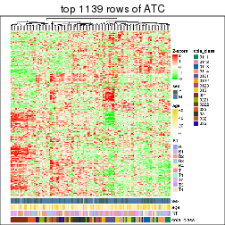

Top rows on each node:


```r
top_rows_overlap(res_rh, method = "upset")
```

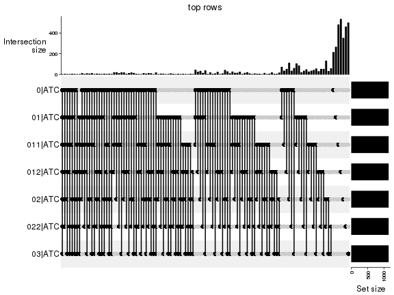


### UMAP plot

UMAP plot which shows how samples are separated.


<script>
$( function() {
	$( '#tabs-dimension-reduction-by-depth' ).tabs();
} );
</script>
<div id='tabs-dimension-reduction-by-depth'>
<ul>
<li><a href='#tab-dimension-reduction-by-depth-1'>n_signatures ≥ 561</a></li>
<li><a href='#tab-dimension-reduction-by-depth-2'>n_signatures ≥ 1224</a></li>
<li><a href='#tab-dimension-reduction-by-depth-3'>n_signatures ≥ 1726</a></li>
<li><a href='#tab-dimension-reduction-by-depth-4'>n_signatures ≥ 1901</a></li>
<li><a href='#tab-dimension-reduction-by-depth-5'>n_signatures ≥ 4791</a></li>
<li><a href='#tab-dimension-reduction-by-depth-6'>n_signatures ≥ 5639</a></li>
<li><a href='#tab-dimension-reduction-by-depth-7'>n_signatures ≥ 8975</a></li>
</ul>
<div id='tab-dimension-reduction-by-depth-1'>
<pre><code class="r">par(mfrow = c(1, 2))
dimension_reduction(res_rh, merge_node = merge_node_param(min_n_signatures = 561),
    method = &quot;UMAP&quot;, top_value_method = &quot;SD&quot;, top_n = 1200, scale_rows = FALSE)
dimension_reduction(res_rh, merge_node = merge_node_param(min_n_signatures = 561),
    method = &quot;UMAP&quot;, top_value_method = &quot;ATC&quot;, top_n = 1200, scale_rows = TRUE)
</code></pre>

<p>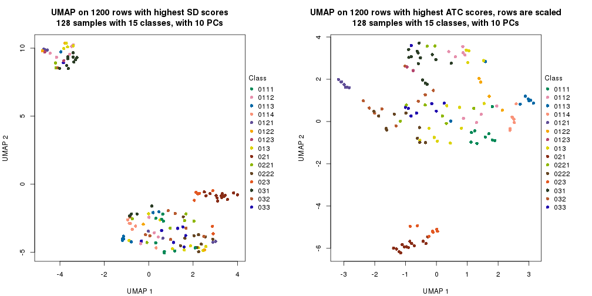</p>

</div>
<div id='tab-dimension-reduction-by-depth-2'>
<pre><code class="r">par(mfrow = c(1, 2))
dimension_reduction(res_rh, merge_node = merge_node_param(min_n_signatures = 1224),
    method = &quot;UMAP&quot;, top_value_method = &quot;SD&quot;, top_n = 1200, scale_rows = FALSE)
dimension_reduction(res_rh, merge_node = merge_node_param(min_n_signatures = 1224),
    method = &quot;UMAP&quot;, top_value_method = &quot;ATC&quot;, top_n = 1200, scale_rows = TRUE)
</code></pre>

<p>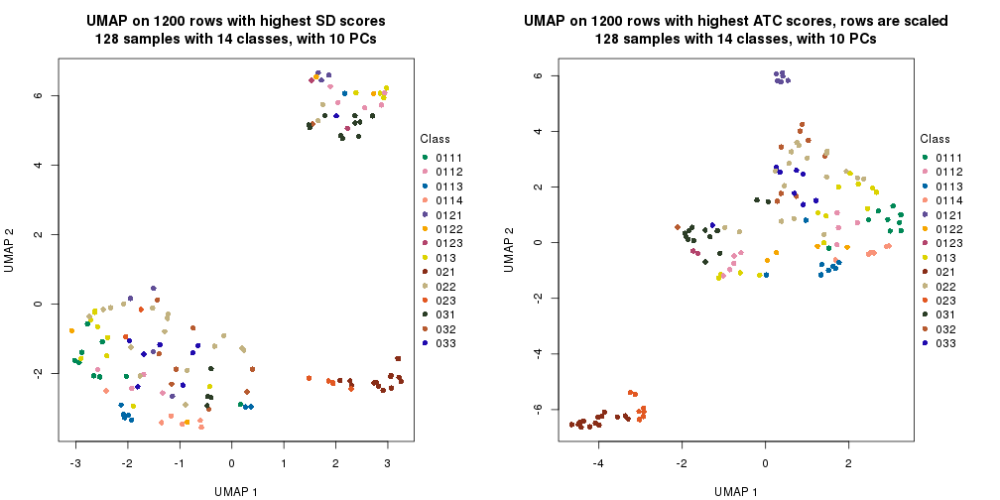</p>

</div>
<div id='tab-dimension-reduction-by-depth-3'>
<pre><code class="r">par(mfrow = c(1, 2))
dimension_reduction(res_rh, merge_node = merge_node_param(min_n_signatures = 1726),
    method = &quot;UMAP&quot;, top_value_method = &quot;SD&quot;, top_n = 1200, scale_rows = FALSE)
dimension_reduction(res_rh, merge_node = merge_node_param(min_n_signatures = 1726),
    method = &quot;UMAP&quot;, top_value_method = &quot;ATC&quot;, top_n = 1200, scale_rows = TRUE)
</code></pre>

<p>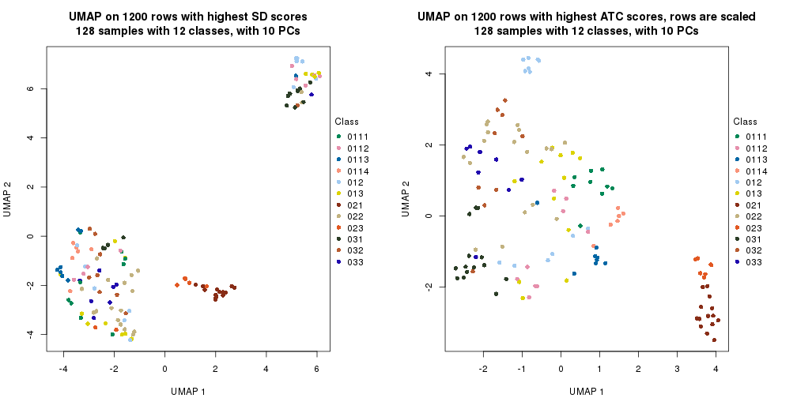</p>

</div>
<div id='tab-dimension-reduction-by-depth-4'>
<pre><code class="r">par(mfrow = c(1, 2))
dimension_reduction(res_rh, merge_node = merge_node_param(min_n_signatures = 1901),
    method = &quot;UMAP&quot;, top_value_method = &quot;SD&quot;, top_n = 1200, scale_rows = FALSE)
dimension_reduction(res_rh, merge_node = merge_node_param(min_n_signatures = 1901),
    method = &quot;UMAP&quot;, top_value_method = &quot;ATC&quot;, top_n = 1200, scale_rows = TRUE)
</code></pre>

<p></p>

</div>
<div id='tab-dimension-reduction-by-depth-5'>
<pre><code class="r">par(mfrow = c(1, 2))
dimension_reduction(res_rh, merge_node = merge_node_param(min_n_signatures = 4791),
    method = &quot;UMAP&quot;, top_value_method = &quot;SD&quot;, top_n = 1200, scale_rows = FALSE)
dimension_reduction(res_rh, merge_node = merge_node_param(min_n_signatures = 4791),
    method = &quot;UMAP&quot;, top_value_method = &quot;ATC&quot;, top_n = 1200, scale_rows = TRUE)
</code></pre>

<p>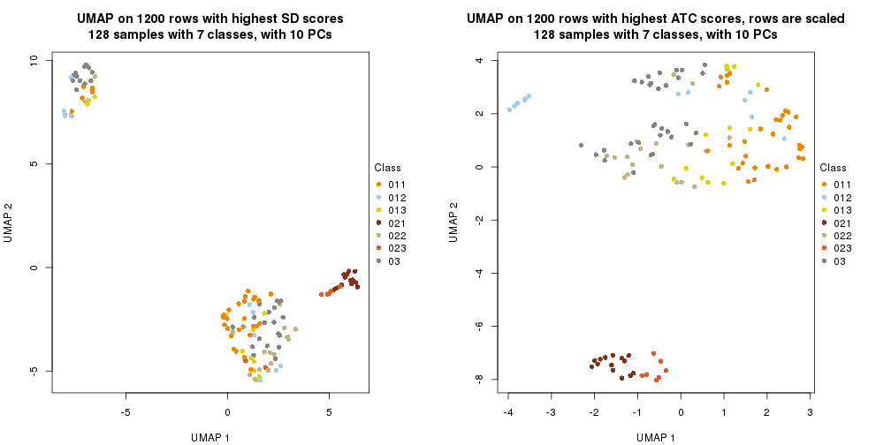</p>

</div>
<div id='tab-dimension-reduction-by-depth-6'>
<pre><code class="r">par(mfrow = c(1, 2))
dimension_reduction(res_rh, merge_node = merge_node_param(min_n_signatures = 5639),
    method = &quot;UMAP&quot;, top_value_method = &quot;SD&quot;, top_n = 1200, scale_rows = FALSE)
dimension_reduction(res_rh, merge_node = merge_node_param(min_n_signatures = 5639),
    method = &quot;UMAP&quot;, top_value_method = &quot;ATC&quot;, top_n = 1200, scale_rows = TRUE)
</code></pre>

<p>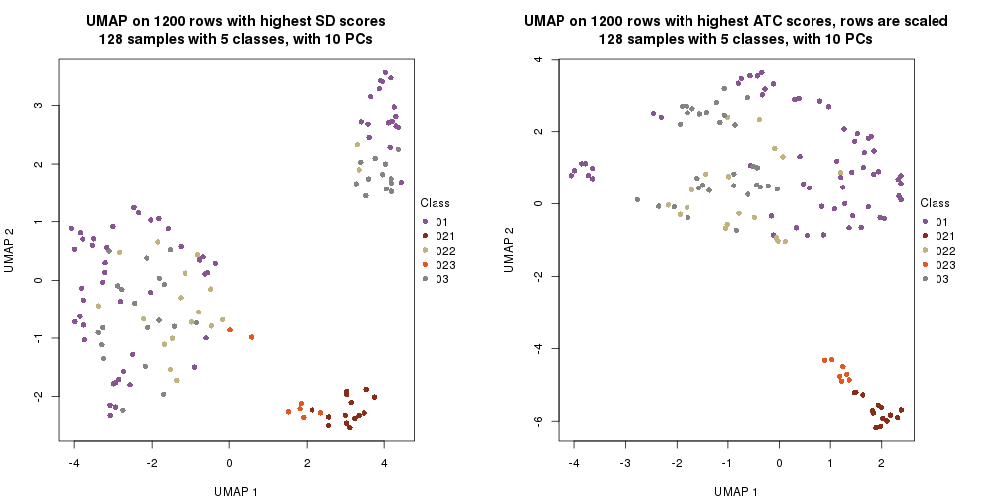</p>

</div>
<div id='tab-dimension-reduction-by-depth-7'>
<pre><code class="r">par(mfrow = c(1, 2))
dimension_reduction(res_rh, merge_node = merge_node_param(min_n_signatures = 8975),
    method = &quot;UMAP&quot;, top_value_method = &quot;SD&quot;, top_n = 1200, scale_rows = FALSE)
dimension_reduction(res_rh, merge_node = merge_node_param(min_n_signatures = 8975),
    method = &quot;UMAP&quot;, top_value_method = &quot;ATC&quot;, top_n = 1200, scale_rows = TRUE)
</code></pre>

<p>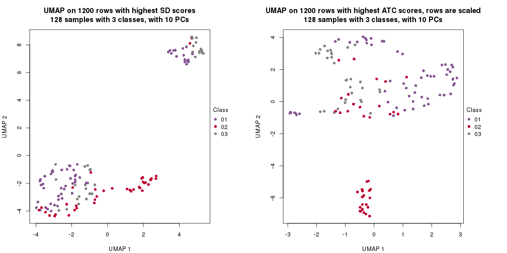</p>

</div>
</div>


### Signature heatmap

Signatures on the heatmap are the union of all signatures found on every node
on the hierarchy. The number of k-means on rows are automatically selected by the function.


<script>
$( function() {
	$( '#tabs-get-signatures-from-hierarchical-partition' ).tabs();
} );
</script>
<div id='tabs-get-signatures-from-hierarchical-partition'>
<ul>
<li><a href='#tab-get-signatures-from-hierarchical-partition-1'>n_signatures ≥ 561</a></li>
<li><a href='#tab-get-signatures-from-hierarchical-partition-2'>n_signatures ≥ 1224</a></li>
<li><a href='#tab-get-signatures-from-hierarchical-partition-3'>n_signatures ≥ 1726</a></li>
<li><a href='#tab-get-signatures-from-hierarchical-partition-4'>n_signatures ≥ 1901</a></li>
<li><a href='#tab-get-signatures-from-hierarchical-partition-5'>n_signatures ≥ 4791</a></li>
<li><a href='#tab-get-signatures-from-hierarchical-partition-6'>n_signatures ≥ 5639</a></li>
<li><a href='#tab-get-signatures-from-hierarchical-partition-7'>n_signatures ≥ 8975</a></li>
</ul>
<div id='tab-get-signatures-from-hierarchical-partition-1'>
<pre><code class="r">get_signatures(res_rh, merge_node = merge_node_param(min_n_signatures = 561))
</code></pre>

<p>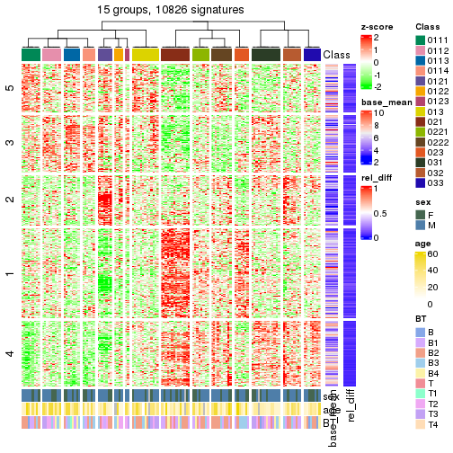</p>

</div>
<div id='tab-get-signatures-from-hierarchical-partition-2'>
<pre><code class="r">get_signatures(res_rh, merge_node = merge_node_param(min_n_signatures = 1224))
</code></pre>

<p>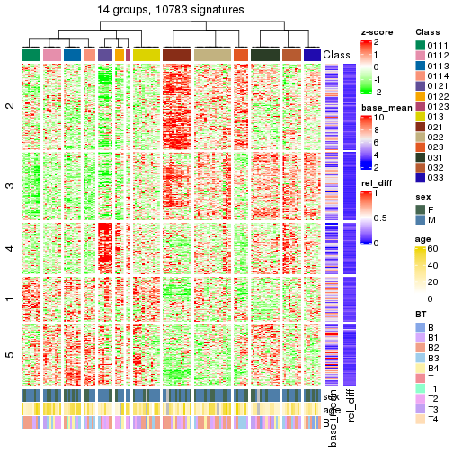</p>

</div>
<div id='tab-get-signatures-from-hierarchical-partition-3'>
<pre><code class="r">get_signatures(res_rh, merge_node = merge_node_param(min_n_signatures = 1726))
</code></pre>

<p>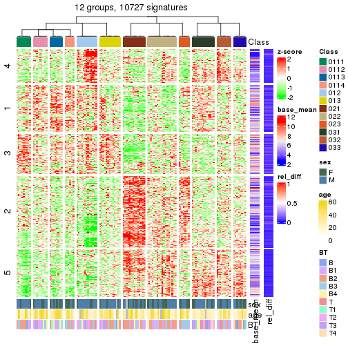</p>

</div>
<div id='tab-get-signatures-from-hierarchical-partition-4'>
<pre><code class="r">get_signatures(res_rh, merge_node = merge_node_param(min_n_signatures = 1901))
</code></pre>

<p>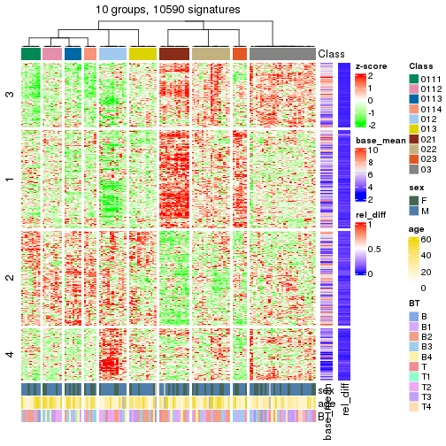</p>

</div>
<div id='tab-get-signatures-from-hierarchical-partition-5'>
<pre><code class="r">get_signatures(res_rh, merge_node = merge_node_param(min_n_signatures = 4791))
</code></pre>

<p>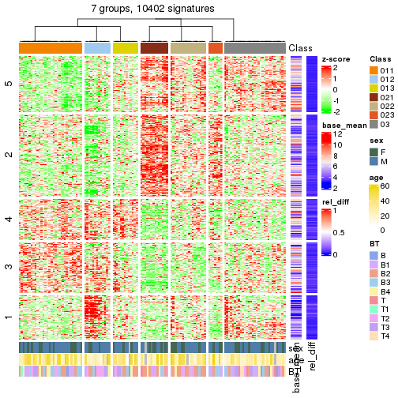</p>

</div>
<div id='tab-get-signatures-from-hierarchical-partition-6'>
<pre><code class="r">get_signatures(res_rh, merge_node = merge_node_param(min_n_signatures = 5639))
</code></pre>

<p>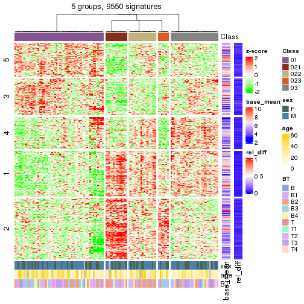</p>

</div>
<div id='tab-get-signatures-from-hierarchical-partition-7'>
<pre><code class="r">get_signatures(res_rh, merge_node = merge_node_param(min_n_signatures = 8975))
</code></pre>

<p>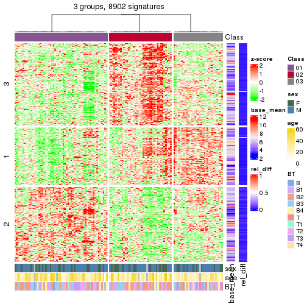</p>

</div>
</div>


Compare signatures from different nodes:


```r
compare_signatures(res_rh, verbose = FALSE)
```

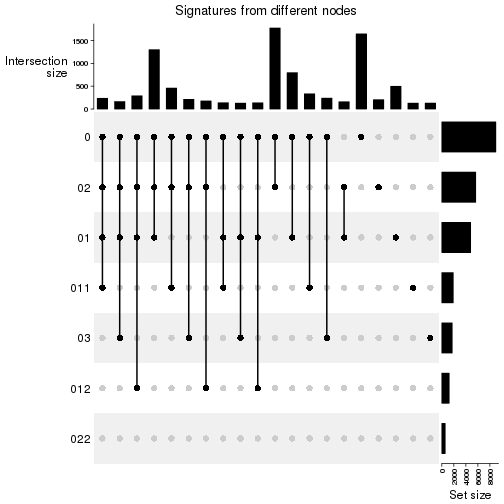

If there are too many signatures, `top_signatures = ...` can be set to only show the 
signatures with the highest FDRs. Note it only works on every node and the final signatures
are the union of all signatures of all nodes.


```r
# code only for demonstration
# e.g. to show the top 500 most significant rows on each node.
tb = get_signature(res_rh, top_signatures = 500)
```


### Test to known annotations

Test correlation between subgroups and known annotations. If the known
annotation is numeric, one-way ANOVA test is applied, and if the known
annotation is discrete, chi-squared contingency table test is applied.


<script>
$( function() {
	$( '#tabs-test-to-known-factors-from-hierarchical-partition' ).tabs();
} );
</script>
<div id='tabs-test-to-known-factors-from-hierarchical-partition'>
<ul>
<li><a href='#tab-test-to-known-factors-from-hierarchical-partition-1'>n_signatures ≥ 561</a></li>
<li><a href='#tab-test-to-known-factors-from-hierarchical-partition-2'>n_signatures ≥ 1224</a></li>
<li><a href='#tab-test-to-known-factors-from-hierarchical-partition-3'>n_signatures ≥ 1726</a></li>
<li><a href='#tab-test-to-known-factors-from-hierarchical-partition-4'>n_signatures ≥ 1901</a></li>
<li><a href='#tab-test-to-known-factors-from-hierarchical-partition-5'>n_signatures ≥ 4791</a></li>
<li><a href='#tab-test-to-known-factors-from-hierarchical-partition-6'>n_signatures ≥ 5639</a></li>
<li><a href='#tab-test-to-known-factors-from-hierarchical-partition-7'>n_signatures ≥ 8975</a></li>
</ul>
<div id='tab-test-to-known-factors-from-hierarchical-partition-1'>
<pre><code class="r">test_to_known_factors(res_rh, merge_node = merge_node_param(min_n_signatures = 561))
</code></pre>

<pre><code>#&gt;         sex    age    BT
#&gt; class 0.969 0.0863 0.029
</code></pre>

</div>
<div id='tab-test-to-known-factors-from-hierarchical-partition-2'>
<pre><code class="r">test_to_known_factors(res_rh, merge_node = merge_node_param(min_n_signatures = 1224))
</code></pre>

<pre><code>#&gt;         sex    age     BT
#&gt; class 0.954 0.0767 0.0146
</code></pre>

</div>
<div id='tab-test-to-known-factors-from-hierarchical-partition-3'>
<pre><code class="r">test_to_known_factors(res_rh, merge_node = merge_node_param(min_n_signatures = 1726))
</code></pre>

<pre><code>#&gt;         sex    age      BT
#&gt; class 0.921 0.0199 0.00374
</code></pre>

</div>
<div id='tab-test-to-known-factors-from-hierarchical-partition-4'>
<pre><code class="r">test_to_known_factors(res_rh, merge_node = merge_node_param(min_n_signatures = 1901))
</code></pre>

<pre><code>#&gt;         sex   age     BT
#&gt; class 0.932 0.179 0.0552
</code></pre>

</div>
<div id='tab-test-to-known-factors-from-hierarchical-partition-5'>
<pre><code class="r">test_to_known_factors(res_rh, merge_node = merge_node_param(min_n_signatures = 4791))
</code></pre>

<pre><code>#&gt;         sex    age    BT
#&gt; class 0.947 0.0997 0.203
</code></pre>

</div>
<div id='tab-test-to-known-factors-from-hierarchical-partition-6'>
<pre><code class="r">test_to_known_factors(res_rh, merge_node = merge_node_param(min_n_signatures = 5639))
</code></pre>

<pre><code>#&gt;         sex    age    BT
#&gt; class 0.972 0.0819 0.195
</code></pre>

</div>
<div id='tab-test-to-known-factors-from-hierarchical-partition-7'>
<pre><code class="r">test_to_known_factors(res_rh, merge_node = merge_node_param(min_n_signatures = 8975))
</code></pre>

<pre><code>#&gt;         sex   age     BT
#&gt; class 0.867 0.012 0.0532
</code></pre>

</div>
</div>


## Results for each node


---------------------------------------------------


### Node0


Child nodes: 
                [Node01](#Node01)
        ,
                [Node02](#Node02)
        ,
                [Node03](#Node03)
        .


The object with results only for a single top-value method and a single partitioning method 
can be extracted as:

```r
res = res_rh["0"]
```

A summary of `res` and all the functions that can be applied to it:

```r
res
```

```
#> A 'ConsensusPartition' object with k = 2, 3, 4.
#>   On a matrix with 11393 rows and 128 columns.
#>   Top rows (1139) are extracted by 'ATC' method.
#>   Subgroups are detected by 'skmeans' method.
#>   Performed in total 150 partitions by row resampling.
#>   Best k for subgroups seems to be 3.
#> 
#> Following methods can be applied to this 'ConsensusPartition' object:
#>  [1] "cola_report"             "collect_classes"         "collect_plots"          
#>  [4] "collect_stats"           "colnames"                "compare_partitions"     
#>  [7] "compare_signatures"      "consensus_heatmap"       "dimension_reduction"    
#> [10] "functional_enrichment"   "get_anno_col"            "get_anno"               
#> [13] "get_classes"             "get_consensus"           "get_matrix"             
#> [16] "get_membership"          "get_param"               "get_signatures"         
#> [19] "get_stats"               "is_best_k"               "is_stable_k"            
#> [22] "membership_heatmap"      "ncol"                    "nrow"                   
#> [25] "plot_ecdf"               "predict_classes"         "rownames"               
#> [28] "select_partition_number" "show"                    "suggest_best_k"         
#> [31] "test_to_known_factors"   "top_rows_heatmap"
```

`collect_plots()` function collects all the plots made from `res` for all `k` (number of subgroups)
into one single page to provide an easy and fast comparison between different `k`.

```r
collect_plots(res)
```

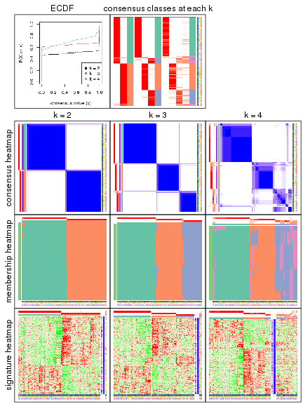

The plots are:

- The first row: a plot of the eCDF (empirical cumulative distribution
  function) curves of the consensus matrix for each `k` and the heatmap of
  predicted classes for each `k`.
- The second row: heatmaps of the consensus matrix for each `k`.
- The third row: heatmaps of the membership matrix for each `k`.
- The fouth row: heatmaps of the signatures for each `k`.

All the plots in panels can be made by individual functions and they are
plotted later in this section.

`select_partition_number()` produces several plots showing different
statistics for choosing "optimized" `k`. There are following statistics:

- eCDF curves of the consensus matrix for each `k`;
- 1-PAC. [The PAC score](https://en.wikipedia.org/wiki/Consensus_clustering#Over-interpretation_potential_of_consensus_clustering)
  measures the proportion of the ambiguous subgrouping.
- Mean silhouette score.
- Concordance. The mean probability of fiting the consensus subgroup labels in all
  partitions.
- Area increased. Denote $A_k$ as the area under the eCDF curve for current
  `k`, the area increased is defined as $A_k - A_{k-1}$.
- Rand index. The percent of pairs of samples that are both in a same cluster
  or both are not in a same cluster in the partition of k and k-1.
- Jaccard index. The ratio of pairs of samples are both in a same cluster in
  the partition of k and k-1 and the pairs of samples are both in a same
  cluster in the partition k or k-1.

The detailed explanations of these statistics can be found in [the _cola_
vignette](https://jokergoo.github.io/cola_vignettes/cola.html#toc_13).

Generally speaking, higher 1-PAC score, higher mean silhouette score or higher
concordance corresponds to better partition. Rand index and Jaccard index
measure how similar the current partition is compared to partition with `k-1`.
If they are too similar, we won't accept `k` is better than `k-1`.

```r
select_partition_number(res)
```

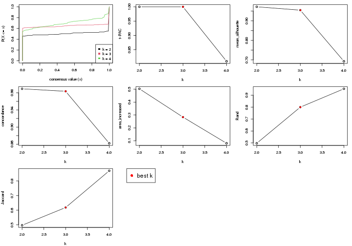

The numeric values for all these statistics can be obtained by `get_stats()`.

```r
get_stats(res)
```

```
#>   k 1-PAC mean_silhouette concordance area_increased  Rand Jaccard
#> 2 2  1.00           0.972       0.989         0.5031 0.497   0.497
#> 3 3  1.00           0.955       0.983         0.2836 0.800   0.619
#> 4 4  0.81           0.693       0.862         0.0809 0.954   0.869
```

`suggest_best_k()` suggests the best $k$ based on these statistics. The rules are as follows:

- All $k$ with Jaccard index larger than 0.95 are removed because increasing
  $k$ does not provide enough extra information. If all $k$ are removed, it is
  marked as no subgroup is detected.
- For all $k$ with 1-PAC score larger than 0.9, the maximal $k$ is taken as
  the best $k$, and other $k$ are marked as optional $k$.
- If it does not fit the second rule. The $k$ with the maximal vote of the
  highest 1-PAC score, highest mean silhouette, and highest concordance is
  taken as the best $k$.

```r
suggest_best_k(res)
```

```
#> [1] 3
#> attr(,"optional")
#> [1] 2
```

There is also optional best $k$ = 2 that is worth to check.

Following is the table of the partitions (You need to click the **show/hide
code output** link to see it). The membership matrix (columns with name `p*`)
is inferred by
[`clue::cl_consensus()`](https://www.rdocumentation.org/link/cl_consensus?package=clue)
function with the `SE` method. Basically the value in the membership matrix
represents the probability to belong to a certain group. The finall subgroup
label for an item is determined with the group with highest probability it
belongs to.

In `get_classes()` function, the entropy is calculated from the membership
matrix and the silhouette score is calculated from the consensus matrix.


<script>
$( function() {
	$( '#tabs-node-0-get-classes' ).tabs();
} );
</script>
<div id='tabs-node-0-get-classes'>
<ul>
<li><a href='#tab-node-0-get-classes-1'>k = 2</a></li>
<li><a href='#tab-node-0-get-classes-2'>k = 3</a></li>
<li><a href='#tab-node-0-get-classes-3'>k = 4</a></li>
</ul>

<div id='tab-node-0-get-classes-1'>
<p><a id='tab-node-0-get-classes-1-a' style='color:#0366d6' href='#'>show/hide code output</a></p>
<pre><code class="r">cbind(get_classes(res, k = 2), get_membership(res, k = 2))
</code></pre>

<pre><code>#&gt;       class entropy silhouette   p1   p2
#&gt; 01005     1   0.000      0.990 1.00 0.00
#&gt; 01010     2   0.000      0.987 0.00 1.00
#&gt; 03002     1   0.000      0.990 1.00 0.00
#&gt; 04006     2   0.000      0.987 0.00 1.00
#&gt; 04007     1   0.000      0.990 1.00 0.00
#&gt; 04008     2   0.000      0.987 0.00 1.00
#&gt; 04010     2   0.000      0.987 0.00 1.00
#&gt; 04016     1   0.000      0.990 1.00 0.00
#&gt; 06002     2   0.000      0.987 0.00 1.00
#&gt; 08001     1   0.000      0.990 1.00 0.00
#&gt; 08011     1   0.000      0.990 1.00 0.00
#&gt; 08012     1   0.000      0.990 1.00 0.00
#&gt; 08018     1   0.000      0.990 1.00 0.00
#&gt; 08024     2   0.000      0.987 0.00 1.00
#&gt; 09008     2   0.000      0.987 0.00 1.00
#&gt; 09017     1   0.000      0.990 1.00 0.00
#&gt; 11005     1   0.000      0.990 1.00 0.00
#&gt; 12006     2   0.000      0.987 0.00 1.00
#&gt; 12007     1   0.000      0.990 1.00 0.00
#&gt; 12012     2   0.000      0.987 0.00 1.00
#&gt; 12019     2   0.000      0.987 0.00 1.00
#&gt; 12026     2   0.000      0.987 0.00 1.00
#&gt; 14016     2   0.000      0.987 0.00 1.00
#&gt; 15001     2   0.000      0.987 0.00 1.00
#&gt; 15004     2   0.990      0.209 0.44 0.56
#&gt; 15005     2   0.000      0.987 0.00 1.00
#&gt; 16004     2   0.000      0.987 0.00 1.00
#&gt; 16009     2   0.000      0.987 0.00 1.00
#&gt; 19005     2   0.000      0.987 0.00 1.00
#&gt; 20002     2   0.000      0.987 0.00 1.00
#&gt; 22009     2   0.000      0.987 0.00 1.00
#&gt; 22010     2   0.000      0.987 0.00 1.00
#&gt; 22011     1   0.000      0.990 1.00 0.00
#&gt; 22013     2   0.000      0.987 0.00 1.00
#&gt; 24001     1   0.000      0.990 1.00 0.00
#&gt; 24005     1   0.000      0.990 1.00 0.00
#&gt; 24008     1   0.000      0.990 1.00 0.00
#&gt; 24010     1   0.000      0.990 1.00 0.00
#&gt; 24011     2   0.000      0.987 0.00 1.00
#&gt; 24017     2   0.000      0.987 0.00 1.00
#&gt; 24018     2   0.000      0.987 0.00 1.00
#&gt; 24019     2   0.000      0.987 0.00 1.00
#&gt; 24022     1   0.000      0.990 1.00 0.00
#&gt; 25003     2   0.000      0.987 0.00 1.00
#&gt; 25006     2   0.000      0.987 0.00 1.00
#&gt; 26001     2   0.000      0.987 0.00 1.00
#&gt; 26003     1   0.000      0.990 1.00 0.00
#&gt; 26005     2   0.000      0.987 0.00 1.00
#&gt; 26008     2   0.000      0.987 0.00 1.00
#&gt; 27003     2   0.000      0.987 0.00 1.00
#&gt; 27004     1   0.000      0.990 1.00 0.00
#&gt; 28001     2   0.000      0.987 0.00 1.00
#&gt; 28003     2   0.000      0.987 0.00 1.00
#&gt; 28005     1   0.000      0.990 1.00 0.00
#&gt; 28006     1   0.000      0.990 1.00 0.00
#&gt; 28007     1   0.000      0.990 1.00 0.00
#&gt; 28019     2   0.000      0.987 0.00 1.00
#&gt; 28021     2   0.000      0.987 0.00 1.00
#&gt; 28023     1   0.000      0.990 1.00 0.00
#&gt; 28024     1   0.000      0.990 1.00 0.00
#&gt; 28028     1   0.000      0.990 1.00 0.00
#&gt; 28031     1   0.529      0.859 0.88 0.12
#&gt; 28032     1   0.000      0.990 1.00 0.00
#&gt; 28035     2   0.000      0.987 0.00 1.00
#&gt; 28036     1   0.000      0.990 1.00 0.00
#&gt; 28037     2   0.000      0.987 0.00 1.00
#&gt; 28042     1   0.000      0.990 1.00 0.00
#&gt; 28043     1   0.000      0.990 1.00 0.00
#&gt; 28044     1   0.981      0.266 0.58 0.42
#&gt; 28047     1   0.000      0.990 1.00 0.00
#&gt; 30001     2   0.000      0.987 0.00 1.00
#&gt; 31007     1   0.000      0.990 1.00 0.00
#&gt; 31011     1   0.000      0.990 1.00 0.00
#&gt; 33005     2   0.000      0.987 0.00 1.00
#&gt; 36001     2   0.000      0.987 0.00 1.00
#&gt; 36002     1   0.000      0.990 1.00 0.00
#&gt; 37013     2   0.000      0.987 0.00 1.00
#&gt; 43001     2   0.000      0.987 0.00 1.00
#&gt; 43004     2   0.000      0.987 0.00 1.00
#&gt; 43007     1   0.000      0.990 1.00 0.00
#&gt; 43012     1   0.000      0.990 1.00 0.00
#&gt; 48001     2   0.000      0.987 0.00 1.00
#&gt; 49006     1   0.000      0.990 1.00 0.00
#&gt; 57001     1   0.000      0.990 1.00 0.00
#&gt; 62001     1   0.000      0.990 1.00 0.00
#&gt; 62002     1   0.000      0.990 1.00 0.00
#&gt; 62003     2   0.000      0.987 0.00 1.00
#&gt; 63001     1   0.000      0.990 1.00 0.00
#&gt; 64001     1   0.000      0.990 1.00 0.00
#&gt; 64002     2   0.000      0.987 0.00 1.00
#&gt; 65005     1   0.000      0.990 1.00 0.00
#&gt; 68001     2   0.000      0.987 0.00 1.00
#&gt; 68003     1   0.000      0.990 1.00 0.00
#&gt; 84004     1   0.000      0.990 1.00 0.00
#&gt; LAL5      1   0.000      0.990 1.00 0.00
#&gt; 01003     1   0.000      0.990 1.00 0.00
#&gt; 01007     2   0.000      0.987 0.00 1.00
#&gt; 02020     2   0.000      0.987 0.00 1.00
#&gt; 04018     1   0.000      0.990 1.00 0.00
#&gt; 09002     1   0.000      0.990 1.00 0.00
#&gt; 10005     1   0.000      0.990 1.00 0.00
#&gt; 11002     1   0.000      0.990 1.00 0.00
#&gt; 12008     2   0.000      0.987 0.00 1.00
#&gt; 15006     2   0.000      0.987 0.00 1.00
#&gt; 16002     1   0.000      0.990 1.00 0.00
#&gt; 16007     1   0.000      0.990 1.00 0.00
#&gt; 17003     2   0.000      0.987 0.00 1.00
#&gt; 18001     1   0.000      0.990 1.00 0.00
#&gt; 19002     2   0.000      0.987 0.00 1.00
#&gt; 19008     1   0.000      0.990 1.00 0.00
#&gt; 19014     1   0.242      0.951 0.96 0.04
#&gt; 19017     1   0.000      0.990 1.00 0.00
#&gt; 20005     1   0.000      0.990 1.00 0.00
#&gt; 24006     2   0.000      0.987 0.00 1.00
#&gt; 26009     2   0.000      0.987 0.00 1.00
#&gt; 28008     1   0.000      0.990 1.00 0.00
#&gt; 28009     2   0.000      0.987 0.00 1.00
#&gt; 31015     1   0.000      0.990 1.00 0.00
#&gt; 37001     2   0.000      0.987 0.00 1.00
#&gt; 43006     1   0.000      0.990 1.00 0.00
#&gt; 43015     1   0.000      0.990 1.00 0.00
#&gt; 44001     1   0.000      0.990 1.00 0.00
#&gt; 49004     1   0.000      0.990 1.00 0.00
#&gt; 56007     1   0.000      0.990 1.00 0.00
#&gt; 64005     2   0.000      0.987 0.00 1.00
#&gt; 65003     2   0.881      0.567 0.30 0.70
#&gt; 83001     2   0.000      0.987 0.00 1.00
#&gt; LAL4      1   0.327      0.931 0.94 0.06
</code></pre>

<script>
$('#tab-node-0-get-classes-1-a').parent().next().next().hide();
$('#tab-node-0-get-classes-1-a').click(function(){
  $('#tab-node-0-get-classes-1-a').parent().next().next().toggle();
  return(false);
});
</script>
</div>

<div id='tab-node-0-get-classes-2'>
<p><a id='tab-node-0-get-classes-2-a' style='color:#0366d6' href='#'>show/hide code output</a></p>
<pre><code class="r">cbind(get_classes(res, k = 3), get_membership(res, k = 3))
</code></pre>

<pre><code>#&gt;       class entropy silhouette   p1   p2   p3
#&gt; 01005     1  0.0000     1.0000 1.00 0.00 0.00
#&gt; 01010     2  0.0000     0.9801 0.00 1.00 0.00
#&gt; 03002     1  0.0000     1.0000 1.00 0.00 0.00
#&gt; 04006     2  0.0000     0.9801 0.00 1.00 0.00
#&gt; 04007     1  0.0000     1.0000 1.00 0.00 0.00
#&gt; 04008     2  0.0000     0.9801 0.00 1.00 0.00
#&gt; 04010     2  0.0000     0.9801 0.00 1.00 0.00
#&gt; 04016     1  0.0000     1.0000 1.00 0.00 0.00
#&gt; 06002     2  0.0000     0.9801 0.00 1.00 0.00
#&gt; 08001     1  0.0000     1.0000 1.00 0.00 0.00
#&gt; 08011     1  0.0000     1.0000 1.00 0.00 0.00
#&gt; 08012     1  0.0000     1.0000 1.00 0.00 0.00
#&gt; 08018     1  0.0000     1.0000 1.00 0.00 0.00
#&gt; 08024     3  0.6302     0.0748 0.00 0.48 0.52
#&gt; 09008     2  0.0000     0.9801 0.00 1.00 0.00
#&gt; 09017     3  0.6280     0.1358 0.46 0.00 0.54
#&gt; 11005     1  0.0000     1.0000 1.00 0.00 0.00
#&gt; 12006     3  0.0000     0.9480 0.00 0.00 1.00
#&gt; 12007     1  0.0000     1.0000 1.00 0.00 0.00
#&gt; 12012     2  0.0000     0.9801 0.00 1.00 0.00
#&gt; 12019     2  0.6045     0.3566 0.00 0.62 0.38
#&gt; 12026     2  0.0000     0.9801 0.00 1.00 0.00
#&gt; 14016     2  0.0000     0.9801 0.00 1.00 0.00
#&gt; 15001     2  0.0000     0.9801 0.00 1.00 0.00
#&gt; 15004     3  0.0000     0.9480 0.00 0.00 1.00
#&gt; 15005     2  0.0000     0.9801 0.00 1.00 0.00
#&gt; 16004     2  0.0000     0.9801 0.00 1.00 0.00
#&gt; 16009     2  0.0000     0.9801 0.00 1.00 0.00
#&gt; 19005     2  0.0000     0.9801 0.00 1.00 0.00
#&gt; 20002     2  0.0000     0.9801 0.00 1.00 0.00
#&gt; 22009     3  0.0000     0.9480 0.00 0.00 1.00
#&gt; 22010     3  0.0000     0.9480 0.00 0.00 1.00
#&gt; 22011     1  0.0000     1.0000 1.00 0.00 0.00
#&gt; 22013     3  0.0892     0.9327 0.00 0.02 0.98
#&gt; 24001     1  0.0000     1.0000 1.00 0.00 0.00
#&gt; 24005     1  0.0000     1.0000 1.00 0.00 0.00
#&gt; 24008     1  0.0000     1.0000 1.00 0.00 0.00
#&gt; 24010     1  0.0000     1.0000 1.00 0.00 0.00
#&gt; 24011     2  0.3340     0.8483 0.00 0.88 0.12
#&gt; 24017     2  0.0000     0.9801 0.00 1.00 0.00
#&gt; 24018     3  0.0000     0.9480 0.00 0.00 1.00
#&gt; 24019     2  0.0000     0.9801 0.00 1.00 0.00
#&gt; 24022     1  0.0000     1.0000 1.00 0.00 0.00
#&gt; 25003     3  0.0000     0.9480 0.00 0.00 1.00
#&gt; 25006     2  0.0000     0.9801 0.00 1.00 0.00
#&gt; 26001     2  0.0000     0.9801 0.00 1.00 0.00
#&gt; 26003     1  0.0000     1.0000 1.00 0.00 0.00
#&gt; 26005     2  0.0000     0.9801 0.00 1.00 0.00
#&gt; 26008     2  0.0000     0.9801 0.00 1.00 0.00
#&gt; 27003     3  0.0000     0.9480 0.00 0.00 1.00
#&gt; 27004     1  0.0000     1.0000 1.00 0.00 0.00
#&gt; 28001     3  0.0000     0.9480 0.00 0.00 1.00
#&gt; 28003     3  0.0000     0.9480 0.00 0.00 1.00
#&gt; 28005     1  0.0000     1.0000 1.00 0.00 0.00
#&gt; 28006     1  0.0000     1.0000 1.00 0.00 0.00
#&gt; 28007     1  0.0000     1.0000 1.00 0.00 0.00
#&gt; 28019     2  0.0000     0.9801 0.00 1.00 0.00
#&gt; 28021     2  0.0000     0.9801 0.00 1.00 0.00
#&gt; 28023     1  0.0000     1.0000 1.00 0.00 0.00
#&gt; 28024     1  0.0000     1.0000 1.00 0.00 0.00
#&gt; 28028     1  0.0000     1.0000 1.00 0.00 0.00
#&gt; 28031     3  0.0000     0.9480 0.00 0.00 1.00
#&gt; 28032     1  0.0000     1.0000 1.00 0.00 0.00
#&gt; 28035     2  0.0000     0.9801 0.00 1.00 0.00
#&gt; 28036     1  0.0000     1.0000 1.00 0.00 0.00
#&gt; 28037     2  0.0000     0.9801 0.00 1.00 0.00
#&gt; 28042     3  0.0000     0.9480 0.00 0.00 1.00
#&gt; 28043     1  0.0000     1.0000 1.00 0.00 0.00
#&gt; 28044     2  0.4291     0.7478 0.18 0.82 0.00
#&gt; 28047     1  0.0000     1.0000 1.00 0.00 0.00
#&gt; 30001     2  0.0000     0.9801 0.00 1.00 0.00
#&gt; 31007     3  0.0000     0.9480 0.00 0.00 1.00
#&gt; 31011     1  0.0000     1.0000 1.00 0.00 0.00
#&gt; 33005     2  0.0000     0.9801 0.00 1.00 0.00
#&gt; 36001     2  0.0000     0.9801 0.00 1.00 0.00
#&gt; 36002     1  0.0000     1.0000 1.00 0.00 0.00
#&gt; 37013     2  0.0000     0.9801 0.00 1.00 0.00
#&gt; 43001     3  0.6126     0.3258 0.00 0.40 0.60
#&gt; 43004     3  0.0000     0.9480 0.00 0.00 1.00
#&gt; 43007     1  0.0000     1.0000 1.00 0.00 0.00
#&gt; 43012     3  0.0000     0.9480 0.00 0.00 1.00
#&gt; 48001     2  0.0000     0.9801 0.00 1.00 0.00
#&gt; 49006     1  0.0000     1.0000 1.00 0.00 0.00
#&gt; 57001     1  0.0000     1.0000 1.00 0.00 0.00
#&gt; 62001     1  0.0000     1.0000 1.00 0.00 0.00
#&gt; 62002     1  0.0000     1.0000 1.00 0.00 0.00
#&gt; 62003     3  0.0892     0.9327 0.00 0.02 0.98
#&gt; 63001     1  0.0000     1.0000 1.00 0.00 0.00
#&gt; 64001     1  0.0000     1.0000 1.00 0.00 0.00
#&gt; 64002     2  0.0000     0.9801 0.00 1.00 0.00
#&gt; 65005     1  0.0000     1.0000 1.00 0.00 0.00
#&gt; 68001     2  0.0000     0.9801 0.00 1.00 0.00
#&gt; 68003     1  0.0000     1.0000 1.00 0.00 0.00
#&gt; 84004     1  0.0000     1.0000 1.00 0.00 0.00
#&gt; LAL5      1  0.0000     1.0000 1.00 0.00 0.00
#&gt; 01003     3  0.0000     0.9480 0.00 0.00 1.00
#&gt; 01007     3  0.2066     0.8949 0.00 0.06 0.94
#&gt; 02020     2  0.0000     0.9801 0.00 1.00 0.00
#&gt; 04018     1  0.0000     1.0000 1.00 0.00 0.00
#&gt; 09002     1  0.0000     1.0000 1.00 0.00 0.00
#&gt; 10005     1  0.0000     1.0000 1.00 0.00 0.00
#&gt; 11002     1  0.0000     1.0000 1.00 0.00 0.00
#&gt; 12008     3  0.0000     0.9480 0.00 0.00 1.00
#&gt; 15006     2  0.0000     0.9801 0.00 1.00 0.00
#&gt; 16002     1  0.0000     1.0000 1.00 0.00 0.00
#&gt; 16007     1  0.0000     1.0000 1.00 0.00 0.00
#&gt; 17003     3  0.0000     0.9480 0.00 0.00 1.00
#&gt; 18001     1  0.0000     1.0000 1.00 0.00 0.00
#&gt; 19002     3  0.0000     0.9480 0.00 0.00 1.00
#&gt; 19008     1  0.0000     1.0000 1.00 0.00 0.00
#&gt; 19014     3  0.0000     0.9480 0.00 0.00 1.00
#&gt; 19017     1  0.0000     1.0000 1.00 0.00 0.00
#&gt; 20005     1  0.0000     1.0000 1.00 0.00 0.00
#&gt; 24006     3  0.0000     0.9480 0.00 0.00 1.00
#&gt; 26009     2  0.0000     0.9801 0.00 1.00 0.00
#&gt; 28008     1  0.0000     1.0000 1.00 0.00 0.00
#&gt; 28009     3  0.0000     0.9480 0.00 0.00 1.00
#&gt; 31015     1  0.0000     1.0000 1.00 0.00 0.00
#&gt; 37001     3  0.0000     0.9480 0.00 0.00 1.00
#&gt; 43006     1  0.0000     1.0000 1.00 0.00 0.00
#&gt; 43015     1  0.0000     1.0000 1.00 0.00 0.00
#&gt; 44001     1  0.0000     1.0000 1.00 0.00 0.00
#&gt; 49004     1  0.0000     1.0000 1.00 0.00 0.00
#&gt; 56007     1  0.0000     1.0000 1.00 0.00 0.00
#&gt; 64005     3  0.0000     0.9480 0.00 0.00 1.00
#&gt; 65003     3  0.0000     0.9480 0.00 0.00 1.00
#&gt; 83001     2  0.0000     0.9801 0.00 1.00 0.00
#&gt; LAL4      3  0.0000     0.9480 0.00 0.00 1.00
</code></pre>

<script>
$('#tab-node-0-get-classes-2-a').parent().next().next().hide();
$('#tab-node-0-get-classes-2-a').click(function(){
  $('#tab-node-0-get-classes-2-a').parent().next().next().toggle();
  return(false);
});
</script>
</div>

<div id='tab-node-0-get-classes-3'>
<p><a id='tab-node-0-get-classes-3-a' style='color:#0366d6' href='#'>show/hide code output</a></p>
<pre><code class="r">cbind(get_classes(res, k = 4), get_membership(res, k = 4))
</code></pre>

<pre><code>#&gt;       class entropy silhouette   p1   p2   p3   p4
#&gt; 01005     1  0.0000     0.9503 1.00 0.00 0.00 0.00
#&gt; 01010     2  0.0000     0.8809 0.00 1.00 0.00 0.00
#&gt; 03002     1  0.0000     0.9503 1.00 0.00 0.00 0.00
#&gt; 04006     2  0.0000     0.8809 0.00 1.00 0.00 0.00
#&gt; 04007     1  0.0000     0.9503 1.00 0.00 0.00 0.00
#&gt; 04008     2  0.0000     0.8809 0.00 1.00 0.00 0.00
#&gt; 04010     2  0.0000     0.8809 0.00 1.00 0.00 0.00
#&gt; 04016     1  0.0000     0.9503 1.00 0.00 0.00 0.00
#&gt; 06002     2  0.3172     0.7777 0.00 0.84 0.16 0.00
#&gt; 08001     1  0.0000     0.9503 1.00 0.00 0.00 0.00
#&gt; 08011     1  0.0000     0.9503 1.00 0.00 0.00 0.00
#&gt; 08012     1  0.0000     0.9503 1.00 0.00 0.00 0.00
#&gt; 08018     1  0.3975     0.6518 0.76 0.00 0.00 0.24
#&gt; 08024     3  0.7493     0.2559 0.00 0.20 0.48 0.32
#&gt; 09008     2  0.0000     0.8809 0.00 1.00 0.00 0.00
#&gt; 09017     4  0.6201     0.1238 0.08 0.00 0.30 0.62
#&gt; 11005     1  0.1637     0.9246 0.94 0.00 0.00 0.06
#&gt; 12006     3  0.4624     0.2130 0.00 0.00 0.66 0.34
#&gt; 12007     1  0.2011     0.9109 0.92 0.00 0.00 0.08
#&gt; 12012     2  0.7198     0.3649 0.00 0.54 0.18 0.28
#&gt; 12019     2  0.6299     0.2115 0.00 0.52 0.42 0.06
#&gt; 12026     2  0.3610     0.7459 0.00 0.80 0.20 0.00
#&gt; 14016     2  0.3610     0.7459 0.00 0.80 0.20 0.00
#&gt; 15001     2  0.6320     0.5793 0.00 0.66 0.16 0.18
#&gt; 15004     4  0.4994     0.1052 0.00 0.00 0.48 0.52
#&gt; 15005     2  0.0000     0.8809 0.00 1.00 0.00 0.00
#&gt; 16004     2  0.3610     0.7459 0.00 0.80 0.20 0.00
#&gt; 16009     2  0.0000     0.8809 0.00 1.00 0.00 0.00
#&gt; 19005     2  0.0000     0.8809 0.00 1.00 0.00 0.00
#&gt; 20002     2  0.0000     0.8809 0.00 1.00 0.00 0.00
#&gt; 22009     3  0.2647     0.5548 0.00 0.12 0.88 0.00
#&gt; 22010     3  0.3801     0.4042 0.00 0.00 0.78 0.22
#&gt; 22011     1  0.0000     0.9503 1.00 0.00 0.00 0.00
#&gt; 22013     3  0.2647     0.5548 0.00 0.12 0.88 0.00
#&gt; 24001     1  0.0000     0.9503 1.00 0.00 0.00 0.00
#&gt; 24005     1  0.0000     0.9503 1.00 0.00 0.00 0.00
#&gt; 24008     1  0.0000     0.9503 1.00 0.00 0.00 0.00
#&gt; 24010     1  0.0000     0.9503 1.00 0.00 0.00 0.00
#&gt; 24011     2  0.7913    -0.1509 0.00 0.36 0.32 0.32
#&gt; 24017     2  0.0000     0.8809 0.00 1.00 0.00 0.00
#&gt; 24018     3  0.2647     0.5548 0.00 0.12 0.88 0.00
#&gt; 24019     2  0.0000     0.8809 0.00 1.00 0.00 0.00
#&gt; 24022     1  0.1637     0.9246 0.94 0.00 0.00 0.06
#&gt; 25003     3  0.1637     0.5206 0.00 0.00 0.94 0.06
#&gt; 25006     2  0.0000     0.8809 0.00 1.00 0.00 0.00
#&gt; 26001     2  0.3801     0.7266 0.00 0.78 0.22 0.00
#&gt; 26003     1  0.1637     0.9246 0.94 0.00 0.00 0.06
#&gt; 26005     2  0.3400     0.7619 0.00 0.82 0.18 0.00
#&gt; 26008     2  0.0000     0.8809 0.00 1.00 0.00 0.00
#&gt; 27003     3  0.5000    -0.1682 0.00 0.00 0.50 0.50
#&gt; 27004     1  0.0000     0.9503 1.00 0.00 0.00 0.00
#&gt; 28001     3  0.4790     0.1527 0.00 0.00 0.62 0.38
#&gt; 28003     3  0.3172     0.4294 0.00 0.00 0.84 0.16
#&gt; 28005     1  0.0000     0.9503 1.00 0.00 0.00 0.00
#&gt; 28006     1  0.0000     0.9503 1.00 0.00 0.00 0.00
#&gt; 28007     1  0.0000     0.9503 1.00 0.00 0.00 0.00
#&gt; 28019     2  0.0000     0.8809 0.00 1.00 0.00 0.00
#&gt; 28021     2  0.0000     0.8809 0.00 1.00 0.00 0.00
#&gt; 28023     1  0.0000     0.9503 1.00 0.00 0.00 0.00
#&gt; 28024     1  0.1211     0.9339 0.96 0.00 0.00 0.04
#&gt; 28028     1  0.1637     0.9246 0.94 0.00 0.00 0.06
#&gt; 28031     4  0.4994     0.1052 0.00 0.00 0.48 0.52
#&gt; 28032     1  0.1637     0.9246 0.94 0.00 0.00 0.06
#&gt; 28035     2  0.0000     0.8809 0.00 1.00 0.00 0.00
#&gt; 28036     1  0.1637     0.9246 0.94 0.00 0.00 0.06
#&gt; 28037     2  0.0000     0.8809 0.00 1.00 0.00 0.00
#&gt; 28042     4  0.4994     0.1052 0.00 0.00 0.48 0.52
#&gt; 28043     1  0.1637     0.9246 0.94 0.00 0.00 0.06
#&gt; 28044     4  0.8103     0.0597 0.02 0.24 0.26 0.48
#&gt; 28047     1  0.0000     0.9503 1.00 0.00 0.00 0.00
#&gt; 30001     2  0.0000     0.8809 0.00 1.00 0.00 0.00
#&gt; 31007     4  0.5000     0.0494 0.00 0.00 0.50 0.50
#&gt; 31011     1  0.0000     0.9503 1.00 0.00 0.00 0.00
#&gt; 33005     2  0.0000     0.8809 0.00 1.00 0.00 0.00
#&gt; 36001     2  0.0000     0.8809 0.00 1.00 0.00 0.00
#&gt; 36002     1  0.0000     0.9503 1.00 0.00 0.00 0.00
#&gt; 37013     2  0.1211     0.8544 0.00 0.96 0.04 0.00
#&gt; 43001     3  0.6941     0.2769 0.00 0.36 0.52 0.12
#&gt; 43004     3  0.2647     0.5548 0.00 0.12 0.88 0.00
#&gt; 43007     1  0.0000     0.9503 1.00 0.00 0.00 0.00
#&gt; 43012     4  0.4994     0.1052 0.00 0.00 0.48 0.52
#&gt; 48001     2  0.2011     0.8334 0.00 0.92 0.08 0.00
#&gt; 49006     1  0.0000     0.9503 1.00 0.00 0.00 0.00
#&gt; 57001     1  0.4994     0.2913 0.52 0.00 0.00 0.48
#&gt; 62001     1  0.0000     0.9503 1.00 0.00 0.00 0.00
#&gt; 62002     1  0.4994     0.2913 0.52 0.00 0.00 0.48
#&gt; 62003     3  0.2647     0.5548 0.00 0.12 0.88 0.00
#&gt; 63001     1  0.0000     0.9503 1.00 0.00 0.00 0.00
#&gt; 64001     1  0.0000     0.9503 1.00 0.00 0.00 0.00
#&gt; 64002     2  0.0000     0.8809 0.00 1.00 0.00 0.00
#&gt; 65005     1  0.0000     0.9503 1.00 0.00 0.00 0.00
#&gt; 68001     2  0.0000     0.8809 0.00 1.00 0.00 0.00
#&gt; 68003     1  0.6011     0.1850 0.48 0.00 0.04 0.48
#&gt; 84004     1  0.0000     0.9503 1.00 0.00 0.00 0.00
#&gt; LAL5      1  0.1637     0.9246 0.94 0.00 0.00 0.06
#&gt; 01003     4  0.4522     0.0608 0.00 0.00 0.32 0.68
#&gt; 01007     3  0.6766     0.2222 0.00 0.10 0.52 0.38
#&gt; 02020     2  0.4994     0.2651 0.00 0.52 0.48 0.00
#&gt; 04018     4  0.7382     0.1538 0.22 0.00 0.26 0.52
#&gt; 09002     1  0.2011     0.9123 0.92 0.00 0.00 0.08
#&gt; 10005     1  0.0000     0.9503 1.00 0.00 0.00 0.00
#&gt; 11002     1  0.0000     0.9503 1.00 0.00 0.00 0.00
#&gt; 12008     3  0.0707     0.5268 0.00 0.00 0.98 0.02
#&gt; 15006     2  0.0000     0.8809 0.00 1.00 0.00 0.00
#&gt; 16002     1  0.0000     0.9503 1.00 0.00 0.00 0.00
#&gt; 16007     1  0.0000     0.9503 1.00 0.00 0.00 0.00
#&gt; 17003     3  0.4790     0.1505 0.00 0.00 0.62 0.38
#&gt; 18001     1  0.0000     0.9503 1.00 0.00 0.00 0.00
#&gt; 19002     3  0.4790     0.2309 0.00 0.00 0.62 0.38
#&gt; 19008     1  0.2011     0.9123 0.92 0.00 0.00 0.08
#&gt; 19014     3  0.4522     0.2969 0.00 0.00 0.68 0.32
#&gt; 19017     1  0.0000     0.9503 1.00 0.00 0.00 0.00
#&gt; 20005     1  0.1637     0.9246 0.94 0.00 0.00 0.06
#&gt; 24006     3  0.0000     0.5319 0.00 0.00 1.00 0.00
#&gt; 26009     2  0.0000     0.8809 0.00 1.00 0.00 0.00
#&gt; 28008     1  0.0000     0.9503 1.00 0.00 0.00 0.00
#&gt; 28009     4  0.4994     0.1052 0.00 0.00 0.48 0.52
#&gt; 31015     1  0.0000     0.9503 1.00 0.00 0.00 0.00
#&gt; 37001     3  0.3172     0.4294 0.00 0.00 0.84 0.16
#&gt; 43006     1  0.1637     0.9246 0.94 0.00 0.00 0.06
#&gt; 43015     1  0.1637     0.9246 0.94 0.00 0.00 0.06
#&gt; 44001     1  0.0707     0.9364 0.98 0.00 0.00 0.02
#&gt; 49004     1  0.0000     0.9503 1.00 0.00 0.00 0.00
#&gt; 56007     4  0.6453     0.0921 0.36 0.00 0.08 0.56
#&gt; 64005     3  0.2647     0.5548 0.00 0.12 0.88 0.00
#&gt; 65003     4  0.4994     0.1052 0.00 0.00 0.48 0.52
#&gt; 83001     2  0.4907     0.3649 0.00 0.58 0.00 0.42
#&gt; LAL4      3  0.3801     0.3658 0.00 0.00 0.78 0.22
</code></pre>

<script>
$('#tab-node-0-get-classes-3-a').parent().next().next().hide();
$('#tab-node-0-get-classes-3-a').click(function(){
  $('#tab-node-0-get-classes-3-a').parent().next().next().toggle();
  return(false);
});
</script>
</div>
</div>

Heatmaps for the consensus matrix. It visualizes the probability of two
samples to be in a same group.


<script>
$( function() {
	$( '#tabs-node-0-consensus-heatmap' ).tabs();
} );
</script>
<div id='tabs-node-0-consensus-heatmap'>
<ul>
<li><a href='#tab-node-0-consensus-heatmap-1'>k = 2</a></li>
<li><a href='#tab-node-0-consensus-heatmap-2'>k = 3</a></li>
<li><a href='#tab-node-0-consensus-heatmap-3'>k = 4</a></li>
</ul>
<div id='tab-node-0-consensus-heatmap-1'>
<pre><code class="r">consensus_heatmap(res, k = 2)
</code></pre>

<p>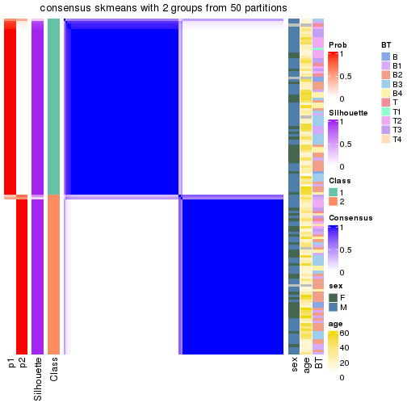</p>

</div>
<div id='tab-node-0-consensus-heatmap-2'>
<pre><code class="r">consensus_heatmap(res, k = 3)
</code></pre>

<p>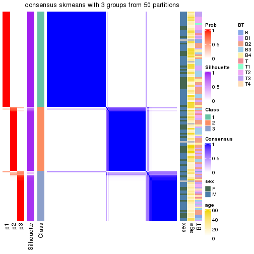</p>

</div>
<div id='tab-node-0-consensus-heatmap-3'>
<pre><code class="r">consensus_heatmap(res, k = 4)
</code></pre>

<p>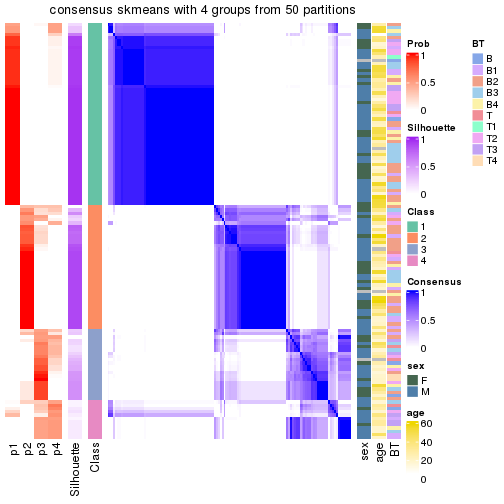</p>

</div>
</div>

Heatmaps for the membership of samples in all partitions to see how consistent they are:


<script>
$( function() {
	$( '#tabs-node-0-membership-heatmap' ).tabs();
} );
</script>
<div id='tabs-node-0-membership-heatmap'>
<ul>
<li><a href='#tab-node-0-membership-heatmap-1'>k = 2</a></li>
<li><a href='#tab-node-0-membership-heatmap-2'>k = 3</a></li>
<li><a href='#tab-node-0-membership-heatmap-3'>k = 4</a></li>
</ul>
<div id='tab-node-0-membership-heatmap-1'>
<pre><code class="r">membership_heatmap(res, k = 2)
</code></pre>

<p>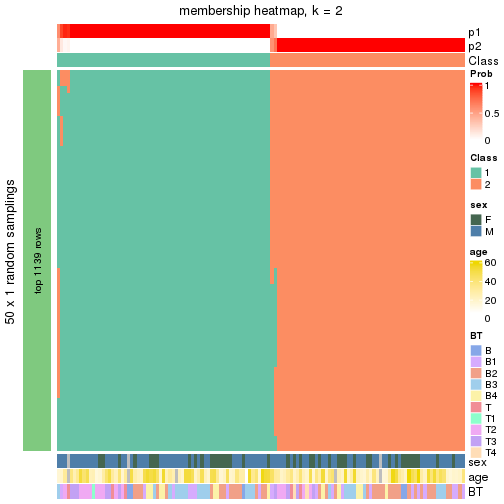</p>

</div>
<div id='tab-node-0-membership-heatmap-2'>
<pre><code class="r">membership_heatmap(res, k = 3)
</code></pre>

<p>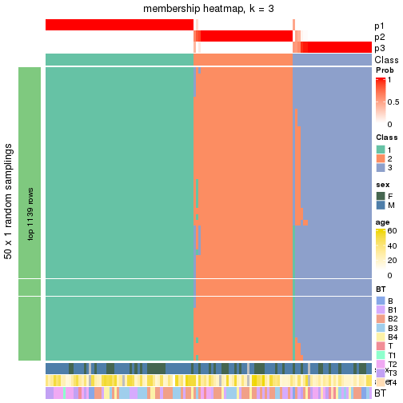</p>

</div>
<div id='tab-node-0-membership-heatmap-3'>
<pre><code class="r">membership_heatmap(res, k = 4)
</code></pre>

<p>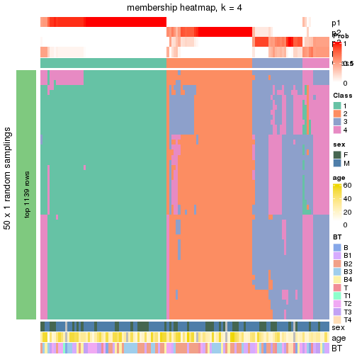</p>

</div>
</div>

As soon as the classes for columns are determined, the signatures
that are significantly different between subgroups can be looked for. 
Following are the heatmaps for signatures.


Signature heatmaps where rows are scaled:


<script>
$( function() {
	$( '#tabs-node-0-get-signatures' ).tabs();
} );
</script>
<div id='tabs-node-0-get-signatures'>
<ul>
<li><a href='#tab-node-0-get-signatures-1'>k = 2</a></li>
<li><a href='#tab-node-0-get-signatures-2'>k = 3</a></li>
<li><a href='#tab-node-0-get-signatures-3'>k = 4</a></li>
</ul>
<div id='tab-node-0-get-signatures-1'>
<pre><code class="r">get_signatures(res, k = 2)
</code></pre>

<p></p>

</div>
<div id='tab-node-0-get-signatures-2'>
<pre><code class="r">get_signatures(res, k = 3)
</code></pre>

<p>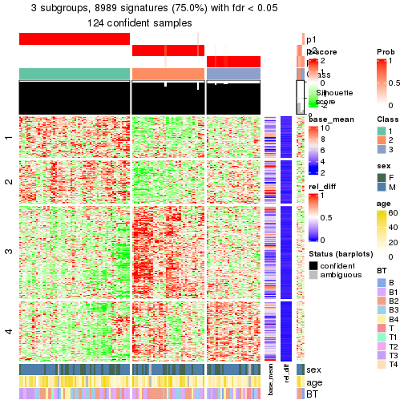</p>

</div>
<div id='tab-node-0-get-signatures-3'>
<pre><code class="r">get_signatures(res, k = 4)
</code></pre>

<p>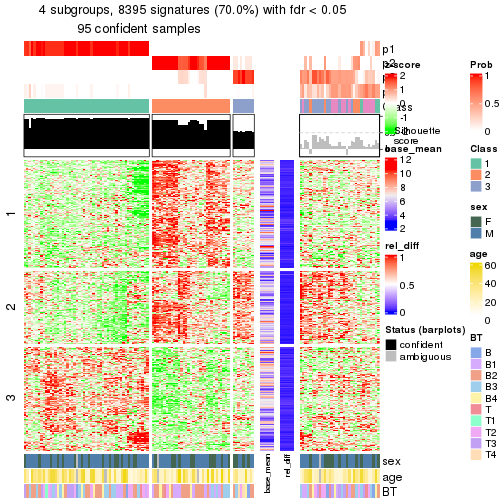</p>

</div>
</div>


Signature heatmaps where rows are not scaled:


<script>
$( function() {
	$( '#tabs-node-0-get-signatures-no-scale' ).tabs();
} );
</script>
<div id='tabs-node-0-get-signatures-no-scale'>
<ul>
<li><a href='#tab-node-0-get-signatures-no-scale-1'>k = 2</a></li>
<li><a href='#tab-node-0-get-signatures-no-scale-2'>k = 3</a></li>
<li><a href='#tab-node-0-get-signatures-no-scale-3'>k = 4</a></li>
</ul>
<div id='tab-node-0-get-signatures-no-scale-1'>
<pre><code class="r">get_signatures(res, k = 2, scale_rows = FALSE)
</code></pre>

<p>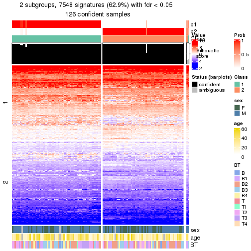</p>

</div>
<div id='tab-node-0-get-signatures-no-scale-2'>
<pre><code class="r">get_signatures(res, k = 3, scale_rows = FALSE)
</code></pre>

<p>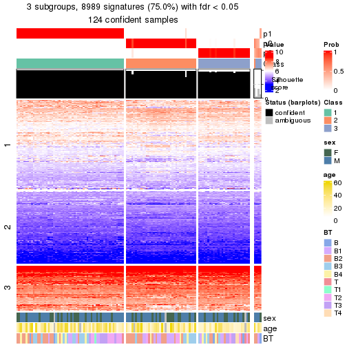</p>

</div>
<div id='tab-node-0-get-signatures-no-scale-3'>
<pre><code class="r">get_signatures(res, k = 4, scale_rows = FALSE)
</code></pre>

<p>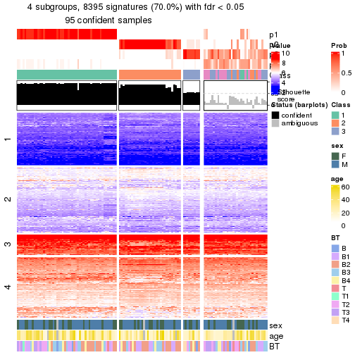</p>

</div>
</div>


Compare the overlap of signatures from different k:

```r
compare_signatures(res)
```

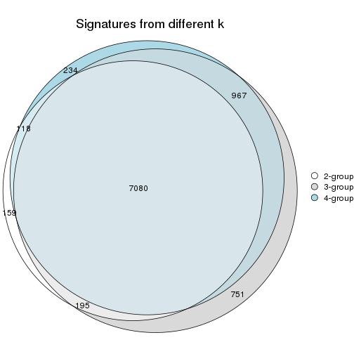

`get_signature()` returns a data frame invisibly. To get the list of signatures, the function
call should be assigned to a variable explicitly. In following code, if `plot` argument is set
to `FALSE`, no heatmap is plotted while only the differential analysis is performed.

```r
# code only for demonstration
tb = get_signature(res, k = ..., plot = FALSE)
```

An example of the output of `tb` is:

```
#>   which_row         fdr    mean_1    mean_2 scaled_mean_1 scaled_mean_2 km
#> 1        38 0.042760348  8.373488  9.131774    -0.5533452     0.5164555  1
#> 2        40 0.018707592  7.106213  8.469186    -0.6173731     0.5762149  1
#> 3        55 0.019134737 10.221463 11.207825    -0.6159697     0.5749050  1
#> 4        59 0.006059896  5.921854  7.869574    -0.6899429     0.6439467  1
#> 5        60 0.018055526  8.928898 10.211722    -0.6204761     0.5791110  1
#> 6        98 0.009384629 15.714769 14.887706     0.6635654    -0.6193277  2
...
```

The columns in `tb` are:

1. `which_row`: row indices corresponding to the input matrix.
2. `fdr`: FDR for the differential test. 
3. `mean_x`: The mean value in group x.
4. `scaled_mean_x`: The mean value in group x after rows are scaled.
5. `km`: Row groups if k-means clustering is applied to rows (which is done by automatically selecting number of clusters).

If there are too many signatures, `top_signatures = ...` can be set to only show the 
signatures with the highest FDRs:

```r
# code only for demonstration
# e.g. to show the top 500 most significant rows
tb = get_signature(res, k = ..., top_signatures = 500)
```

If the signatures are defined as these which are uniquely high in current group, `diff_method` argument
can be set to `"uniquely_high_in_one_group"`:

```r
# code only for demonstration
tb = get_signature(res, k = ..., diff_method = "uniquely_high_in_one_group")
```


UMAP plot which shows how samples are separated.


<script>
$( function() {
	$( '#tabs-node-0-dimension-reduction' ).tabs();
} );
</script>
<div id='tabs-node-0-dimension-reduction'>
<ul>
<li><a href='#tab-node-0-dimension-reduction-1'>k = 2</a></li>
<li><a href='#tab-node-0-dimension-reduction-2'>k = 3</a></li>
<li><a href='#tab-node-0-dimension-reduction-3'>k = 4</a></li>
</ul>
<div id='tab-node-0-dimension-reduction-1'>
<pre><code class="r">dimension_reduction(res, k = 2, method = &quot;UMAP&quot;)
</code></pre>

<p>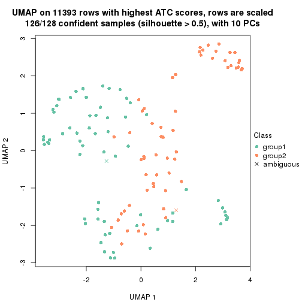</p>

</div>
<div id='tab-node-0-dimension-reduction-2'>
<pre><code class="r">dimension_reduction(res, k = 3, method = &quot;UMAP&quot;)
</code></pre>

<p>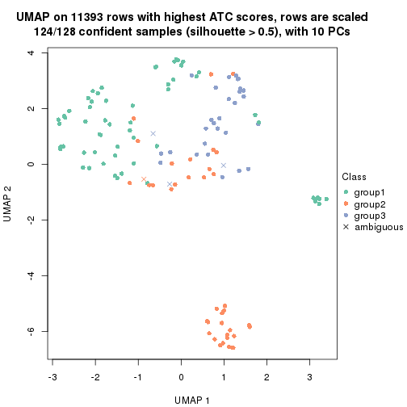</p>

</div>
<div id='tab-node-0-dimension-reduction-3'>
<pre><code class="r">dimension_reduction(res, k = 4, method = &quot;UMAP&quot;)
</code></pre>

<p>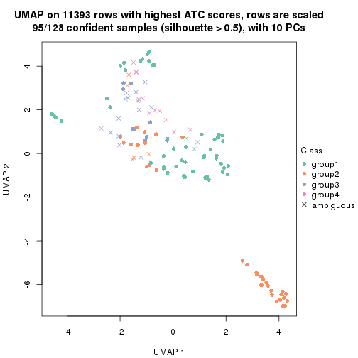</p>

</div>
</div>


Following heatmap shows how subgroups are split when increasing `k`:

```r
collect_classes(res)
```

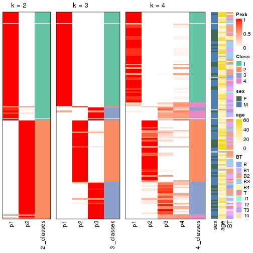


Test correlation between subgroups and known annotations. If the known
annotation is numeric, one-way ANOVA test is applied, and if the known
annotation is discrete, chi-squared contingency table test is applied.

```r
test_to_known_factors(res)
```

```
#>             n_sample sex(p-value) age(p-value) BT(p-value) k
#> ATC:skmeans      126        0.370       0.3787     0.58720 2
#> ATC:skmeans      124        0.820       0.0152     0.05971 3
#> ATC:skmeans       95        0.716       0.2768     0.00522 4
```


If matrix rows can be associated to genes, consider to use `functional_enrichment(res,
...)` to perform function enrichment for the signature genes. See [this vignette](https://jokergoo.github.io/cola_vignettes/functional_enrichment.html) for more detailed explanations.


 

---------------------------------------------------


### Node01


Parent node: [Node0](#Node0).
Child nodes: 
                [Node011](#Node011)
        ,
                [Node012](#Node012)
        ,
                Node013-leaf
        ,
                Node021-leaf
        ,
                [Node022](#Node022)
        ,
                Node023-leaf
        ,
                Node031-leaf
        ,
                Node032-leaf
        ,
                Node033-leaf
        .


The object with results only for a single top-value method and a single partitioning method 
can be extracted as:

```r
res = res_rh["01"]
```

A summary of `res` and all the functions that can be applied to it:

```r
res
```

```
#> A 'ConsensusPartition' object with k = 2, 3, 4.
#>   On a matrix with 11393 rows and 58 columns.
#>   Top rows (1139) are extracted by 'ATC' method.
#>   Subgroups are detected by 'skmeans' method.
#>   Performed in total 150 partitions by row resampling.
#>   Best k for subgroups seems to be 3.
#> 
#> Following methods can be applied to this 'ConsensusPartition' object:
#>  [1] "cola_report"             "collect_classes"         "collect_plots"          
#>  [4] "collect_stats"           "colnames"                "compare_partitions"     
#>  [7] "compare_signatures"      "consensus_heatmap"       "dimension_reduction"    
#> [10] "functional_enrichment"   "get_anno_col"            "get_anno"               
#> [13] "get_classes"             "get_consensus"           "get_matrix"             
#> [16] "get_membership"          "get_param"               "get_signatures"         
#> [19] "get_stats"               "is_best_k"               "is_stable_k"            
#> [22] "membership_heatmap"      "ncol"                    "nrow"                   
#> [25] "plot_ecdf"               "predict_classes"         "rownames"               
#> [28] "select_partition_number" "show"                    "suggest_best_k"         
#> [31] "test_to_known_factors"   "top_rows_heatmap"
```

`collect_plots()` function collects all the plots made from `res` for all `k` (number of subgroups)
into one single page to provide an easy and fast comparison between different `k`.

```r
collect_plots(res)
```

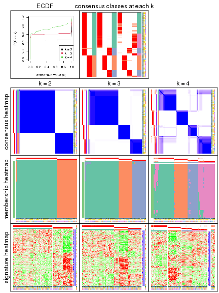

The plots are:

- The first row: a plot of the eCDF (empirical cumulative distribution
  function) curves of the consensus matrix for each `k` and the heatmap of
  predicted classes for each `k`.
- The second row: heatmaps of the consensus matrix for each `k`.
- The third row: heatmaps of the membership matrix for each `k`.
- The fouth row: heatmaps of the signatures for each `k`.

All the plots in panels can be made by individual functions and they are
plotted later in this section.

`select_partition_number()` produces several plots showing different
statistics for choosing "optimized" `k`. There are following statistics:

- eCDF curves of the consensus matrix for each `k`;
- 1-PAC. [The PAC score](https://en.wikipedia.org/wiki/Consensus_clustering#Over-interpretation_potential_of_consensus_clustering)
  measures the proportion of the ambiguous subgrouping.
- Mean silhouette score.
- Concordance. The mean probability of fiting the consensus subgroup labels in all
  partitions.
- Area increased. Denote $A_k$ as the area under the eCDF curve for current
  `k`, the area increased is defined as $A_k - A_{k-1}$.
- Rand index. The percent of pairs of samples that are both in a same cluster
  or both are not in a same cluster in the partition of k and k-1.
- Jaccard index. The ratio of pairs of samples are both in a same cluster in
  the partition of k and k-1 and the pairs of samples are both in a same
  cluster in the partition k or k-1.

The detailed explanations of these statistics can be found in [the _cola_
vignette](https://jokergoo.github.io/cola_vignettes/cola.html#toc_13).

Generally speaking, higher 1-PAC score, higher mean silhouette score or higher
concordance corresponds to better partition. Rand index and Jaccard index
measure how similar the current partition is compared to partition with `k-1`.
If they are too similar, we won't accept `k` is better than `k-1`.

```r
select_partition_number(res)
```

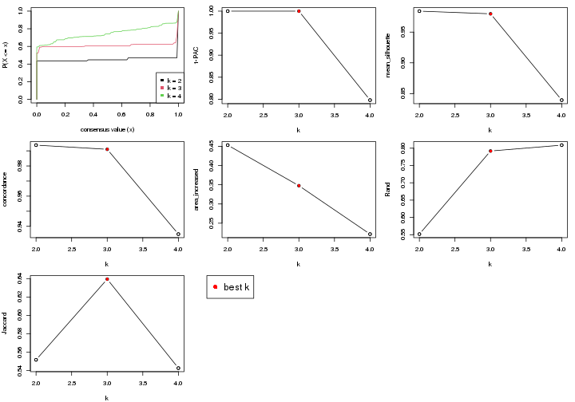

The numeric values for all these statistics can be obtained by `get_stats()`.

```r
get_stats(res)
```

```
#>   k 1-PAC mean_silhouette concordance area_increased  Rand Jaccard
#> 2 2 1.000           0.984       0.994          0.453 0.552   0.552
#> 3 3 1.000           0.980       0.991          0.348 0.792   0.639
#> 4 4 0.798           0.839       0.935          0.222 0.809   0.543
```

`suggest_best_k()` suggests the best $k$ based on these statistics. The rules are as follows:

- All $k$ with Jaccard index larger than 0.95 are removed because increasing
  $k$ does not provide enough extra information. If all $k$ are removed, it is
  marked as no subgroup is detected.
- For all $k$ with 1-PAC score larger than 0.9, the maximal $k$ is taken as
  the best $k$, and other $k$ are marked as optional $k$.
- If it does not fit the second rule. The $k$ with the maximal vote of the
  highest 1-PAC score, highest mean silhouette, and highest concordance is
  taken as the best $k$.

```r
suggest_best_k(res)
```

```
#> [1] 3
#> attr(,"optional")
#> [1] 2
```

There is also optional best $k$ = 2 that is worth to check.

Following is the table of the partitions (You need to click the **show/hide
code output** link to see it). The membership matrix (columns with name `p*`)
is inferred by
[`clue::cl_consensus()`](https://www.rdocumentation.org/link/cl_consensus?package=clue)
function with the `SE` method. Basically the value in the membership matrix
represents the probability to belong to a certain group. The finall subgroup
label for an item is determined with the group with highest probability it
belongs to.

In `get_classes()` function, the entropy is calculated from the membership
matrix and the silhouette score is calculated from the consensus matrix.


<script>
$( function() {
	$( '#tabs-node-01-get-classes' ).tabs();
} );
</script>
<div id='tabs-node-01-get-classes'>
<ul>
<li><a href='#tab-node-01-get-classes-1'>k = 2</a></li>
<li><a href='#tab-node-01-get-classes-2'>k = 3</a></li>
<li><a href='#tab-node-01-get-classes-3'>k = 4</a></li>
</ul>

<div id='tab-node-01-get-classes-1'>
<p><a id='tab-node-01-get-classes-1-a' style='color:#0366d6' href='#'>show/hide code output</a></p>
<pre><code class="r">cbind(get_classes(res, k = 2), get_membership(res, k = 2))
</code></pre>

<pre><code>#&gt;       class entropy silhouette   p1   p2
#&gt; 01005     1   0.943      0.437 0.64 0.36
#&gt; 03002     1   0.000      0.990 1.00 0.00
#&gt; 04007     1   0.000      0.990 1.00 0.00
#&gt; 04016     1   0.000      0.990 1.00 0.00
#&gt; 08001     1   0.000      0.990 1.00 0.00
#&gt; 08011     1   0.000      0.990 1.00 0.00
#&gt; 08012     1   0.000      0.990 1.00 0.00
#&gt; 08018     2   0.000      1.000 0.00 1.00
#&gt; 11005     2   0.000      1.000 0.00 1.00
#&gt; 12007     1   0.000      0.990 1.00 0.00
#&gt; 22011     1   0.000      0.990 1.00 0.00
#&gt; 24001     1   0.000      0.990 1.00 0.00
#&gt; 24005     1   0.000      0.990 1.00 0.00
#&gt; 24008     2   0.000      1.000 0.00 1.00
#&gt; 24010     2   0.000      1.000 0.00 1.00
#&gt; 24022     1   0.000      0.990 1.00 0.00
#&gt; 26003     1   0.000      0.990 1.00 0.00
#&gt; 27004     1   0.000      0.990 1.00 0.00
#&gt; 28005     1   0.000      0.990 1.00 0.00
#&gt; 28006     2   0.000      1.000 0.00 1.00
#&gt; 28007     1   0.000      0.990 1.00 0.00
#&gt; 28023     1   0.000      0.990 1.00 0.00
#&gt; 28024     1   0.000      0.990 1.00 0.00
#&gt; 28028     1   0.000      0.990 1.00 0.00
#&gt; 28032     1   0.000      0.990 1.00 0.00
#&gt; 28036     1   0.000      0.990 1.00 0.00
#&gt; 28043     1   0.000      0.990 1.00 0.00
#&gt; 28047     2   0.000      1.000 0.00 1.00
#&gt; 31011     1   0.000      0.990 1.00 0.00
#&gt; 36002     1   0.000      0.990 1.00 0.00
#&gt; 43007     2   0.000      1.000 0.00 1.00
#&gt; 49006     2   0.000      1.000 0.00 1.00
#&gt; 57001     1   0.000      0.990 1.00 0.00
#&gt; 62001     1   0.000      0.990 1.00 0.00
#&gt; 62002     1   0.000      0.990 1.00 0.00
#&gt; 63001     2   0.000      1.000 0.00 1.00
#&gt; 64001     1   0.000      0.990 1.00 0.00
#&gt; 65005     1   0.000      0.990 1.00 0.00
#&gt; 68003     1   0.000      0.990 1.00 0.00
#&gt; 84004     1   0.000      0.990 1.00 0.00
#&gt; LAL5      1   0.000      0.990 1.00 0.00
#&gt; 04018     1   0.000      0.990 1.00 0.00
#&gt; 09002     2   0.000      1.000 0.00 1.00
#&gt; 10005     2   0.000      1.000 0.00 1.00
#&gt; 11002     2   0.000      1.000 0.00 1.00
#&gt; 16002     1   0.000      0.990 1.00 0.00
#&gt; 16007     1   0.000      0.990 1.00 0.00
#&gt; 18001     1   0.000      0.990 1.00 0.00
#&gt; 19008     2   0.000      1.000 0.00 1.00
#&gt; 19017     2   0.000      1.000 0.00 1.00
#&gt; 20005     1   0.000      0.990 1.00 0.00
#&gt; 28008     2   0.000      1.000 0.00 1.00
#&gt; 31015     2   0.000      1.000 0.00 1.00
#&gt; 43006     2   0.000      1.000 0.00 1.00
#&gt; 43015     1   0.000      0.990 1.00 0.00
#&gt; 44001     2   0.000      1.000 0.00 1.00
#&gt; 49004     2   0.000      1.000 0.00 1.00
#&gt; 56007     1   0.000      0.990 1.00 0.00
</code></pre>

<script>
$('#tab-node-01-get-classes-1-a').parent().next().next().hide();
$('#tab-node-01-get-classes-1-a').click(function(){
  $('#tab-node-01-get-classes-1-a').parent().next().next().toggle();
  return(false);
});
</script>
</div>

<div id='tab-node-01-get-classes-2'>
<p><a id='tab-node-01-get-classes-2-a' style='color:#0366d6' href='#'>show/hide code output</a></p>
<pre><code class="r">cbind(get_classes(res, k = 3), get_membership(res, k = 3))
</code></pre>

<pre><code>#&gt;       class entropy silhouette   p1   p2   p3
#&gt; 01005     3  0.0000      0.994 0.00 0.00 1.00
#&gt; 03002     3  0.0000      0.994 0.00 0.00 1.00
#&gt; 04007     1  0.0000      0.985 1.00 0.00 0.00
#&gt; 04016     1  0.0000      0.985 1.00 0.00 0.00
#&gt; 08001     1  0.0000      0.985 1.00 0.00 0.00
#&gt; 08011     3  0.0892      0.976 0.02 0.00 0.98
#&gt; 08012     1  0.0000      0.985 1.00 0.00 0.00
#&gt; 08018     3  0.0000      0.994 0.00 0.00 1.00
#&gt; 11005     3  0.0000      0.994 0.00 0.00 1.00
#&gt; 12007     3  0.0000      0.994 0.00 0.00 1.00
#&gt; 22011     3  0.0892      0.976 0.02 0.00 0.98
#&gt; 24001     1  0.0000      0.985 1.00 0.00 0.00
#&gt; 24005     1  0.0000      0.985 1.00 0.00 0.00
#&gt; 24008     2  0.0000      1.000 0.00 1.00 0.00
#&gt; 24010     2  0.0000      1.000 0.00 1.00 0.00
#&gt; 24022     1  0.0000      0.985 1.00 0.00 0.00
#&gt; 26003     1  0.0892      0.972 0.98 0.00 0.02
#&gt; 27004     1  0.0000      0.985 1.00 0.00 0.00
#&gt; 28005     1  0.0000      0.985 1.00 0.00 0.00
#&gt; 28006     2  0.0000      1.000 0.00 1.00 0.00
#&gt; 28007     1  0.0000      0.985 1.00 0.00 0.00
#&gt; 28023     1  0.0000      0.985 1.00 0.00 0.00
#&gt; 28024     1  0.0000      0.985 1.00 0.00 0.00
#&gt; 28028     1  0.0000      0.985 1.00 0.00 0.00
#&gt; 28032     1  0.0892      0.972 0.98 0.00 0.02
#&gt; 28036     1  0.0892      0.972 0.98 0.00 0.02
#&gt; 28043     1  0.0000      0.985 1.00 0.00 0.00
#&gt; 28047     2  0.0000      1.000 0.00 1.00 0.00
#&gt; 31011     1  0.0000      0.985 1.00 0.00 0.00
#&gt; 36002     1  0.0000      0.985 1.00 0.00 0.00
#&gt; 43007     2  0.0000      1.000 0.00 1.00 0.00
#&gt; 49006     3  0.0892      0.977 0.00 0.02 0.98
#&gt; 57001     1  0.0000      0.985 1.00 0.00 0.00
#&gt; 62001     1  0.0000      0.985 1.00 0.00 0.00
#&gt; 62002     1  0.0000      0.985 1.00 0.00 0.00
#&gt; 63001     2  0.0000      1.000 0.00 1.00 0.00
#&gt; 64001     1  0.0000      0.985 1.00 0.00 0.00
#&gt; 65005     1  0.0000      0.985 1.00 0.00 0.00
#&gt; 68003     1  0.0000      0.985 1.00 0.00 0.00
#&gt; 84004     1  0.0000      0.985 1.00 0.00 0.00
#&gt; LAL5      3  0.0000      0.994 0.00 0.00 1.00
#&gt; 04018     1  0.0892      0.972 0.98 0.00 0.02
#&gt; 09002     3  0.0000      0.994 0.00 0.00 1.00
#&gt; 10005     2  0.0000      1.000 0.00 1.00 0.00
#&gt; 11002     2  0.0000      1.000 0.00 1.00 0.00
#&gt; 16002     1  0.0000      0.985 1.00 0.00 0.00
#&gt; 16007     1  0.0000      0.985 1.00 0.00 0.00
#&gt; 18001     1  0.0000      0.985 1.00 0.00 0.00
#&gt; 19008     2  0.0000      1.000 0.00 1.00 0.00
#&gt; 19017     2  0.0000      1.000 0.00 1.00 0.00
#&gt; 20005     1  0.1529      0.954 0.96 0.00 0.04
#&gt; 28008     2  0.0000      1.000 0.00 1.00 0.00
#&gt; 31015     2  0.0000      1.000 0.00 1.00 0.00
#&gt; 43006     3  0.0000      0.994 0.00 0.00 1.00
#&gt; 43015     1  0.5835      0.498 0.66 0.00 0.34
#&gt; 44001     2  0.0000      1.000 0.00 1.00 0.00
#&gt; 49004     3  0.0000      0.994 0.00 0.00 1.00
#&gt; 56007     3  0.0000      0.994 0.00 0.00 1.00
</code></pre>

<script>
$('#tab-node-01-get-classes-2-a').parent().next().next().hide();
$('#tab-node-01-get-classes-2-a').click(function(){
  $('#tab-node-01-get-classes-2-a').parent().next().next().toggle();
  return(false);
});
</script>
</div>

<div id='tab-node-01-get-classes-3'>
<p><a id='tab-node-01-get-classes-3-a' style='color:#0366d6' href='#'>show/hide code output</a></p>
<pre><code class="r">cbind(get_classes(res, k = 4), get_membership(res, k = 4))
</code></pre>

<pre><code>#&gt;       class entropy silhouette   p1  p2   p3   p4
#&gt; 01005     3  0.0000     0.9475 0.00 0.0 1.00 0.00
#&gt; 03002     3  0.3610     0.7590 0.00 0.0 0.80 0.20
#&gt; 04007     1  0.0000     0.8885 1.00 0.0 0.00 0.00
#&gt; 04016     1  0.0000     0.8885 1.00 0.0 0.00 0.00
#&gt; 08001     4  0.2921     0.8098 0.14 0.0 0.00 0.86
#&gt; 08011     3  0.0000     0.9475 0.00 0.0 1.00 0.00
#&gt; 08012     1  0.0000     0.8885 1.00 0.0 0.00 0.00
#&gt; 08018     3  0.0000     0.9475 0.00 0.0 1.00 0.00
#&gt; 11005     3  0.0000     0.9475 0.00 0.0 1.00 0.00
#&gt; 12007     3  0.2647     0.8633 0.00 0.0 0.88 0.12
#&gt; 22011     3  0.2647     0.8496 0.12 0.0 0.88 0.00
#&gt; 24001     1  0.0000     0.8885 1.00 0.0 0.00 0.00
#&gt; 24005     1  0.0000     0.8885 1.00 0.0 0.00 0.00
#&gt; 24008     2  0.0000     0.9833 0.00 1.0 0.00 0.00
#&gt; 24010     2  0.0000     0.9833 0.00 1.0 0.00 0.00
#&gt; 24022     4  0.2921     0.8098 0.14 0.0 0.00 0.86
#&gt; 26003     4  0.0000     0.8935 0.00 0.0 0.00 1.00
#&gt; 27004     1  0.0000     0.8885 1.00 0.0 0.00 0.00
#&gt; 28005     1  0.0000     0.8885 1.00 0.0 0.00 0.00
#&gt; 28006     2  0.0000     0.9833 0.00 1.0 0.00 0.00
#&gt; 28007     1  0.0000     0.8885 1.00 0.0 0.00 0.00
#&gt; 28023     1  0.0000     0.8885 1.00 0.0 0.00 0.00
#&gt; 28024     1  0.0000     0.8885 1.00 0.0 0.00 0.00
#&gt; 28028     4  0.2345     0.8418 0.10 0.0 0.00 0.90
#&gt; 28032     4  0.0000     0.8935 0.00 0.0 0.00 1.00
#&gt; 28036     4  0.0000     0.8935 0.00 0.0 0.00 1.00
#&gt; 28043     4  0.0000     0.8935 0.00 0.0 0.00 1.00
#&gt; 28047     2  0.0000     0.9833 0.00 1.0 0.00 0.00
#&gt; 31011     1  0.4977     0.1824 0.54 0.0 0.00 0.46
#&gt; 36002     1  0.4406     0.5603 0.70 0.0 0.00 0.30
#&gt; 43007     2  0.3610     0.7555 0.00 0.8 0.20 0.00
#&gt; 49006     3  0.0000     0.9475 0.00 0.0 1.00 0.00
#&gt; 57001     1  0.4994     0.0627 0.52 0.0 0.00 0.48
#&gt; 62001     4  0.3801     0.6770 0.22 0.0 0.00 0.78
#&gt; 62002     4  0.4994    -0.0137 0.48 0.0 0.00 0.52
#&gt; 63001     2  0.0000     0.9833 0.00 1.0 0.00 0.00
#&gt; 64001     1  0.0000     0.8885 1.00 0.0 0.00 0.00
#&gt; 65005     1  0.0000     0.8885 1.00 0.0 0.00 0.00
#&gt; 68003     4  0.0707     0.8867 0.02 0.0 0.00 0.98
#&gt; 84004     1  0.0000     0.8885 1.00 0.0 0.00 0.00
#&gt; LAL5      4  0.0000     0.8935 0.00 0.0 0.00 1.00
#&gt; 04018     4  0.0000     0.8935 0.00 0.0 0.00 1.00
#&gt; 09002     3  0.0000     0.9475 0.00 0.0 1.00 0.00
#&gt; 10005     2  0.0000     0.9833 0.00 1.0 0.00 0.00
#&gt; 11002     2  0.0000     0.9833 0.00 1.0 0.00 0.00
#&gt; 16002     1  0.4855     0.3615 0.60 0.0 0.00 0.40
#&gt; 16007     1  0.0707     0.8760 0.98 0.0 0.02 0.00
#&gt; 18001     1  0.2647     0.7894 0.88 0.0 0.00 0.12
#&gt; 19008     2  0.0000     0.9833 0.00 1.0 0.00 0.00
#&gt; 19017     2  0.0000     0.9833 0.00 1.0 0.00 0.00
#&gt; 20005     4  0.0000     0.8935 0.00 0.0 0.00 1.00
#&gt; 28008     2  0.0000     0.9833 0.00 1.0 0.00 0.00
#&gt; 31015     2  0.0000     0.9833 0.00 1.0 0.00 0.00
#&gt; 43006     4  0.4134     0.5892 0.00 0.0 0.26 0.74
#&gt; 43015     4  0.0000     0.8935 0.00 0.0 0.00 1.00
#&gt; 44001     2  0.0000     0.9833 0.00 1.0 0.00 0.00
#&gt; 49004     3  0.0000     0.9475 0.00 0.0 1.00 0.00
#&gt; 56007     4  0.0000     0.8935 0.00 0.0 0.00 1.00
</code></pre>

<script>
$('#tab-node-01-get-classes-3-a').parent().next().next().hide();
$('#tab-node-01-get-classes-3-a').click(function(){
  $('#tab-node-01-get-classes-3-a').parent().next().next().toggle();
  return(false);
});
</script>
</div>
</div>

Heatmaps for the consensus matrix. It visualizes the probability of two
samples to be in a same group.


<script>
$( function() {
	$( '#tabs-node-01-consensus-heatmap' ).tabs();
} );
</script>
<div id='tabs-node-01-consensus-heatmap'>
<ul>
<li><a href='#tab-node-01-consensus-heatmap-1'>k = 2</a></li>
<li><a href='#tab-node-01-consensus-heatmap-2'>k = 3</a></li>
<li><a href='#tab-node-01-consensus-heatmap-3'>k = 4</a></li>
</ul>
<div id='tab-node-01-consensus-heatmap-1'>
<pre><code class="r">consensus_heatmap(res, k = 2)
</code></pre>

<p>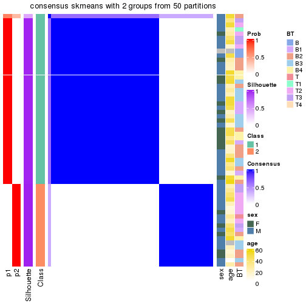</p>

</div>
<div id='tab-node-01-consensus-heatmap-2'>
<pre><code class="r">consensus_heatmap(res, k = 3)
</code></pre>

<p>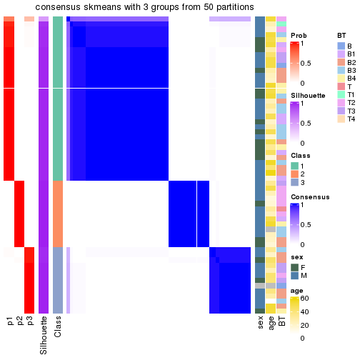</p>

</div>
<div id='tab-node-01-consensus-heatmap-3'>
<pre><code class="r">consensus_heatmap(res, k = 4)
</code></pre>

<p>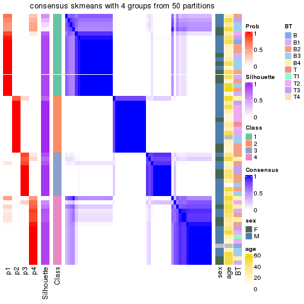</p>

</div>
</div>

Heatmaps for the membership of samples in all partitions to see how consistent they are:


<script>
$( function() {
	$( '#tabs-node-01-membership-heatmap' ).tabs();
} );
</script>
<div id='tabs-node-01-membership-heatmap'>
<ul>
<li><a href='#tab-node-01-membership-heatmap-1'>k = 2</a></li>
<li><a href='#tab-node-01-membership-heatmap-2'>k = 3</a></li>
<li><a href='#tab-node-01-membership-heatmap-3'>k = 4</a></li>
</ul>
<div id='tab-node-01-membership-heatmap-1'>
<pre><code class="r">membership_heatmap(res, k = 2)
</code></pre>

<p>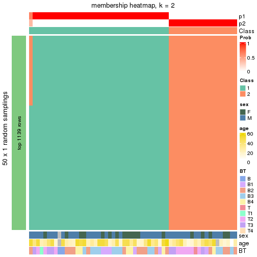</p>

</div>
<div id='tab-node-01-membership-heatmap-2'>
<pre><code class="r">membership_heatmap(res, k = 3)
</code></pre>

<p>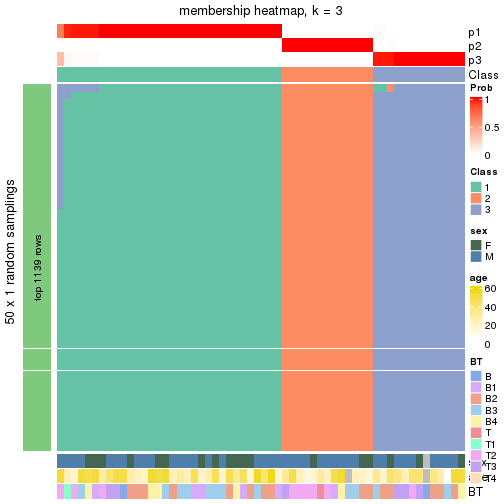</p>

</div>
<div id='tab-node-01-membership-heatmap-3'>
<pre><code class="r">membership_heatmap(res, k = 4)
</code></pre>

<p>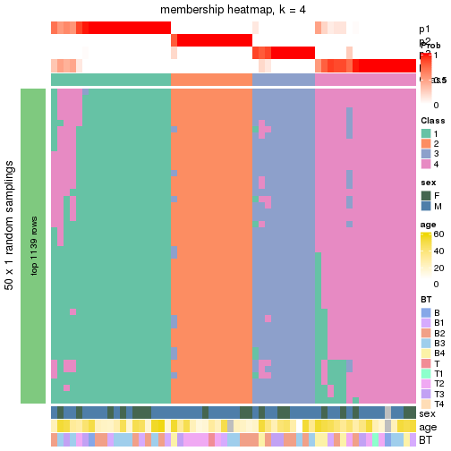</p>

</div>
</div>

As soon as the classes for columns are determined, the signatures
that are significantly different between subgroups can be looked for. 
Following are the heatmaps for signatures.


Signature heatmaps where rows are scaled:


<script>
$( function() {
	$( '#tabs-node-01-get-signatures' ).tabs();
} );
</script>
<div id='tabs-node-01-get-signatures'>
<ul>
<li><a href='#tab-node-01-get-signatures-1'>k = 2</a></li>
<li><a href='#tab-node-01-get-signatures-2'>k = 3</a></li>
<li><a href='#tab-node-01-get-signatures-3'>k = 4</a></li>
</ul>
<div id='tab-node-01-get-signatures-1'>
<pre><code class="r">get_signatures(res, k = 2)
</code></pre>

<p>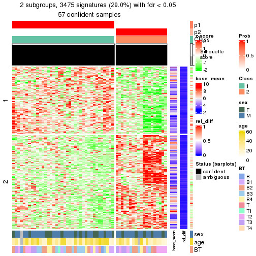</p>

</div>
<div id='tab-node-01-get-signatures-2'>
<pre><code class="r">get_signatures(res, k = 3)
</code></pre>

<p>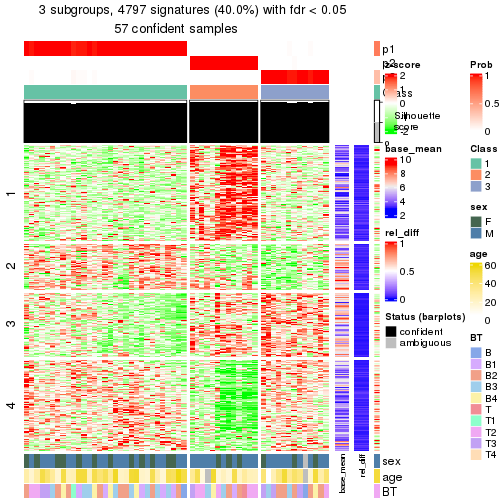</p>

</div>
<div id='tab-node-01-get-signatures-3'>
<pre><code class="r">get_signatures(res, k = 4)
</code></pre>

<p>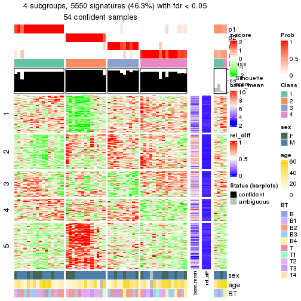</p>

</div>
</div>


Signature heatmaps where rows are not scaled:


<script>
$( function() {
	$( '#tabs-node-01-get-signatures-no-scale' ).tabs();
} );
</script>
<div id='tabs-node-01-get-signatures-no-scale'>
<ul>
<li><a href='#tab-node-01-get-signatures-no-scale-1'>k = 2</a></li>
<li><a href='#tab-node-01-get-signatures-no-scale-2'>k = 3</a></li>
<li><a href='#tab-node-01-get-signatures-no-scale-3'>k = 4</a></li>
</ul>
<div id='tab-node-01-get-signatures-no-scale-1'>
<pre><code class="r">get_signatures(res, k = 2, scale_rows = FALSE)
</code></pre>

<p>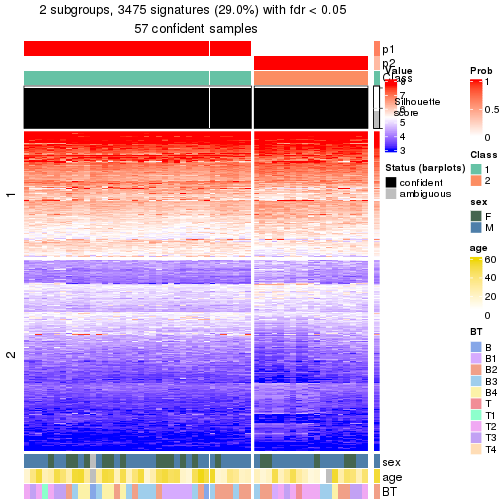</p>

</div>
<div id='tab-node-01-get-signatures-no-scale-2'>
<pre><code class="r">get_signatures(res, k = 3, scale_rows = FALSE)
</code></pre>

<p>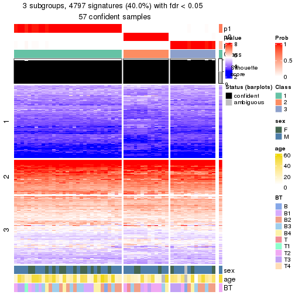</p>

</div>
<div id='tab-node-01-get-signatures-no-scale-3'>
<pre><code class="r">get_signatures(res, k = 4, scale_rows = FALSE)
</code></pre>

<p>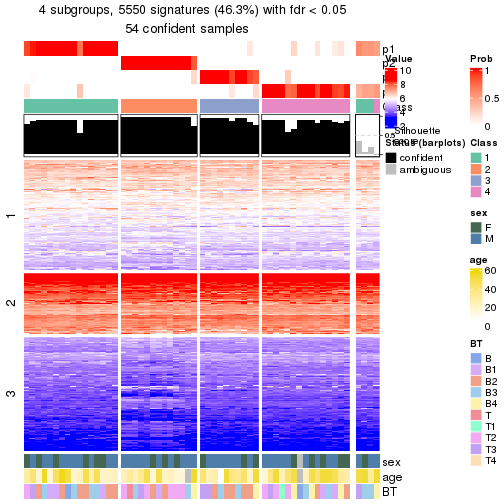</p>

</div>
</div>


Compare the overlap of signatures from different k:

```r
compare_signatures(res)
```

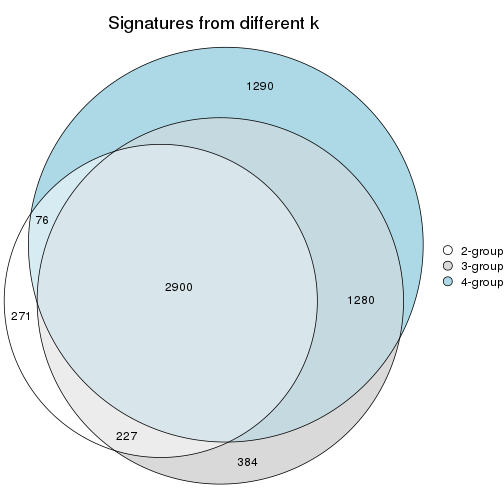

`get_signature()` returns a data frame invisibly. To get the list of signatures, the function
call should be assigned to a variable explicitly. In following code, if `plot` argument is set
to `FALSE`, no heatmap is plotted while only the differential analysis is performed.

```r
# code only for demonstration
tb = get_signature(res, k = ..., plot = FALSE)
```

An example of the output of `tb` is:

```
#>   which_row         fdr    mean_1    mean_2 scaled_mean_1 scaled_mean_2 km
#> 1        38 0.042760348  8.373488  9.131774    -0.5533452     0.5164555  1
#> 2        40 0.018707592  7.106213  8.469186    -0.6173731     0.5762149  1
#> 3        55 0.019134737 10.221463 11.207825    -0.6159697     0.5749050  1
#> 4        59 0.006059896  5.921854  7.869574    -0.6899429     0.6439467  1
#> 5        60 0.018055526  8.928898 10.211722    -0.6204761     0.5791110  1
#> 6        98 0.009384629 15.714769 14.887706     0.6635654    -0.6193277  2
...
```

The columns in `tb` are:

1. `which_row`: row indices corresponding to the input matrix.
2. `fdr`: FDR for the differential test. 
3. `mean_x`: The mean value in group x.
4. `scaled_mean_x`: The mean value in group x after rows are scaled.
5. `km`: Row groups if k-means clustering is applied to rows (which is done by automatically selecting number of clusters).

If there are too many signatures, `top_signatures = ...` can be set to only show the 
signatures with the highest FDRs:

```r
# code only for demonstration
# e.g. to show the top 500 most significant rows
tb = get_signature(res, k = ..., top_signatures = 500)
```

If the signatures are defined as these which are uniquely high in current group, `diff_method` argument
can be set to `"uniquely_high_in_one_group"`:

```r
# code only for demonstration
tb = get_signature(res, k = ..., diff_method = "uniquely_high_in_one_group")
```


UMAP plot which shows how samples are separated.


<script>
$( function() {
	$( '#tabs-node-01-dimension-reduction' ).tabs();
} );
</script>
<div id='tabs-node-01-dimension-reduction'>
<ul>
<li><a href='#tab-node-01-dimension-reduction-1'>k = 2</a></li>
<li><a href='#tab-node-01-dimension-reduction-2'>k = 3</a></li>
<li><a href='#tab-node-01-dimension-reduction-3'>k = 4</a></li>
</ul>
<div id='tab-node-01-dimension-reduction-1'>
<pre><code class="r">dimension_reduction(res, k = 2, method = &quot;UMAP&quot;)
</code></pre>

<p>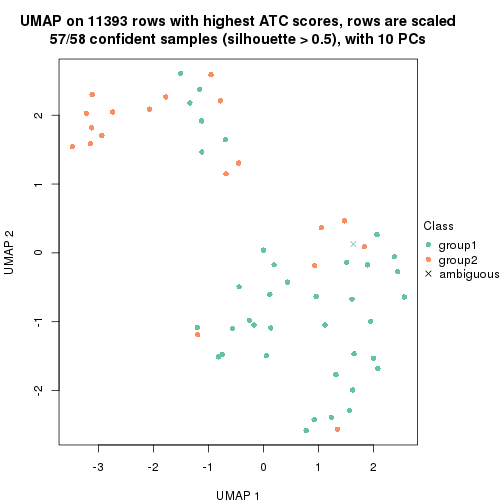</p>

</div>
<div id='tab-node-01-dimension-reduction-2'>
<pre><code class="r">dimension_reduction(res, k = 3, method = &quot;UMAP&quot;)
</code></pre>

<p>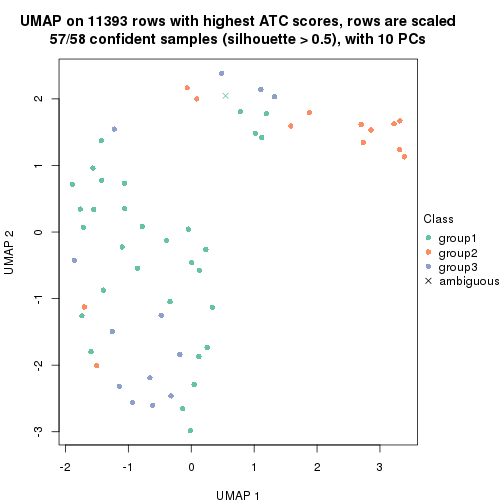</p>

</div>
<div id='tab-node-01-dimension-reduction-3'>
<pre><code class="r">dimension_reduction(res, k = 4, method = &quot;UMAP&quot;)
</code></pre>

<p>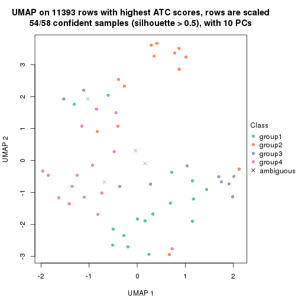</p>

</div>
</div>


Following heatmap shows how subgroups are split when increasing `k`:

```r
collect_classes(res)
```

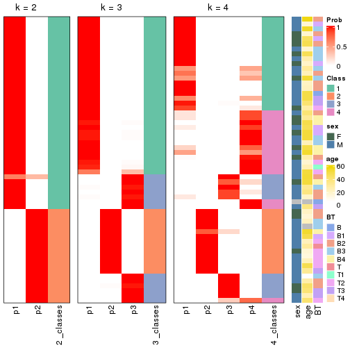


Test correlation between subgroups and known annotations. If the known
annotation is numeric, one-way ANOVA test is applied, and if the known
annotation is discrete, chi-squared contingency table test is applied.

```r
test_to_known_factors(res)
```

```
#>             n_sample sex(p-value) age(p-value) BT(p-value) k
#> ATC:skmeans       57        0.714       0.0649       0.215 2
#> ATC:skmeans       57        0.501       0.3076       0.227 3
#> ATC:skmeans       54        0.848       0.3282       0.370 4
```


If matrix rows can be associated to genes, consider to use `functional_enrichment(res,
...)` to perform function enrichment for the signature genes. See [this vignette](https://jokergoo.github.io/cola_vignettes/functional_enrichment.html) for more detailed explanations.


 

---------------------------------------------------


### Node011


Parent node: [Node01](#Node01).
Child nodes: 
                Node0111-leaf
        ,
                Node0112-leaf
        ,
                Node0113-leaf
        ,
                Node0114-leaf
        ,
                Node0121-leaf
        ,
                Node0122-leaf
        ,
                Node0123-leaf
        ,
                Node0221-leaf
        ,
                Node0222-leaf
        .


The object with results only for a single top-value method and a single partitioning method 
can be extracted as:

```r
res = res_rh["011"]
```

A summary of `res` and all the functions that can be applied to it:

```r
res
```

```
#> A 'ConsensusPartition' object with k = 2, 3, 4.
#>   On a matrix with 11393 rows and 32 columns.
#>   Top rows (1139) are extracted by 'ATC' method.
#>   Subgroups are detected by 'skmeans' method.
#>   Performed in total 150 partitions by row resampling.
#>   Best k for subgroups seems to be 4.
#> 
#> Following methods can be applied to this 'ConsensusPartition' object:
#>  [1] "cola_report"             "collect_classes"         "collect_plots"          
#>  [4] "collect_stats"           "colnames"                "compare_partitions"     
#>  [7] "compare_signatures"      "consensus_heatmap"       "dimension_reduction"    
#> [10] "functional_enrichment"   "get_anno_col"            "get_anno"               
#> [13] "get_classes"             "get_consensus"           "get_matrix"             
#> [16] "get_membership"          "get_param"               "get_signatures"         
#> [19] "get_stats"               "is_best_k"               "is_stable_k"            
#> [22] "membership_heatmap"      "ncol"                    "nrow"                   
#> [25] "plot_ecdf"               "predict_classes"         "rownames"               
#> [28] "select_partition_number" "show"                    "suggest_best_k"         
#> [31] "test_to_known_factors"   "top_rows_heatmap"
```

`collect_plots()` function collects all the plots made from `res` for all `k` (number of subgroups)
into one single page to provide an easy and fast comparison between different `k`.

```r
collect_plots(res)
```

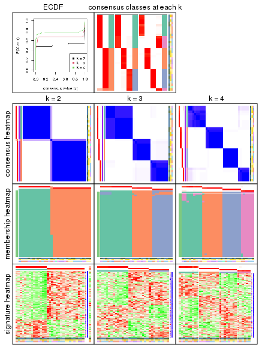

The plots are:

- The first row: a plot of the eCDF (empirical cumulative distribution
  function) curves of the consensus matrix for each `k` and the heatmap of
  predicted classes for each `k`.
- The second row: heatmaps of the consensus matrix for each `k`.
- The third row: heatmaps of the membership matrix for each `k`.
- The fouth row: heatmaps of the signatures for each `k`.

All the plots in panels can be made by individual functions and they are
plotted later in this section.

`select_partition_number()` produces several plots showing different
statistics for choosing "optimized" `k`. There are following statistics:

- eCDF curves of the consensus matrix for each `k`;
- 1-PAC. [The PAC score](https://en.wikipedia.org/wiki/Consensus_clustering#Over-interpretation_potential_of_consensus_clustering)
  measures the proportion of the ambiguous subgrouping.
- Mean silhouette score.
- Concordance. The mean probability of fiting the consensus subgroup labels in all
  partitions.
- Area increased. Denote $A_k$ as the area under the eCDF curve for current
  `k`, the area increased is defined as $A_k - A_{k-1}$.
- Rand index. The percent of pairs of samples that are both in a same cluster
  or both are not in a same cluster in the partition of k and k-1.
- Jaccard index. The ratio of pairs of samples are both in a same cluster in
  the partition of k and k-1 and the pairs of samples are both in a same
  cluster in the partition k or k-1.

The detailed explanations of these statistics can be found in [the _cola_
vignette](https://jokergoo.github.io/cola_vignettes/cola.html#toc_13).

Generally speaking, higher 1-PAC score, higher mean silhouette score or higher
concordance corresponds to better partition. Rand index and Jaccard index
measure how similar the current partition is compared to partition with `k-1`.
If they are too similar, we won't accept `k` is better than `k-1`.

```r
select_partition_number(res)
```

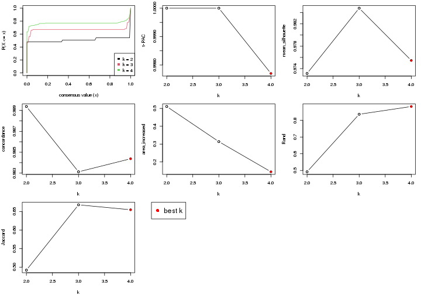

The numeric values for all these statistics can be obtained by `get_stats()`.

```r
get_stats(res)
```

```
#>   k 1-PAC mean_silhouette concordance area_increased  Rand Jaccard
#> 2 2 1.000           0.973       0.989          0.511 0.492   0.492
#> 3 3 1.000           0.985       0.983          0.314 0.837   0.668
#> 4 4 0.998           0.975       0.984          0.145 0.883   0.655
```

`suggest_best_k()` suggests the best $k$ based on these statistics. The rules are as follows:

- All $k$ with Jaccard index larger than 0.95 are removed because increasing
  $k$ does not provide enough extra information. If all $k$ are removed, it is
  marked as no subgroup is detected.
- For all $k$ with 1-PAC score larger than 0.9, the maximal $k$ is taken as
  the best $k$, and other $k$ are marked as optional $k$.
- If it does not fit the second rule. The $k$ with the maximal vote of the
  highest 1-PAC score, highest mean silhouette, and highest concordance is
  taken as the best $k$.

```r
suggest_best_k(res)
```

```
#> [1] 4
#> attr(,"optional")
#> [1] 2 3
```

There is also optional best $k$ = 2 3 that is worth to check.

Following is the table of the partitions (You need to click the **show/hide
code output** link to see it). The membership matrix (columns with name `p*`)
is inferred by
[`clue::cl_consensus()`](https://www.rdocumentation.org/link/cl_consensus?package=clue)
function with the `SE` method. Basically the value in the membership matrix
represents the probability to belong to a certain group. The finall subgroup
label for an item is determined with the group with highest probability it
belongs to.

In `get_classes()` function, the entropy is calculated from the membership
matrix and the silhouette score is calculated from the consensus matrix.


<script>
$( function() {
	$( '#tabs-node-011-get-classes' ).tabs();
} );
</script>
<div id='tabs-node-011-get-classes'>
<ul>
<li><a href='#tab-node-011-get-classes-1'>k = 2</a></li>
<li><a href='#tab-node-011-get-classes-2'>k = 3</a></li>
<li><a href='#tab-node-011-get-classes-3'>k = 4</a></li>
</ul>

<div id='tab-node-011-get-classes-1'>
<p><a id='tab-node-011-get-classes-1-a' style='color:#0366d6' href='#'>show/hide code output</a></p>
<pre><code class="r">cbind(get_classes(res, k = 2), get_membership(res, k = 2))
</code></pre>

<pre><code>#&gt;       class entropy silhouette   p1   p2
#&gt; 04007     1   0.000      1.000 1.00 0.00
#&gt; 04016     1   0.000      1.000 1.00 0.00
#&gt; 08001     1   0.000      1.000 1.00 0.00
#&gt; 08012     1   0.000      1.000 1.00 0.00
#&gt; 24001     1   0.000      1.000 1.00 0.00
#&gt; 24005     1   0.000      1.000 1.00 0.00
#&gt; 24022     2   0.000      0.980 0.00 1.00
#&gt; 26003     2   0.000      0.980 0.00 1.00
#&gt; 27004     2   0.925      0.485 0.34 0.66
#&gt; 28005     1   0.000      1.000 1.00 0.00
#&gt; 28007     1   0.000      1.000 1.00 0.00
#&gt; 28023     1   0.000      1.000 1.00 0.00
#&gt; 28024     1   0.000      1.000 1.00 0.00
#&gt; 28028     2   0.000      0.980 0.00 1.00
#&gt; 28032     2   0.000      0.980 0.00 1.00
#&gt; 28036     2   0.000      0.980 0.00 1.00
#&gt; 28043     2   0.000      0.980 0.00 1.00
#&gt; 31011     2   0.000      0.980 0.00 1.00
#&gt; 36002     1   0.000      1.000 1.00 0.00
#&gt; 57001     2   0.000      0.980 0.00 1.00
#&gt; 62001     2   0.000      0.980 0.00 1.00
#&gt; 62002     2   0.000      0.980 0.00 1.00
#&gt; 64001     1   0.000      1.000 1.00 0.00
#&gt; 65005     1   0.000      1.000 1.00 0.00
#&gt; 68003     2   0.000      0.980 0.00 1.00
#&gt; 84004     1   0.000      1.000 1.00 0.00
#&gt; 04018     2   0.000      0.980 0.00 1.00
#&gt; 16002     2   0.000      0.980 0.00 1.00
#&gt; 16007     2   0.000      0.980 0.00 1.00
#&gt; 18001     2   0.000      0.980 0.00 1.00
#&gt; 20005     2   0.000      0.980 0.00 1.00
#&gt; 43015     2   0.000      0.980 0.00 1.00
</code></pre>

<script>
$('#tab-node-011-get-classes-1-a').parent().next().next().hide();
$('#tab-node-011-get-classes-1-a').click(function(){
  $('#tab-node-011-get-classes-1-a').parent().next().next().toggle();
  return(false);
});
</script>
</div>

<div id='tab-node-011-get-classes-2'>
<p><a id='tab-node-011-get-classes-2-a' style='color:#0366d6' href='#'>show/hide code output</a></p>
<pre><code class="r">cbind(get_classes(res, k = 3), get_membership(res, k = 3))
</code></pre>

<pre><code>#&gt;       class entropy silhouette   p1   p2   p3
#&gt; 04007     1  0.0000      0.987 1.00 0.00 0.00
#&gt; 04016     1  0.0000      0.987 1.00 0.00 0.00
#&gt; 08001     1  0.1529      0.976 0.96 0.00 0.04
#&gt; 08012     1  0.0000      0.987 1.00 0.00 0.00
#&gt; 24001     1  0.0000      0.987 1.00 0.00 0.00
#&gt; 24005     1  0.0000      0.987 1.00 0.00 0.00
#&gt; 24022     3  0.0892      0.978 0.00 0.02 0.98
#&gt; 26003     3  0.1529      0.988 0.00 0.04 0.96
#&gt; 27004     3  0.0892      0.954 0.00 0.02 0.98
#&gt; 28005     1  0.1529      0.976 0.96 0.00 0.04
#&gt; 28007     1  0.1529      0.976 0.96 0.00 0.04
#&gt; 28023     1  0.1529      0.976 0.96 0.00 0.04
#&gt; 28024     1  0.1529      0.976 0.96 0.00 0.04
#&gt; 28028     3  0.0892      0.978 0.00 0.02 0.98
#&gt; 28032     3  0.1529      0.988 0.00 0.04 0.96
#&gt; 28036     3  0.1529      0.988 0.00 0.04 0.96
#&gt; 28043     3  0.1529      0.988 0.00 0.04 0.96
#&gt; 31011     2  0.0000      0.994 0.00 1.00 0.00
#&gt; 36002     1  0.0000      0.987 1.00 0.00 0.00
#&gt; 57001     2  0.0000      0.994 0.00 1.00 0.00
#&gt; 62001     2  0.0000      0.994 0.00 1.00 0.00
#&gt; 62002     2  0.0892      0.977 0.00 0.98 0.02
#&gt; 64001     1  0.0000      0.987 1.00 0.00 0.00
#&gt; 65005     1  0.0000      0.987 1.00 0.00 0.00
#&gt; 68003     3  0.1529      0.988 0.00 0.04 0.96
#&gt; 84004     1  0.0000      0.987 1.00 0.00 0.00
#&gt; 04018     2  0.0000      0.994 0.00 1.00 0.00
#&gt; 16002     2  0.0000      0.994 0.00 1.00 0.00
#&gt; 16007     2  0.0892      0.974 0.02 0.98 0.00
#&gt; 18001     2  0.0000      0.994 0.00 1.00 0.00
#&gt; 20005     3  0.1529      0.988 0.00 0.04 0.96
#&gt; 43015     2  0.0000      0.994 0.00 1.00 0.00
</code></pre>

<script>
$('#tab-node-011-get-classes-2-a').parent().next().next().hide();
$('#tab-node-011-get-classes-2-a').click(function(){
  $('#tab-node-011-get-classes-2-a').parent().next().next().toggle();
  return(false);
});
</script>
</div>

<div id='tab-node-011-get-classes-3'>
<p><a id='tab-node-011-get-classes-3-a' style='color:#0366d6' href='#'>show/hide code output</a></p>
<pre><code class="r">cbind(get_classes(res, k = 4), get_membership(res, k = 4))
</code></pre>

<pre><code>#&gt;       class entropy silhouette   p1   p2   p3   p4
#&gt; 04007     1  0.1211      0.956 0.96 0.00 0.00 0.04
#&gt; 04016     1  0.0707      0.962 0.98 0.00 0.00 0.02
#&gt; 08001     4  0.1637      0.929 0.06 0.00 0.00 0.94
#&gt; 08012     1  0.0000      0.956 1.00 0.00 0.00 0.00
#&gt; 24001     1  0.0000      0.956 1.00 0.00 0.00 0.00
#&gt; 24005     1  0.2647      0.900 0.88 0.00 0.00 0.12
#&gt; 24022     3  0.0000      1.000 0.00 0.00 1.00 0.00
#&gt; 26003     3  0.0000      1.000 0.00 0.00 1.00 0.00
#&gt; 27004     4  0.0707      0.965 0.00 0.00 0.02 0.98
#&gt; 28005     4  0.0000      0.982 0.00 0.00 0.00 1.00
#&gt; 28007     4  0.0000      0.982 0.00 0.00 0.00 1.00
#&gt; 28023     4  0.0000      0.982 0.00 0.00 0.00 1.00
#&gt; 28024     4  0.0000      0.982 0.00 0.00 0.00 1.00
#&gt; 28028     3  0.0000      1.000 0.00 0.00 1.00 0.00
#&gt; 28032     3  0.0000      1.000 0.00 0.00 1.00 0.00
#&gt; 28036     3  0.0000      1.000 0.00 0.00 1.00 0.00
#&gt; 28043     3  0.0000      1.000 0.00 0.00 1.00 0.00
#&gt; 31011     2  0.0000      0.993 0.00 1.00 0.00 0.00
#&gt; 36002     1  0.0707      0.950 0.98 0.00 0.00 0.02
#&gt; 57001     2  0.0000      0.993 0.00 1.00 0.00 0.00
#&gt; 62001     2  0.1411      0.963 0.02 0.96 0.00 0.02
#&gt; 62002     2  0.0707      0.977 0.00 0.98 0.02 0.00
#&gt; 64001     1  0.0707      0.962 0.98 0.00 0.00 0.02
#&gt; 65005     1  0.0707      0.962 0.98 0.00 0.00 0.02
#&gt; 68003     3  0.0000      1.000 0.00 0.00 1.00 0.00
#&gt; 84004     1  0.2647      0.900 0.88 0.00 0.00 0.12
#&gt; 04018     2  0.0000      0.993 0.00 1.00 0.00 0.00
#&gt; 16002     2  0.0000      0.993 0.00 1.00 0.00 0.00
#&gt; 16007     2  0.0000      0.993 0.00 1.00 0.00 0.00
#&gt; 18001     2  0.0000      0.993 0.00 1.00 0.00 0.00
#&gt; 20005     3  0.0000      1.000 0.00 0.00 1.00 0.00
#&gt; 43015     2  0.0000      0.993 0.00 1.00 0.00 0.00
</code></pre>

<script>
$('#tab-node-011-get-classes-3-a').parent().next().next().hide();
$('#tab-node-011-get-classes-3-a').click(function(){
  $('#tab-node-011-get-classes-3-a').parent().next().next().toggle();
  return(false);
});
</script>
</div>
</div>

Heatmaps for the consensus matrix. It visualizes the probability of two
samples to be in a same group.


<script>
$( function() {
	$( '#tabs-node-011-consensus-heatmap' ).tabs();
} );
</script>
<div id='tabs-node-011-consensus-heatmap'>
<ul>
<li><a href='#tab-node-011-consensus-heatmap-1'>k = 2</a></li>
<li><a href='#tab-node-011-consensus-heatmap-2'>k = 3</a></li>
<li><a href='#tab-node-011-consensus-heatmap-3'>k = 4</a></li>
</ul>
<div id='tab-node-011-consensus-heatmap-1'>
<pre><code class="r">consensus_heatmap(res, k = 2)
</code></pre>

<p>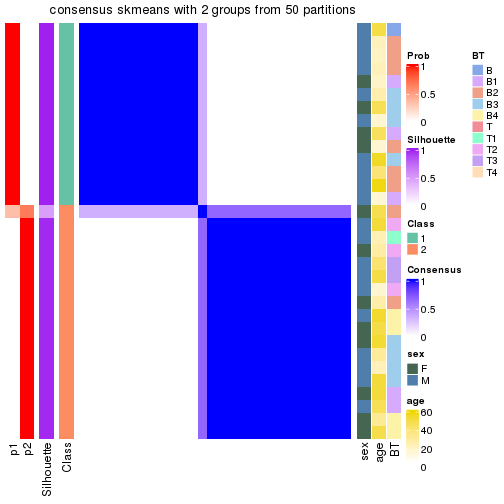</p>

</div>
<div id='tab-node-011-consensus-heatmap-2'>
<pre><code class="r">consensus_heatmap(res, k = 3)
</code></pre>

<p>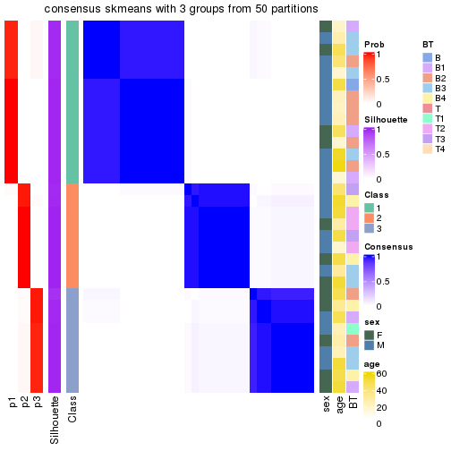</p>

</div>
<div id='tab-node-011-consensus-heatmap-3'>
<pre><code class="r">consensus_heatmap(res, k = 4)
</code></pre>

<p>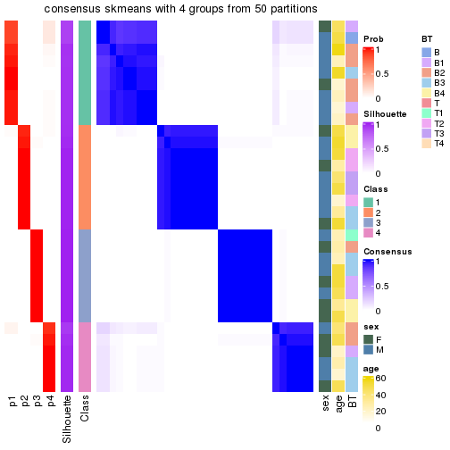</p>

</div>
</div>

Heatmaps for the membership of samples in all partitions to see how consistent they are:


<script>
$( function() {
	$( '#tabs-node-011-membership-heatmap' ).tabs();
} );
</script>
<div id='tabs-node-011-membership-heatmap'>
<ul>
<li><a href='#tab-node-011-membership-heatmap-1'>k = 2</a></li>
<li><a href='#tab-node-011-membership-heatmap-2'>k = 3</a></li>
<li><a href='#tab-node-011-membership-heatmap-3'>k = 4</a></li>
</ul>
<div id='tab-node-011-membership-heatmap-1'>
<pre><code class="r">membership_heatmap(res, k = 2)
</code></pre>

<p>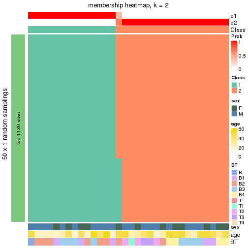</p>

</div>
<div id='tab-node-011-membership-heatmap-2'>
<pre><code class="r">membership_heatmap(res, k = 3)
</code></pre>

<p>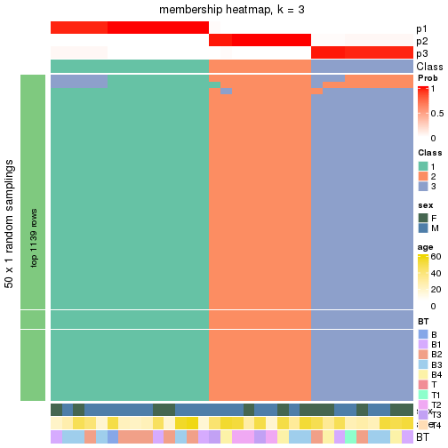</p>

</div>
<div id='tab-node-011-membership-heatmap-3'>
<pre><code class="r">membership_heatmap(res, k = 4)
</code></pre>

<p>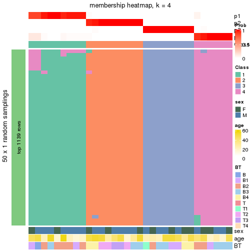</p>

</div>
</div>

As soon as the classes for columns are determined, the signatures
that are significantly different between subgroups can be looked for. 
Following are the heatmaps for signatures.


Signature heatmaps where rows are scaled:


<script>
$( function() {
	$( '#tabs-node-011-get-signatures' ).tabs();
} );
</script>
<div id='tabs-node-011-get-signatures'>
<ul>
<li><a href='#tab-node-011-get-signatures-1'>k = 2</a></li>
<li><a href='#tab-node-011-get-signatures-2'>k = 3</a></li>
<li><a href='#tab-node-011-get-signatures-3'>k = 4</a></li>
</ul>
<div id='tab-node-011-get-signatures-1'>
<pre><code class="r">get_signatures(res, k = 2)
</code></pre>

<p>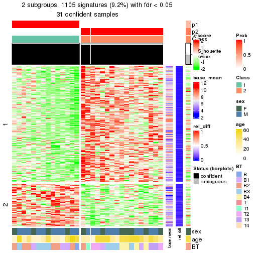</p>

</div>
<div id='tab-node-011-get-signatures-2'>
<pre><code class="r">get_signatures(res, k = 3)
</code></pre>

<p>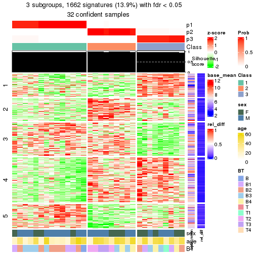</p>

</div>
<div id='tab-node-011-get-signatures-3'>
<pre><code class="r">get_signatures(res, k = 4)
</code></pre>

<p>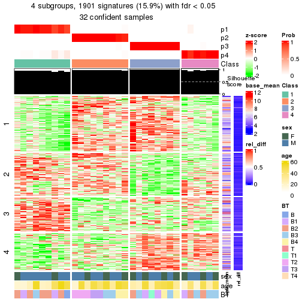</p>

</div>
</div>


Signature heatmaps where rows are not scaled:


<script>
$( function() {
	$( '#tabs-node-011-get-signatures-no-scale' ).tabs();
} );
</script>
<div id='tabs-node-011-get-signatures-no-scale'>
<ul>
<li><a href='#tab-node-011-get-signatures-no-scale-1'>k = 2</a></li>
<li><a href='#tab-node-011-get-signatures-no-scale-2'>k = 3</a></li>
<li><a href='#tab-node-011-get-signatures-no-scale-3'>k = 4</a></li>
</ul>
<div id='tab-node-011-get-signatures-no-scale-1'>
<pre><code class="r">get_signatures(res, k = 2, scale_rows = FALSE)
</code></pre>

<p>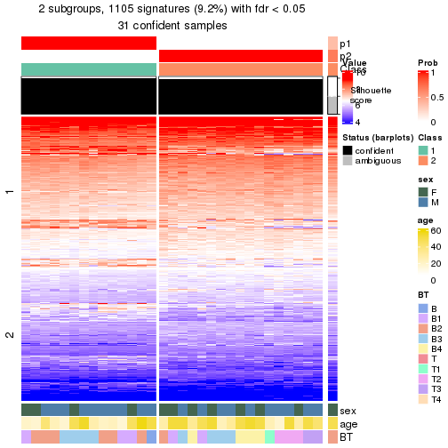</p>

</div>
<div id='tab-node-011-get-signatures-no-scale-2'>
<pre><code class="r">get_signatures(res, k = 3, scale_rows = FALSE)
</code></pre>

<p>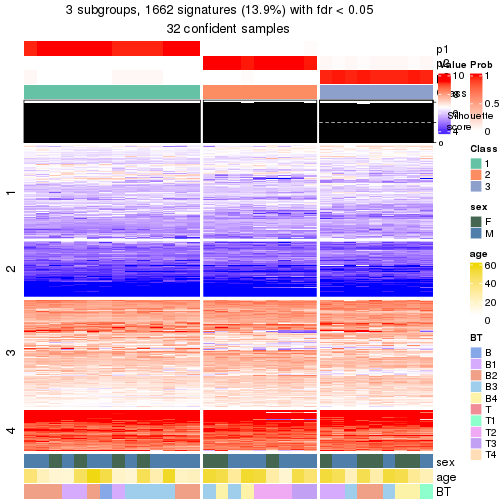</p>

</div>
<div id='tab-node-011-get-signatures-no-scale-3'>
<pre><code class="r">get_signatures(res, k = 4, scale_rows = FALSE)
</code></pre>

<p>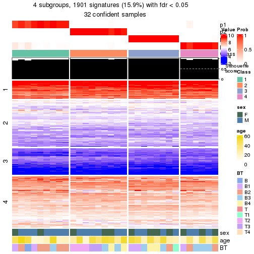</p>

</div>
</div>


Compare the overlap of signatures from different k:

```r
compare_signatures(res)
```

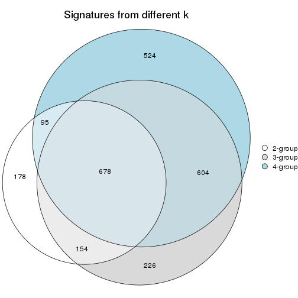

`get_signature()` returns a data frame invisibly. To get the list of signatures, the function
call should be assigned to a variable explicitly. In following code, if `plot` argument is set
to `FALSE`, no heatmap is plotted while only the differential analysis is performed.

```r
# code only for demonstration
tb = get_signature(res, k = ..., plot = FALSE)
```

An example of the output of `tb` is:

```
#>   which_row         fdr    mean_1    mean_2 scaled_mean_1 scaled_mean_2 km
#> 1        38 0.042760348  8.373488  9.131774    -0.5533452     0.5164555  1
#> 2        40 0.018707592  7.106213  8.469186    -0.6173731     0.5762149  1
#> 3        55 0.019134737 10.221463 11.207825    -0.6159697     0.5749050  1
#> 4        59 0.006059896  5.921854  7.869574    -0.6899429     0.6439467  1
#> 5        60 0.018055526  8.928898 10.211722    -0.6204761     0.5791110  1
#> 6        98 0.009384629 15.714769 14.887706     0.6635654    -0.6193277  2
...
```

The columns in `tb` are:

1. `which_row`: row indices corresponding to the input matrix.
2. `fdr`: FDR for the differential test. 
3. `mean_x`: The mean value in group x.
4. `scaled_mean_x`: The mean value in group x after rows are scaled.
5. `km`: Row groups if k-means clustering is applied to rows (which is done by automatically selecting number of clusters).

If there are too many signatures, `top_signatures = ...` can be set to only show the 
signatures with the highest FDRs:

```r
# code only for demonstration
# e.g. to show the top 500 most significant rows
tb = get_signature(res, k = ..., top_signatures = 500)
```

If the signatures are defined as these which are uniquely high in current group, `diff_method` argument
can be set to `"uniquely_high_in_one_group"`:

```r
# code only for demonstration
tb = get_signature(res, k = ..., diff_method = "uniquely_high_in_one_group")
```


UMAP plot which shows how samples are separated.


<script>
$( function() {
	$( '#tabs-node-011-dimension-reduction' ).tabs();
} );
</script>
<div id='tabs-node-011-dimension-reduction'>
<ul>
<li><a href='#tab-node-011-dimension-reduction-1'>k = 2</a></li>
<li><a href='#tab-node-011-dimension-reduction-2'>k = 3</a></li>
<li><a href='#tab-node-011-dimension-reduction-3'>k = 4</a></li>
</ul>
<div id='tab-node-011-dimension-reduction-1'>
<pre><code class="r">dimension_reduction(res, k = 2, method = &quot;UMAP&quot;)
</code></pre>

<p>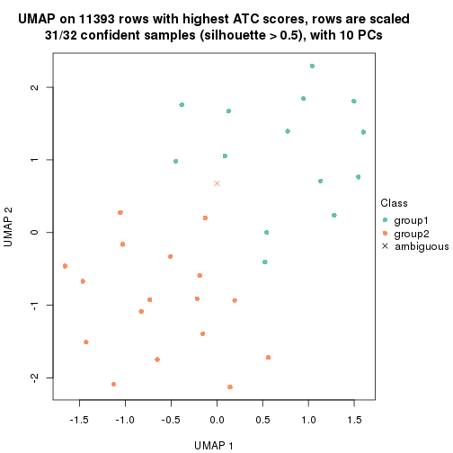</p>

</div>
<div id='tab-node-011-dimension-reduction-2'>
<pre><code class="r">dimension_reduction(res, k = 3, method = &quot;UMAP&quot;)
</code></pre>

<p>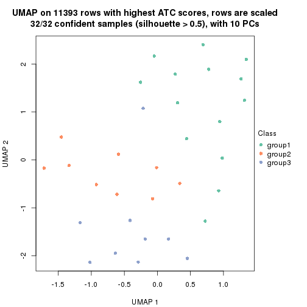</p>

</div>
<div id='tab-node-011-dimension-reduction-3'>
<pre><code class="r">dimension_reduction(res, k = 4, method = &quot;UMAP&quot;)
</code></pre>

<p>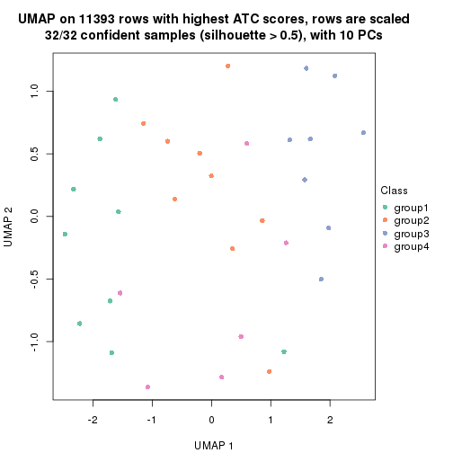</p>

</div>
</div>


Following heatmap shows how subgroups are split when increasing `k`:

```r
collect_classes(res)
```

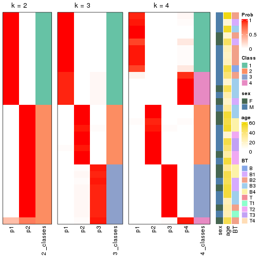


Test correlation between subgroups and known annotations. If the known
annotation is numeric, one-way ANOVA test is applied, and if the known
annotation is discrete, chi-squared contingency table test is applied.

```r
test_to_known_factors(res)
```

```
#>             n_sample sex(p-value) age(p-value) BT(p-value) k
#> ATC:skmeans       31        0.724        0.153      0.0412 2
#> ATC:skmeans       32        0.408        0.311      0.0268 3
#> ATC:skmeans       32        0.594        0.617      0.0521 4
```


If matrix rows can be associated to genes, consider to use `functional_enrichment(res,
...)` to perform function enrichment for the signature genes. See [this vignette](https://jokergoo.github.io/cola_vignettes/functional_enrichment.html) for more detailed explanations.


 

---------------------------------------------------


### Node012


Parent node: [Node01](#Node01).
Child nodes: 
                Node0111-leaf
        ,
                Node0112-leaf
        ,
                Node0113-leaf
        ,
                Node0114-leaf
        ,
                Node0121-leaf
        ,
                Node0122-leaf
        ,
                Node0123-leaf
        ,
                Node0221-leaf
        ,
                Node0222-leaf
        .


The object with results only for a single top-value method and a single partitioning method 
can be extracted as:

```r
res = res_rh["012"]
```

A summary of `res` and all the functions that can be applied to it:

```r
res
```

```
#> A 'ConsensusPartition' object with k = 2, 3, 4.
#>   On a matrix with 11393 rows and 13 columns.
#>   Top rows (1139) are extracted by 'ATC' method.
#>   Subgroups are detected by 'skmeans' method.
#>   Performed in total 150 partitions by row resampling.
#>   Best k for subgroups seems to be 3.
#> 
#> Following methods can be applied to this 'ConsensusPartition' object:
#>  [1] "cola_report"             "collect_classes"         "collect_plots"          
#>  [4] "collect_stats"           "colnames"                "compare_partitions"     
#>  [7] "compare_signatures"      "consensus_heatmap"       "dimension_reduction"    
#> [10] "functional_enrichment"   "get_anno_col"            "get_anno"               
#> [13] "get_classes"             "get_consensus"           "get_matrix"             
#> [16] "get_membership"          "get_param"               "get_signatures"         
#> [19] "get_stats"               "is_best_k"               "is_stable_k"            
#> [22] "membership_heatmap"      "ncol"                    "nrow"                   
#> [25] "plot_ecdf"               "predict_classes"         "rownames"               
#> [28] "select_partition_number" "show"                    "suggest_best_k"         
#> [31] "test_to_known_factors"   "top_rows_heatmap"
```

`collect_plots()` function collects all the plots made from `res` for all `k` (number of subgroups)
into one single page to provide an easy and fast comparison between different `k`.

```r
collect_plots(res)
```

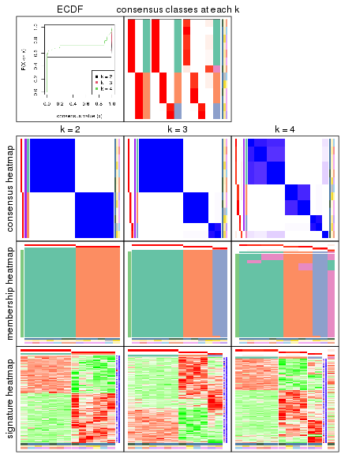

The plots are:

- The first row: a plot of the eCDF (empirical cumulative distribution
  function) curves of the consensus matrix for each `k` and the heatmap of
  predicted classes for each `k`.
- The second row: heatmaps of the consensus matrix for each `k`.
- The third row: heatmaps of the membership matrix for each `k`.
- The fouth row: heatmaps of the signatures for each `k`.

All the plots in panels can be made by individual functions and they are
plotted later in this section.

`select_partition_number()` produces several plots showing different
statistics for choosing "optimized" `k`. There are following statistics:

- eCDF curves of the consensus matrix for each `k`;
- 1-PAC. [The PAC score](https://en.wikipedia.org/wiki/Consensus_clustering#Over-interpretation_potential_of_consensus_clustering)
  measures the proportion of the ambiguous subgrouping.
- Mean silhouette score.
- Concordance. The mean probability of fiting the consensus subgroup labels in all
  partitions.
- Area increased. Denote $A_k$ as the area under the eCDF curve for current
  `k`, the area increased is defined as $A_k - A_{k-1}$.
- Rand index. The percent of pairs of samples that are both in a same cluster
  or both are not in a same cluster in the partition of k and k-1.
- Jaccard index. The ratio of pairs of samples are both in a same cluster in
  the partition of k and k-1 and the pairs of samples are both in a same
  cluster in the partition k or k-1.

The detailed explanations of these statistics can be found in [the _cola_
vignette](https://jokergoo.github.io/cola_vignettes/cola.html#toc_13).

Generally speaking, higher 1-PAC score, higher mean silhouette score or higher
concordance corresponds to better partition. Rand index and Jaccard index
measure how similar the current partition is compared to partition with `k-1`.
If they are too similar, we won't accept `k` is better than `k-1`.

```r
select_partition_number(res)
```

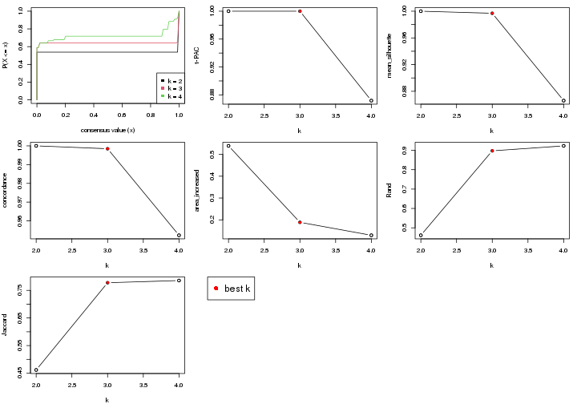

The numeric values for all these statistics can be obtained by `get_stats()`.

```r
get_stats(res)
```

```
#>   k 1-PAC mean_silhouette concordance area_increased  Rand Jaccard
#> 2 2 1.000           1.000       1.000          0.539 0.462   0.462
#> 3 3 1.000           0.997       0.998          0.189 0.897   0.778
#> 4 4 0.872           0.866       0.952          0.129 0.923   0.786
```

`suggest_best_k()` suggests the best $k$ based on these statistics. The rules are as follows:

- All $k$ with Jaccard index larger than 0.95 are removed because increasing
  $k$ does not provide enough extra information. If all $k$ are removed, it is
  marked as no subgroup is detected.
- For all $k$ with 1-PAC score larger than 0.9, the maximal $k$ is taken as
  the best $k$, and other $k$ are marked as optional $k$.
- If it does not fit the second rule. The $k$ with the maximal vote of the
  highest 1-PAC score, highest mean silhouette, and highest concordance is
  taken as the best $k$.

```r
suggest_best_k(res)
```

```
#> [1] 3
#> attr(,"optional")
#> [1] 2
```

There is also optional best $k$ = 2 that is worth to check.

Following is the table of the partitions (You need to click the **show/hide
code output** link to see it). The membership matrix (columns with name `p*`)
is inferred by
[`clue::cl_consensus()`](https://www.rdocumentation.org/link/cl_consensus?package=clue)
function with the `SE` method. Basically the value in the membership matrix
represents the probability to belong to a certain group. The finall subgroup
label for an item is determined with the group with highest probability it
belongs to.

In `get_classes()` function, the entropy is calculated from the membership
matrix and the silhouette score is calculated from the consensus matrix.


<script>
$( function() {
	$( '#tabs-node-012-get-classes' ).tabs();
} );
</script>
<div id='tabs-node-012-get-classes'>
<ul>
<li><a href='#tab-node-012-get-classes-1'>k = 2</a></li>
<li><a href='#tab-node-012-get-classes-2'>k = 3</a></li>
<li><a href='#tab-node-012-get-classes-3'>k = 4</a></li>
</ul>

<div id='tab-node-012-get-classes-1'>
<p><a id='tab-node-012-get-classes-1-a' style='color:#0366d6' href='#'>show/hide code output</a></p>
<pre><code class="r">cbind(get_classes(res, k = 2), get_membership(res, k = 2))
</code></pre>

<pre><code>#&gt;       class entropy silhouette p1 p2
#&gt; 24008     1       0          1  1  0
#&gt; 24010     1       0          1  1  0
#&gt; 28006     1       0          1  1  0
#&gt; 28047     2       0          1  0  1
#&gt; 43007     2       0          1  0  1
#&gt; 63001     1       0          1  1  0
#&gt; 10005     1       0          1  1  0
#&gt; 11002     1       0          1  1  0
#&gt; 19008     2       0          1  0  1
#&gt; 19017     2       0          1  0  1
#&gt; 28008     1       0          1  1  0
#&gt; 31015     2       0          1  0  1
#&gt; 44001     2       0          1  0  1
</code></pre>

<script>
$('#tab-node-012-get-classes-1-a').parent().next().next().hide();
$('#tab-node-012-get-classes-1-a').click(function(){
  $('#tab-node-012-get-classes-1-a').parent().next().next().toggle();
  return(false);
});
</script>
</div>

<div id='tab-node-012-get-classes-2'>
<p><a id='tab-node-012-get-classes-2-a' style='color:#0366d6' href='#'>show/hide code output</a></p>
<pre><code class="r">cbind(get_classes(res, k = 3), get_membership(res, k = 3))
</code></pre>

<pre><code>#&gt;       class entropy silhouette p1   p2   p3
#&gt; 24008     1  0.0000       1.00  1 0.00 0.00
#&gt; 24010     1  0.0000       1.00  1 0.00 0.00
#&gt; 28006     1  0.0000       1.00  1 0.00 0.00
#&gt; 28047     2  0.0000       1.00  0 1.00 0.00
#&gt; 43007     2  0.0000       1.00  0 1.00 0.00
#&gt; 63001     1  0.0000       1.00  1 0.00 0.00
#&gt; 10005     1  0.0000       1.00  1 0.00 0.00
#&gt; 11002     1  0.0000       1.00  1 0.00 0.00
#&gt; 19008     2  0.0000       1.00  0 1.00 0.00
#&gt; 19017     2  0.0000       1.00  0 1.00 0.00
#&gt; 28008     1  0.0000       1.00  1 0.00 0.00
#&gt; 31015     3  0.0892       0.98  0 0.02 0.98
#&gt; 44001     3  0.0000       0.98  0 0.00 1.00
</code></pre>

<script>
$('#tab-node-012-get-classes-2-a').parent().next().next().hide();
$('#tab-node-012-get-classes-2-a').click(function(){
  $('#tab-node-012-get-classes-2-a').parent().next().next().toggle();
  return(false);
});
</script>
</div>

<div id='tab-node-012-get-classes-3'>
<p><a id='tab-node-012-get-classes-3-a' style='color:#0366d6' href='#'>show/hide code output</a></p>
<pre><code class="r">cbind(get_classes(res, k = 4), get_membership(res, k = 4))
</code></pre>

<pre><code>#&gt;       class entropy silhouette   p1   p2   p3   p4
#&gt; 24008     4  0.2647      0.000 0.12 0.00 0.00 0.88
#&gt; 24010     1  0.2011      0.924 0.92 0.00 0.00 0.08
#&gt; 28006     1  0.0000      0.921 1.00 0.00 0.00 0.00
#&gt; 28047     2  0.2011      0.952 0.00 0.92 0.00 0.08
#&gt; 43007     2  0.2011      0.952 0.00 0.92 0.00 0.08
#&gt; 63001     1  0.2011      0.924 0.92 0.00 0.00 0.08
#&gt; 10005     1  0.2011      0.924 0.92 0.00 0.00 0.08
#&gt; 11002     1  0.1211      0.907 0.96 0.00 0.00 0.04
#&gt; 19008     2  0.0000      0.952 0.00 1.00 0.00 0.00
#&gt; 19017     2  0.0000      0.952 0.00 1.00 0.00 0.00
#&gt; 28008     1  0.1211      0.907 0.96 0.00 0.00 0.04
#&gt; 31015     3  0.0707      0.972 0.00 0.02 0.98 0.00
#&gt; 44001     3  0.0000      0.972 0.00 0.00 1.00 0.00
</code></pre>

<script>
$('#tab-node-012-get-classes-3-a').parent().next().next().hide();
$('#tab-node-012-get-classes-3-a').click(function(){
  $('#tab-node-012-get-classes-3-a').parent().next().next().toggle();
  return(false);
});
</script>
</div>
</div>

Heatmaps for the consensus matrix. It visualizes the probability of two
samples to be in a same group.


<script>
$( function() {
	$( '#tabs-node-012-consensus-heatmap' ).tabs();
} );
</script>
<div id='tabs-node-012-consensus-heatmap'>
<ul>
<li><a href='#tab-node-012-consensus-heatmap-1'>k = 2</a></li>
<li><a href='#tab-node-012-consensus-heatmap-2'>k = 3</a></li>
<li><a href='#tab-node-012-consensus-heatmap-3'>k = 4</a></li>
</ul>
<div id='tab-node-012-consensus-heatmap-1'>
<pre><code class="r">consensus_heatmap(res, k = 2)
</code></pre>

<p>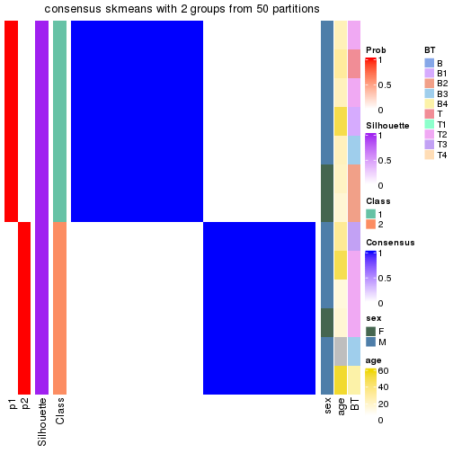</p>

</div>
<div id='tab-node-012-consensus-heatmap-2'>
<pre><code class="r">consensus_heatmap(res, k = 3)
</code></pre>

<p>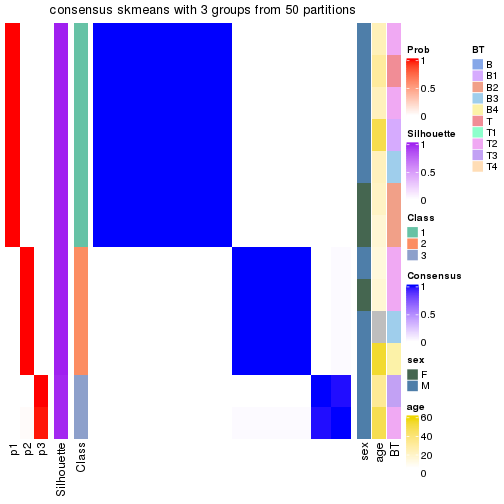</p>

</div>
<div id='tab-node-012-consensus-heatmap-3'>
<pre><code class="r">consensus_heatmap(res, k = 4)
</code></pre>

<p>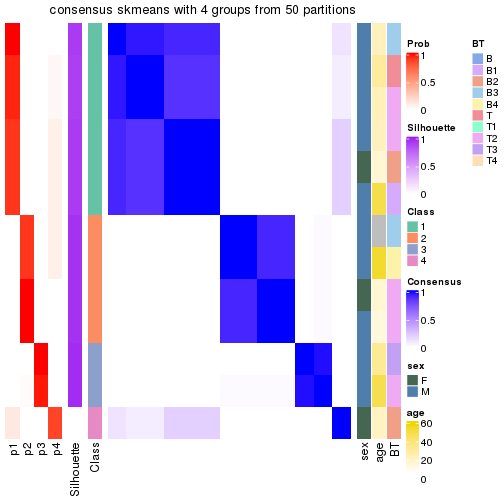</p>

</div>
</div>

Heatmaps for the membership of samples in all partitions to see how consistent they are:


<script>
$( function() {
	$( '#tabs-node-012-membership-heatmap' ).tabs();
} );
</script>
<div id='tabs-node-012-membership-heatmap'>
<ul>
<li><a href='#tab-node-012-membership-heatmap-1'>k = 2</a></li>
<li><a href='#tab-node-012-membership-heatmap-2'>k = 3</a></li>
<li><a href='#tab-node-012-membership-heatmap-3'>k = 4</a></li>
</ul>
<div id='tab-node-012-membership-heatmap-1'>
<pre><code class="r">membership_heatmap(res, k = 2)
</code></pre>

<p>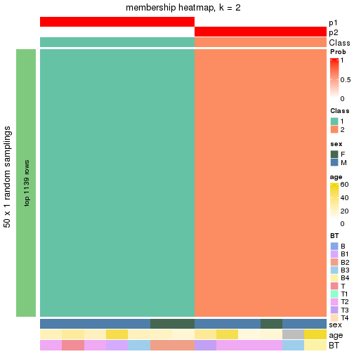</p>

</div>
<div id='tab-node-012-membership-heatmap-2'>
<pre><code class="r">membership_heatmap(res, k = 3)
</code></pre>

<p>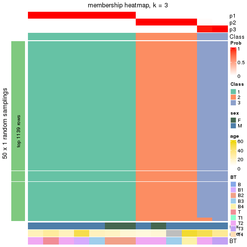</p>

</div>
<div id='tab-node-012-membership-heatmap-3'>
<pre><code class="r">membership_heatmap(res, k = 4)
</code></pre>

<p></p>

</div>
</div>

As soon as the classes for columns are determined, the signatures
that are significantly different between subgroups can be looked for. 
Following are the heatmaps for signatures.


Signature heatmaps where rows are scaled:


<script>
$( function() {
	$( '#tabs-node-012-get-signatures' ).tabs();
} );
</script>
<div id='tabs-node-012-get-signatures'>
<ul>
<li><a href='#tab-node-012-get-signatures-1'>k = 2</a></li>
<li><a href='#tab-node-012-get-signatures-2'>k = 3</a></li>
<li><a href='#tab-node-012-get-signatures-3'>k = 4</a></li>
</ul>
<div id='tab-node-012-get-signatures-1'>
<pre><code class="r">get_signatures(res, k = 2)
</code></pre>

<p>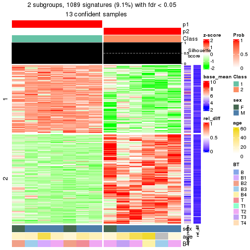</p>

</div>
<div id='tab-node-012-get-signatures-2'>
<pre><code class="r">get_signatures(res, k = 3)
</code></pre>

<p>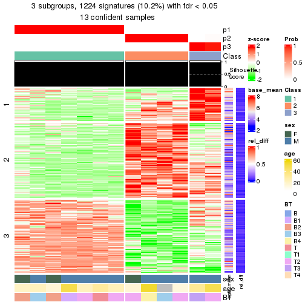</p>

</div>
<div id='tab-node-012-get-signatures-3'>
<pre><code class="r">get_signatures(res, k = 4)
</code></pre>

<p>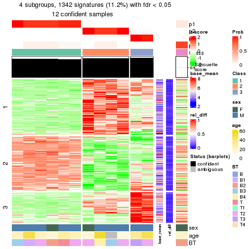</p>

</div>
</div>


Signature heatmaps where rows are not scaled:


<script>
$( function() {
	$( '#tabs-node-012-get-signatures-no-scale' ).tabs();
} );
</script>
<div id='tabs-node-012-get-signatures-no-scale'>
<ul>
<li><a href='#tab-node-012-get-signatures-no-scale-1'>k = 2</a></li>
<li><a href='#tab-node-012-get-signatures-no-scale-2'>k = 3</a></li>
<li><a href='#tab-node-012-get-signatures-no-scale-3'>k = 4</a></li>
</ul>
<div id='tab-node-012-get-signatures-no-scale-1'>
<pre><code class="r">get_signatures(res, k = 2, scale_rows = FALSE)
</code></pre>

<p>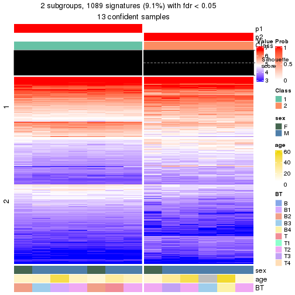</p>

</div>
<div id='tab-node-012-get-signatures-no-scale-2'>
<pre><code class="r">get_signatures(res, k = 3, scale_rows = FALSE)
</code></pre>

<p>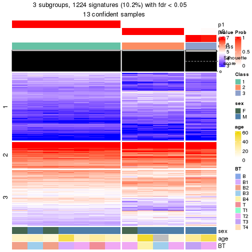</p>

</div>
<div id='tab-node-012-get-signatures-no-scale-3'>
<pre><code class="r">get_signatures(res, k = 4, scale_rows = FALSE)
</code></pre>

<p>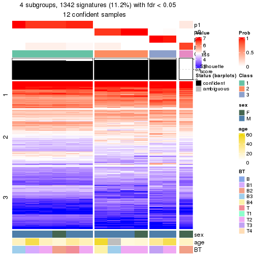</p>

</div>
</div>


Compare the overlap of signatures from different k:

```r
compare_signatures(res)
```

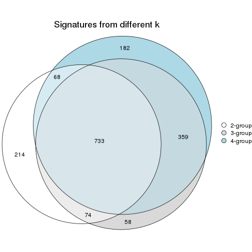

`get_signature()` returns a data frame invisibly. To get the list of signatures, the function
call should be assigned to a variable explicitly. In following code, if `plot` argument is set
to `FALSE`, no heatmap is plotted while only the differential analysis is performed.

```r
# code only for demonstration
tb = get_signature(res, k = ..., plot = FALSE)
```

An example of the output of `tb` is:

```
#>   which_row         fdr    mean_1    mean_2 scaled_mean_1 scaled_mean_2 km
#> 1        38 0.042760348  8.373488  9.131774    -0.5533452     0.5164555  1
#> 2        40 0.018707592  7.106213  8.469186    -0.6173731     0.5762149  1
#> 3        55 0.019134737 10.221463 11.207825    -0.6159697     0.5749050  1
#> 4        59 0.006059896  5.921854  7.869574    -0.6899429     0.6439467  1
#> 5        60 0.018055526  8.928898 10.211722    -0.6204761     0.5791110  1
#> 6        98 0.009384629 15.714769 14.887706     0.6635654    -0.6193277  2
...
```

The columns in `tb` are:

1. `which_row`: row indices corresponding to the input matrix.
2. `fdr`: FDR for the differential test. 
3. `mean_x`: The mean value in group x.
4. `scaled_mean_x`: The mean value in group x after rows are scaled.
5. `km`: Row groups if k-means clustering is applied to rows (which is done by automatically selecting number of clusters).

If there are too many signatures, `top_signatures = ...` can be set to only show the 
signatures with the highest FDRs:

```r
# code only for demonstration
# e.g. to show the top 500 most significant rows
tb = get_signature(res, k = ..., top_signatures = 500)
```

If the signatures are defined as these which are uniquely high in current group, `diff_method` argument
can be set to `"uniquely_high_in_one_group"`:

```r
# code only for demonstration
tb = get_signature(res, k = ..., diff_method = "uniquely_high_in_one_group")
```


UMAP plot which shows how samples are separated.


<script>
$( function() {
	$( '#tabs-node-012-dimension-reduction' ).tabs();
} );
</script>
<div id='tabs-node-012-dimension-reduction'>
<ul>
<li><a href='#tab-node-012-dimension-reduction-1'>k = 2</a></li>
<li><a href='#tab-node-012-dimension-reduction-2'>k = 3</a></li>
<li><a href='#tab-node-012-dimension-reduction-3'>k = 4</a></li>
</ul>
<div id='tab-node-012-dimension-reduction-1'>
<pre><code class="r">dimension_reduction(res, k = 2, method = &quot;UMAP&quot;)
</code></pre>

<p>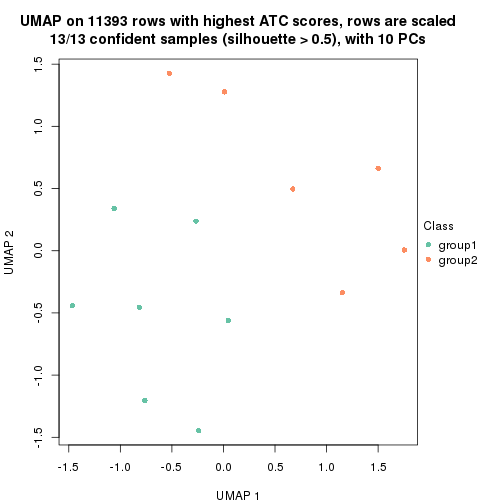</p>

</div>
<div id='tab-node-012-dimension-reduction-2'>
<pre><code class="r">dimension_reduction(res, k = 3, method = &quot;UMAP&quot;)
</code></pre>

<p>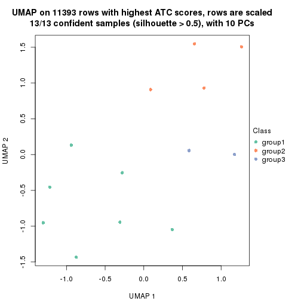</p>

</div>
<div id='tab-node-012-dimension-reduction-3'>
<pre><code class="r">dimension_reduction(res, k = 4, method = &quot;UMAP&quot;)
</code></pre>

<p>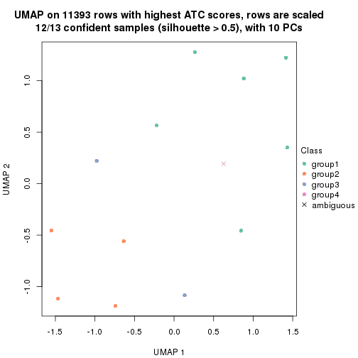</p>

</div>
</div>


Following heatmap shows how subgroups are split when increasing `k`:

```r
collect_classes(res)
```

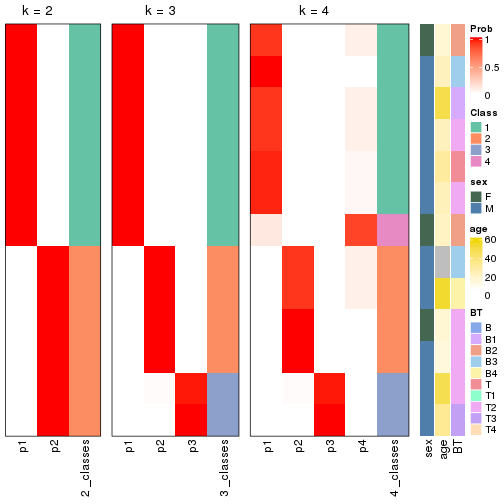


Test correlation between subgroups and known annotations. If the known
annotation is numeric, one-way ANOVA test is applied, and if the known
annotation is discrete, chi-squared contingency table test is applied.

```r
test_to_known_factors(res)
```

```
#>             n_sample sex(p-value) age(p-value) BT(p-value) k
#> ATC:skmeans       13        1.000        0.483       0.406 2
#> ATC:skmeans       13        0.695        0.495       0.436 3
#> ATC:skmeans       12        0.741        0.539       0.555 4
```


If matrix rows can be associated to genes, consider to use `functional_enrichment(res,
...)` to perform function enrichment for the signature genes. See [this vignette](https://jokergoo.github.io/cola_vignettes/functional_enrichment.html) for more detailed explanations.


 

---------------------------------------------------


### Node02


Parent node: [Node0](#Node0).
Child nodes: 
                [Node011](#Node011)
        ,
                [Node012](#Node012)
        ,
                Node013-leaf
        ,
                Node021-leaf
        ,
                [Node022](#Node022)
        ,
                Node023-leaf
        ,
                Node031-leaf
        ,
                Node032-leaf
        ,
                Node033-leaf
        .


The object with results only for a single top-value method and a single partitioning method 
can be extracted as:

```r
res = res_rh["02"]
```

A summary of `res` and all the functions that can be applied to it:

```r
res
```

```
#> A 'ConsensusPartition' object with k = 2, 3, 4.
#>   On a matrix with 11393 rows and 39 columns.
#>   Top rows (1139) are extracted by 'ATC' method.
#>   Subgroups are detected by 'skmeans' method.
#>   Performed in total 150 partitions by row resampling.
#>   Best k for subgroups seems to be 3.
#> 
#> Following methods can be applied to this 'ConsensusPartition' object:
#>  [1] "cola_report"             "collect_classes"         "collect_plots"          
#>  [4] "collect_stats"           "colnames"                "compare_partitions"     
#>  [7] "compare_signatures"      "consensus_heatmap"       "dimension_reduction"    
#> [10] "functional_enrichment"   "get_anno_col"            "get_anno"               
#> [13] "get_classes"             "get_consensus"           "get_matrix"             
#> [16] "get_membership"          "get_param"               "get_signatures"         
#> [19] "get_stats"               "is_best_k"               "is_stable_k"            
#> [22] "membership_heatmap"      "ncol"                    "nrow"                   
#> [25] "plot_ecdf"               "predict_classes"         "rownames"               
#> [28] "select_partition_number" "show"                    "suggest_best_k"         
#> [31] "test_to_known_factors"   "top_rows_heatmap"
```

`collect_plots()` function collects all the plots made from `res` for all `k` (number of subgroups)
into one single page to provide an easy and fast comparison between different `k`.

```r
collect_plots(res)
```

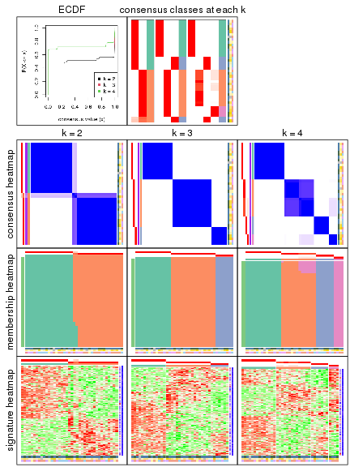

The plots are:

- The first row: a plot of the eCDF (empirical cumulative distribution
  function) curves of the consensus matrix for each `k` and the heatmap of
  predicted classes for each `k`.
- The second row: heatmaps of the consensus matrix for each `k`.
- The third row: heatmaps of the membership matrix for each `k`.
- The fouth row: heatmaps of the signatures for each `k`.

All the plots in panels can be made by individual functions and they are
plotted later in this section.

`select_partition_number()` produces several plots showing different
statistics for choosing "optimized" `k`. There are following statistics:

- eCDF curves of the consensus matrix for each `k`;
- 1-PAC. [The PAC score](https://en.wikipedia.org/wiki/Consensus_clustering#Over-interpretation_potential_of_consensus_clustering)
  measures the proportion of the ambiguous subgrouping.
- Mean silhouette score.
- Concordance. The mean probability of fiting the consensus subgroup labels in all
  partitions.
- Area increased. Denote $A_k$ as the area under the eCDF curve for current
  `k`, the area increased is defined as $A_k - A_{k-1}$.
- Rand index. The percent of pairs of samples that are both in a same cluster
  or both are not in a same cluster in the partition of k and k-1.
- Jaccard index. The ratio of pairs of samples are both in a same cluster in
  the partition of k and k-1 and the pairs of samples are both in a same
  cluster in the partition k or k-1.

The detailed explanations of these statistics can be found in [the _cola_
vignette](https://jokergoo.github.io/cola_vignettes/cola.html#toc_13).

Generally speaking, higher 1-PAC score, higher mean silhouette score or higher
concordance corresponds to better partition. Rand index and Jaccard index
measure how similar the current partition is compared to partition with `k-1`.
If they are too similar, we won't accept `k` is better than `k-1`.

```r
select_partition_number(res)
```

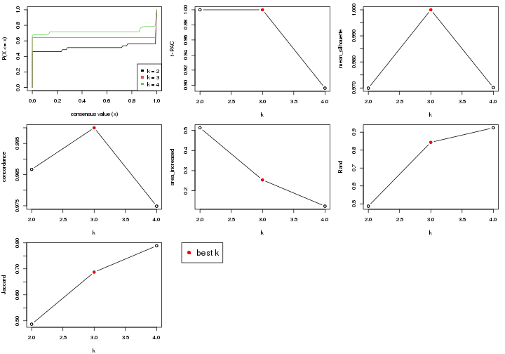

The numeric values for all these statistics can be obtained by `get_stats()`.

```r
get_stats(res)
```

```
#>   k 1-PAC mean_silhouette concordance area_increased  Rand Jaccard
#> 2 2 1.000            0.97       0.987          0.513 0.487   0.487
#> 3 3 1.000            1.00       1.000          0.254 0.843   0.687
#> 4 4 0.896            0.97       0.975          0.123 0.924   0.789
```

`suggest_best_k()` suggests the best $k$ based on these statistics. The rules are as follows:

- All $k$ with Jaccard index larger than 0.95 are removed because increasing
  $k$ does not provide enough extra information. If all $k$ are removed, it is
  marked as no subgroup is detected.
- For all $k$ with 1-PAC score larger than 0.9, the maximal $k$ is taken as
  the best $k$, and other $k$ are marked as optional $k$.
- If it does not fit the second rule. The $k$ with the maximal vote of the
  highest 1-PAC score, highest mean silhouette, and highest concordance is
  taken as the best $k$.

```r
suggest_best_k(res)
```

```
#> [1] 3
#> attr(,"optional")
#> [1] 2
```

There is also optional best $k$ = 2 that is worth to check.

Following is the table of the partitions (You need to click the **show/hide
code output** link to see it). The membership matrix (columns with name `p*`)
is inferred by
[`clue::cl_consensus()`](https://www.rdocumentation.org/link/cl_consensus?package=clue)
function with the `SE` method. Basically the value in the membership matrix
represents the probability to belong to a certain group. The finall subgroup
label for an item is determined with the group with highest probability it
belongs to.

In `get_classes()` function, the entropy is calculated from the membership
matrix and the silhouette score is calculated from the consensus matrix.


<script>
$( function() {
	$( '#tabs-node-02-get-classes' ).tabs();
} );
</script>
<div id='tabs-node-02-get-classes'>
<ul>
<li><a href='#tab-node-02-get-classes-1'>k = 2</a></li>
<li><a href='#tab-node-02-get-classes-2'>k = 3</a></li>
<li><a href='#tab-node-02-get-classes-3'>k = 4</a></li>
</ul>

<div id='tab-node-02-get-classes-1'>
<p><a id='tab-node-02-get-classes-1-a' style='color:#0366d6' href='#'>show/hide code output</a></p>
<pre><code class="r">cbind(get_classes(res, k = 2), get_membership(res, k = 2))
</code></pre>

<pre><code>#&gt;       class entropy silhouette   p1   p2
#&gt; 01010     1   0.000      1.000 1.00 0.00
#&gt; 04006     1   0.000      1.000 1.00 0.00
#&gt; 04008     2   0.795      0.697 0.24 0.76
#&gt; 04010     1   0.000      1.000 1.00 0.00
#&gt; 06002     2   0.000      0.972 0.00 1.00
#&gt; 09008     1   0.000      1.000 1.00 0.00
#&gt; 12012     2   0.000      0.972 0.00 1.00
#&gt; 12019     2   0.000      0.972 0.00 1.00
#&gt; 12026     2   0.000      0.972 0.00 1.00
#&gt; 14016     2   0.000      0.972 0.00 1.00
#&gt; 15001     2   0.000      0.972 0.00 1.00
#&gt; 15005     2   0.000      0.972 0.00 1.00
#&gt; 16004     2   0.000      0.972 0.00 1.00
#&gt; 16009     1   0.000      1.000 1.00 0.00
#&gt; 19005     2   0.000      0.972 0.00 1.00
#&gt; 20002     2   0.855      0.631 0.28 0.72
#&gt; 24011     2   0.000      0.972 0.00 1.00
#&gt; 24017     1   0.000      1.000 1.00 0.00
#&gt; 24019     1   0.000      1.000 1.00 0.00
#&gt; 25006     1   0.000      1.000 1.00 0.00
#&gt; 26001     2   0.000      0.972 0.00 1.00
#&gt; 26005     2   0.000      0.972 0.00 1.00
#&gt; 26008     1   0.000      1.000 1.00 0.00
#&gt; 28019     1   0.000      1.000 1.00 0.00
#&gt; 28021     1   0.000      1.000 1.00 0.00
#&gt; 28035     1   0.000      1.000 1.00 0.00
#&gt; 28037     1   0.000      1.000 1.00 0.00
#&gt; 28044     2   0.000      0.972 0.00 1.00
#&gt; 30001     1   0.000      1.000 1.00 0.00
#&gt; 33005     1   0.000      1.000 1.00 0.00
#&gt; 36001     2   0.000      0.972 0.00 1.00
#&gt; 37013     2   0.000      0.972 0.00 1.00
#&gt; 48001     2   0.000      0.972 0.00 1.00
#&gt; 64002     1   0.000      1.000 1.00 0.00
#&gt; 68001     1   0.000      1.000 1.00 0.00
#&gt; 02020     2   0.000      0.972 0.00 1.00
#&gt; 15006     1   0.000      1.000 1.00 0.00
#&gt; 26009     1   0.000      1.000 1.00 0.00
#&gt; 83001     2   0.000      0.972 0.00 1.00
</code></pre>

<script>
$('#tab-node-02-get-classes-1-a').parent().next().next().hide();
$('#tab-node-02-get-classes-1-a').click(function(){
  $('#tab-node-02-get-classes-1-a').parent().next().next().toggle();
  return(false);
});
</script>
</div>

<div id='tab-node-02-get-classes-2'>
<p><a id='tab-node-02-get-classes-2-a' style='color:#0366d6' href='#'>show/hide code output</a></p>
<pre><code class="r">cbind(get_classes(res, k = 3), get_membership(res, k = 3))
</code></pre>

<pre><code>#&gt;       class entropy silhouette p1 p2 p3
#&gt; 01010     1       0          1  1  0  0
#&gt; 04006     1       0          1  1  0  0
#&gt; 04008     3       0          1  0  0  1
#&gt; 04010     1       0          1  1  0  0
#&gt; 06002     2       0          1  0  1  0
#&gt; 09008     3       0          1  0  0  1
#&gt; 12012     2       0          1  0  1  0
#&gt; 12019     2       0          1  0  1  0
#&gt; 12026     2       0          1  0  1  0
#&gt; 14016     2       0          1  0  1  0
#&gt; 15001     2       0          1  0  1  0
#&gt; 15005     2       0          1  0  1  0
#&gt; 16004     2       0          1  0  1  0
#&gt; 16009     1       0          1  1  0  0
#&gt; 19005     2       0          1  0  1  0
#&gt; 20002     3       0          1  0  0  1
#&gt; 24011     2       0          1  0  1  0
#&gt; 24017     1       0          1  1  0  0
#&gt; 24019     1       0          1  1  0  0
#&gt; 25006     1       0          1  1  0  0
#&gt; 26001     2       0          1  0  1  0
#&gt; 26005     2       0          1  0  1  0
#&gt; 26008     1       0          1  1  0  0
#&gt; 28019     1       0          1  1  0  0
#&gt; 28021     3       0          1  0  0  1
#&gt; 28035     3       0          1  0  0  1
#&gt; 28037     3       0          1  0  0  1
#&gt; 28044     2       0          1  0  1  0
#&gt; 30001     1       0          1  1  0  0
#&gt; 33005     3       0          1  0  0  1
#&gt; 36001     2       0          1  0  1  0
#&gt; 37013     2       0          1  0  1  0
#&gt; 48001     2       0          1  0  1  0
#&gt; 64002     1       0          1  1  0  0
#&gt; 68001     1       0          1  1  0  0
#&gt; 02020     2       0          1  0  1  0
#&gt; 15006     1       0          1  1  0  0
#&gt; 26009     1       0          1  1  0  0
#&gt; 83001     2       0          1  0  1  0
</code></pre>

<script>
$('#tab-node-02-get-classes-2-a').parent().next().next().hide();
$('#tab-node-02-get-classes-2-a').click(function(){
  $('#tab-node-02-get-classes-2-a').parent().next().next().toggle();
  return(false);
});
</script>
</div>

<div id='tab-node-02-get-classes-3'>
<p><a id='tab-node-02-get-classes-3-a' style='color:#0366d6' href='#'>show/hide code output</a></p>
<pre><code class="r">cbind(get_classes(res, k = 4), get_membership(res, k = 4))
</code></pre>

<pre><code>#&gt;       class entropy silhouette p1   p2 p3   p4
#&gt; 01010     1  0.0000      1.000  1 0.00  0 0.00
#&gt; 04006     1  0.0000      1.000  1 0.00  0 0.00
#&gt; 04008     3  0.0000      1.000  0 0.00  1 0.00
#&gt; 04010     1  0.0000      1.000  1 0.00  0 0.00
#&gt; 06002     2  0.2921      0.915  0 0.86  0 0.14
#&gt; 09008     3  0.0000      1.000  0 0.00  1 0.00
#&gt; 12012     2  0.2921      0.915  0 0.86  0 0.14
#&gt; 12019     2  0.2921      0.915  0 0.86  0 0.14
#&gt; 12026     4  0.0000      1.000  0 0.00  0 1.00
#&gt; 14016     4  0.0000      1.000  0 0.00  0 1.00
#&gt; 15001     2  0.2921      0.915  0 0.86  0 0.14
#&gt; 15005     2  0.0000      0.918  0 1.00  0 0.00
#&gt; 16004     4  0.0000      1.000  0 0.00  0 1.00
#&gt; 16009     1  0.0000      1.000  1 0.00  0 0.00
#&gt; 19005     2  0.2647      0.918  0 0.88  0 0.12
#&gt; 20002     3  0.0000      1.000  0 0.00  1 0.00
#&gt; 24011     4  0.0000      1.000  0 0.00  0 1.00
#&gt; 24017     1  0.0000      1.000  1 0.00  0 0.00
#&gt; 24019     1  0.0000      1.000  1 0.00  0 0.00
#&gt; 25006     1  0.0000      1.000  1 0.00  0 0.00
#&gt; 26001     2  0.2921      0.915  0 0.86  0 0.14
#&gt; 26005     2  0.2921      0.915  0 0.86  0 0.14
#&gt; 26008     1  0.0000      1.000  1 0.00  0 0.00
#&gt; 28019     1  0.0000      1.000  1 0.00  0 0.00
#&gt; 28021     3  0.0000      1.000  0 0.00  1 0.00
#&gt; 28035     3  0.0000      1.000  0 0.00  1 0.00
#&gt; 28037     3  0.0000      1.000  0 0.00  1 0.00
#&gt; 28044     2  0.0000      0.918  0 1.00  0 0.00
#&gt; 30001     1  0.0000      1.000  1 0.00  0 0.00
#&gt; 33005     3  0.0000      1.000  0 0.00  1 0.00
#&gt; 36001     2  0.0000      0.918  0 1.00  0 0.00
#&gt; 37013     2  0.0000      0.918  0 1.00  0 0.00
#&gt; 48001     2  0.0000      0.918  0 1.00  0 0.00
#&gt; 64002     1  0.0000      1.000  1 0.00  0 0.00
#&gt; 68001     1  0.0000      1.000  1 0.00  0 0.00
#&gt; 02020     2  0.0707      0.920  0 0.98  0 0.02
#&gt; 15006     1  0.0000      1.000  1 0.00  0 0.00
#&gt; 26009     1  0.0000      1.000  1 0.00  0 0.00
#&gt; 83001     2  0.0000      0.918  0 1.00  0 0.00
</code></pre>

<script>
$('#tab-node-02-get-classes-3-a').parent().next().next().hide();
$('#tab-node-02-get-classes-3-a').click(function(){
  $('#tab-node-02-get-classes-3-a').parent().next().next().toggle();
  return(false);
});
</script>
</div>
</div>

Heatmaps for the consensus matrix. It visualizes the probability of two
samples to be in a same group.


<script>
$( function() {
	$( '#tabs-node-02-consensus-heatmap' ).tabs();
} );
</script>
<div id='tabs-node-02-consensus-heatmap'>
<ul>
<li><a href='#tab-node-02-consensus-heatmap-1'>k = 2</a></li>
<li><a href='#tab-node-02-consensus-heatmap-2'>k = 3</a></li>
<li><a href='#tab-node-02-consensus-heatmap-3'>k = 4</a></li>
</ul>
<div id='tab-node-02-consensus-heatmap-1'>
<pre><code class="r">consensus_heatmap(res, k = 2)
</code></pre>

<p>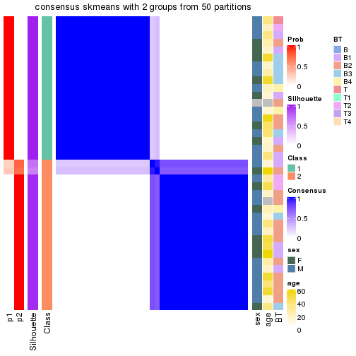</p>

</div>
<div id='tab-node-02-consensus-heatmap-2'>
<pre><code class="r">consensus_heatmap(res, k = 3)
</code></pre>

<p>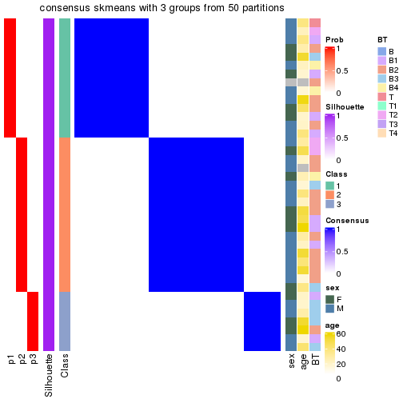</p>

</div>
<div id='tab-node-02-consensus-heatmap-3'>
<pre><code class="r">consensus_heatmap(res, k = 4)
</code></pre>

<p>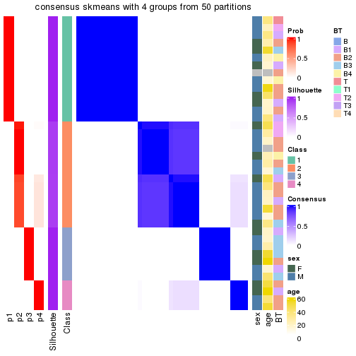</p>

</div>
</div>

Heatmaps for the membership of samples in all partitions to see how consistent they are:


<script>
$( function() {
	$( '#tabs-node-02-membership-heatmap' ).tabs();
} );
</script>
<div id='tabs-node-02-membership-heatmap'>
<ul>
<li><a href='#tab-node-02-membership-heatmap-1'>k = 2</a></li>
<li><a href='#tab-node-02-membership-heatmap-2'>k = 3</a></li>
<li><a href='#tab-node-02-membership-heatmap-3'>k = 4</a></li>
</ul>
<div id='tab-node-02-membership-heatmap-1'>
<pre><code class="r">membership_heatmap(res, k = 2)
</code></pre>

<p>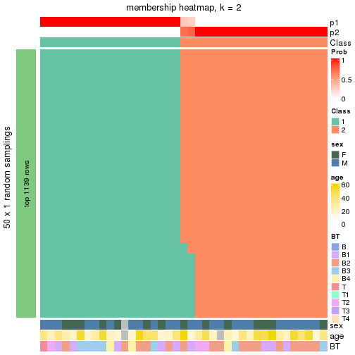</p>

</div>
<div id='tab-node-02-membership-heatmap-2'>
<pre><code class="r">membership_heatmap(res, k = 3)
</code></pre>

<p>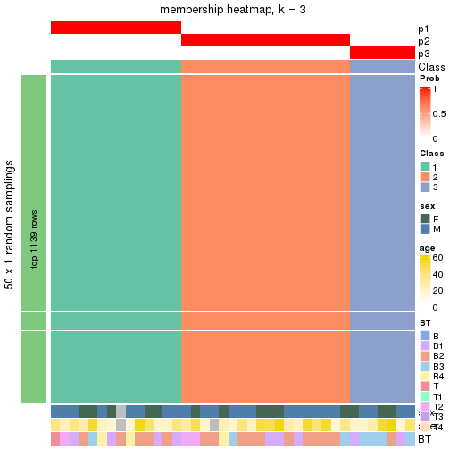</p>

</div>
<div id='tab-node-02-membership-heatmap-3'>
<pre><code class="r">membership_heatmap(res, k = 4)
</code></pre>

<p>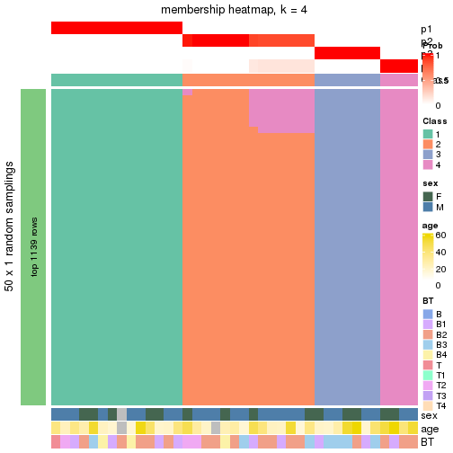</p>

</div>
</div>

As soon as the classes for columns are determined, the signatures
that are significantly different between subgroups can be looked for. 
Following are the heatmaps for signatures.


Signature heatmaps where rows are scaled:


<script>
$( function() {
	$( '#tabs-node-02-get-signatures' ).tabs();
} );
</script>
<div id='tabs-node-02-get-signatures'>
<ul>
<li><a href='#tab-node-02-get-signatures-1'>k = 2</a></li>
<li><a href='#tab-node-02-get-signatures-2'>k = 3</a></li>
<li><a href='#tab-node-02-get-signatures-3'>k = 4</a></li>
</ul>
<div id='tab-node-02-get-signatures-1'>
<pre><code class="r">get_signatures(res, k = 2)
</code></pre>

<p>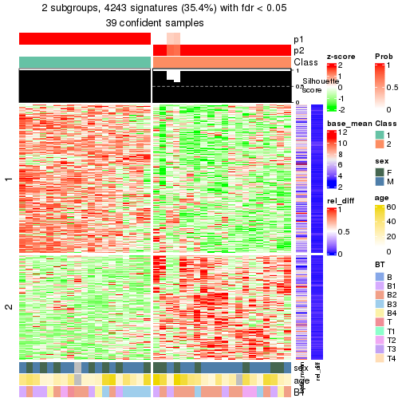</p>

</div>
<div id='tab-node-02-get-signatures-2'>
<pre><code class="r">get_signatures(res, k = 3)
</code></pre>

<p>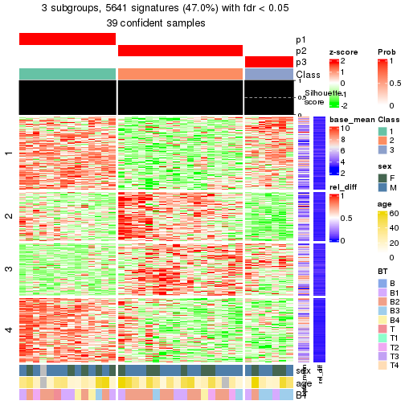</p>

</div>
<div id='tab-node-02-get-signatures-3'>
<pre><code class="r">get_signatures(res, k = 4)
</code></pre>

<p>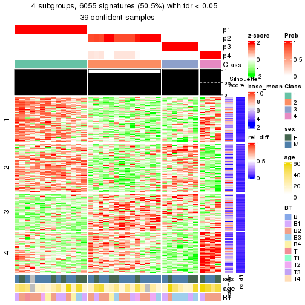</p>

</div>
</div>


Signature heatmaps where rows are not scaled:


<script>
$( function() {
	$( '#tabs-node-02-get-signatures-no-scale' ).tabs();
} );
</script>
<div id='tabs-node-02-get-signatures-no-scale'>
<ul>
<li><a href='#tab-node-02-get-signatures-no-scale-1'>k = 2</a></li>
<li><a href='#tab-node-02-get-signatures-no-scale-2'>k = 3</a></li>
<li><a href='#tab-node-02-get-signatures-no-scale-3'>k = 4</a></li>
</ul>
<div id='tab-node-02-get-signatures-no-scale-1'>
<pre><code class="r">get_signatures(res, k = 2, scale_rows = FALSE)
</code></pre>

<p>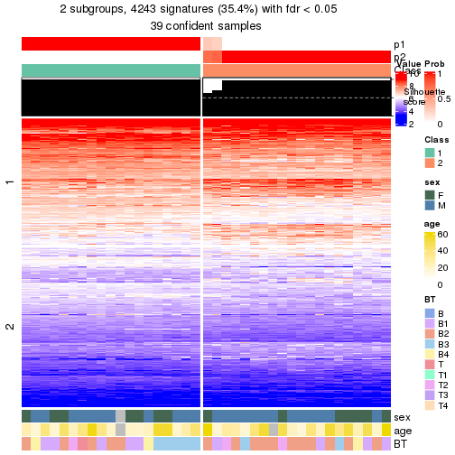</p>

</div>
<div id='tab-node-02-get-signatures-no-scale-2'>
<pre><code class="r">get_signatures(res, k = 3, scale_rows = FALSE)
</code></pre>

<p>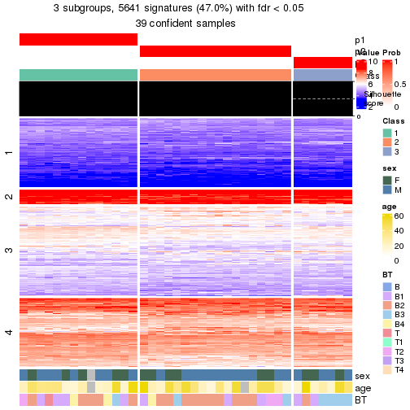</p>

</div>
<div id='tab-node-02-get-signatures-no-scale-3'>
<pre><code class="r">get_signatures(res, k = 4, scale_rows = FALSE)
</code></pre>

<p>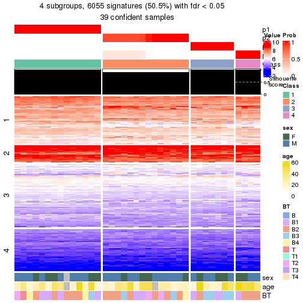</p>

</div>
</div>


Compare the overlap of signatures from different k:

```r
compare_signatures(res)
```

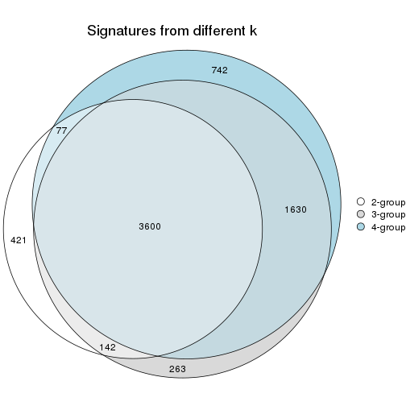

`get_signature()` returns a data frame invisibly. To get the list of signatures, the function
call should be assigned to a variable explicitly. In following code, if `plot` argument is set
to `FALSE`, no heatmap is plotted while only the differential analysis is performed.

```r
# code only for demonstration
tb = get_signature(res, k = ..., plot = FALSE)
```

An example of the output of `tb` is:

```
#>   which_row         fdr    mean_1    mean_2 scaled_mean_1 scaled_mean_2 km
#> 1        38 0.042760348  8.373488  9.131774    -0.5533452     0.5164555  1
#> 2        40 0.018707592  7.106213  8.469186    -0.6173731     0.5762149  1
#> 3        55 0.019134737 10.221463 11.207825    -0.6159697     0.5749050  1
#> 4        59 0.006059896  5.921854  7.869574    -0.6899429     0.6439467  1
#> 5        60 0.018055526  8.928898 10.211722    -0.6204761     0.5791110  1
#> 6        98 0.009384629 15.714769 14.887706     0.6635654    -0.6193277  2
...
```

The columns in `tb` are:

1. `which_row`: row indices corresponding to the input matrix.
2. `fdr`: FDR for the differential test. 
3. `mean_x`: The mean value in group x.
4. `scaled_mean_x`: The mean value in group x after rows are scaled.
5. `km`: Row groups if k-means clustering is applied to rows (which is done by automatically selecting number of clusters).

If there are too many signatures, `top_signatures = ...` can be set to only show the 
signatures with the highest FDRs:

```r
# code only for demonstration
# e.g. to show the top 500 most significant rows
tb = get_signature(res, k = ..., top_signatures = 500)
```

If the signatures are defined as these which are uniquely high in current group, `diff_method` argument
can be set to `"uniquely_high_in_one_group"`:

```r
# code only for demonstration
tb = get_signature(res, k = ..., diff_method = "uniquely_high_in_one_group")
```


UMAP plot which shows how samples are separated.


<script>
$( function() {
	$( '#tabs-node-02-dimension-reduction' ).tabs();
} );
</script>
<div id='tabs-node-02-dimension-reduction'>
<ul>
<li><a href='#tab-node-02-dimension-reduction-1'>k = 2</a></li>
<li><a href='#tab-node-02-dimension-reduction-2'>k = 3</a></li>
<li><a href='#tab-node-02-dimension-reduction-3'>k = 4</a></li>
</ul>
<div id='tab-node-02-dimension-reduction-1'>
<pre><code class="r">dimension_reduction(res, k = 2, method = &quot;UMAP&quot;)
</code></pre>

<p>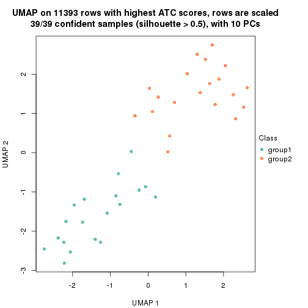</p>

</div>
<div id='tab-node-02-dimension-reduction-2'>
<pre><code class="r">dimension_reduction(res, k = 3, method = &quot;UMAP&quot;)
</code></pre>

<p>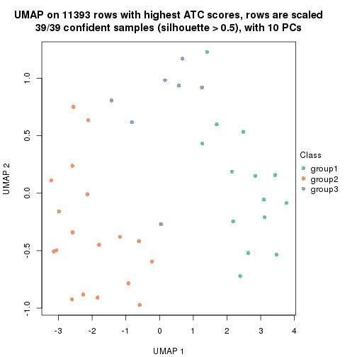</p>

</div>
<div id='tab-node-02-dimension-reduction-3'>
<pre><code class="r">dimension_reduction(res, k = 4, method = &quot;UMAP&quot;)
</code></pre>

<p>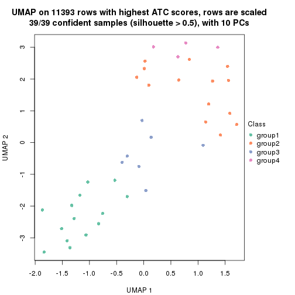</p>

</div>
</div>


Following heatmap shows how subgroups are split when increasing `k`:

```r
collect_classes(res)
```

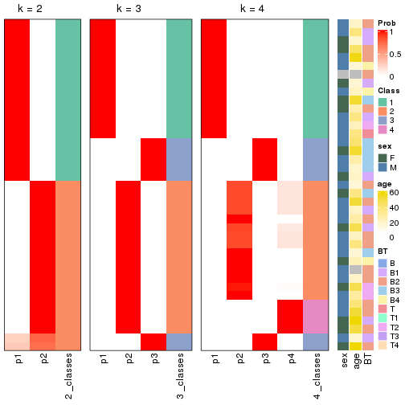


Test correlation between subgroups and known annotations. If the known
annotation is numeric, one-way ANOVA test is applied, and if the known
annotation is discrete, chi-squared contingency table test is applied.

```r
test_to_known_factors(res)
```

```
#>             n_sample sex(p-value) age(p-value) BT(p-value) k
#> ATC:skmeans       39        1.000       0.4107       0.381 2
#> ATC:skmeans       39        0.896       0.7659       0.162 3
#> ATC:skmeans       39        0.842       0.0161       0.365 4
```


If matrix rows can be associated to genes, consider to use `functional_enrichment(res,
...)` to perform function enrichment for the signature genes. See [this vignette](https://jokergoo.github.io/cola_vignettes/functional_enrichment.html) for more detailed explanations.


 

---------------------------------------------------


### Node022


Parent node: [Node02](#Node02).
Child nodes: 
                Node0111-leaf
        ,
                Node0112-leaf
        ,
                Node0113-leaf
        ,
                Node0114-leaf
        ,
                Node0121-leaf
        ,
                Node0122-leaf
        ,
                Node0123-leaf
        ,
                Node0221-leaf
        ,
                Node0222-leaf
        .


The object with results only for a single top-value method and a single partitioning method 
can be extracted as:

```r
res = res_rh["022"]
```

A summary of `res` and all the functions that can be applied to it:

```r
res
```

```
#> A 'ConsensusPartition' object with k = 2, 3, 4.
#>   On a matrix with 11393 rows and 18 columns.
#>   Top rows (1139) are extracted by 'ATC' method.
#>   Subgroups are detected by 'skmeans' method.
#>   Performed in total 150 partitions by row resampling.
#>   Best k for subgroups seems to be 2.
#> 
#> Following methods can be applied to this 'ConsensusPartition' object:
#>  [1] "cola_report"             "collect_classes"         "collect_plots"          
#>  [4] "collect_stats"           "colnames"                "compare_partitions"     
#>  [7] "compare_signatures"      "consensus_heatmap"       "dimension_reduction"    
#> [10] "functional_enrichment"   "get_anno_col"            "get_anno"               
#> [13] "get_classes"             "get_consensus"           "get_matrix"             
#> [16] "get_membership"          "get_param"               "get_signatures"         
#> [19] "get_stats"               "is_best_k"               "is_stable_k"            
#> [22] "membership_heatmap"      "ncol"                    "nrow"                   
#> [25] "plot_ecdf"               "predict_classes"         "rownames"               
#> [28] "select_partition_number" "show"                    "suggest_best_k"         
#> [31] "test_to_known_factors"   "top_rows_heatmap"
```

`collect_plots()` function collects all the plots made from `res` for all `k` (number of subgroups)
into one single page to provide an easy and fast comparison between different `k`.

```r
collect_plots(res)
```

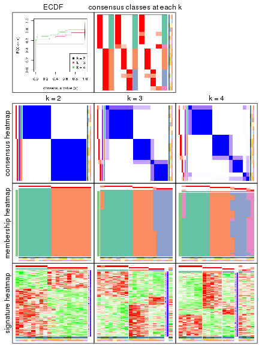

The plots are:

- The first row: a plot of the eCDF (empirical cumulative distribution
  function) curves of the consensus matrix for each `k` and the heatmap of
  predicted classes for each `k`.
- The second row: heatmaps of the consensus matrix for each `k`.
- The third row: heatmaps of the membership matrix for each `k`.
- The fouth row: heatmaps of the signatures for each `k`.

All the plots in panels can be made by individual functions and they are
plotted later in this section.

`select_partition_number()` produces several plots showing different
statistics for choosing "optimized" `k`. There are following statistics:

- eCDF curves of the consensus matrix for each `k`;
- 1-PAC. [The PAC score](https://en.wikipedia.org/wiki/Consensus_clustering#Over-interpretation_potential_of_consensus_clustering)
  measures the proportion of the ambiguous subgrouping.
- Mean silhouette score.
- Concordance. The mean probability of fiting the consensus subgroup labels in all
  partitions.
- Area increased. Denote $A_k$ as the area under the eCDF curve for current
  `k`, the area increased is defined as $A_k - A_{k-1}$.
- Rand index. The percent of pairs of samples that are both in a same cluster
  or both are not in a same cluster in the partition of k and k-1.
- Jaccard index. The ratio of pairs of samples are both in a same cluster in
  the partition of k and k-1 and the pairs of samples are both in a same
  cluster in the partition k or k-1.

The detailed explanations of these statistics can be found in [the _cola_
vignette](https://jokergoo.github.io/cola_vignettes/cola.html#toc_13).

Generally speaking, higher 1-PAC score, higher mean silhouette score or higher
concordance corresponds to better partition. Rand index and Jaccard index
measure how similar the current partition is compared to partition with `k-1`.
If they are too similar, we won't accept `k` is better than `k-1`.

```r
select_partition_number(res)
```

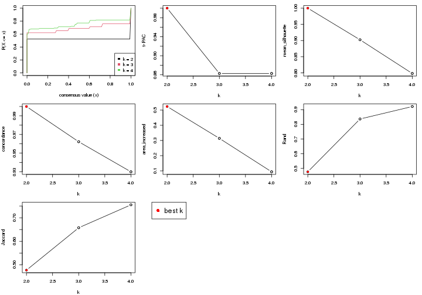

The numeric values for all these statistics can be obtained by `get_stats()`.

```r
get_stats(res)
```

```
#>   k 1-PAC mean_silhouette concordance area_increased  Rand Jaccard
#> 2 2 1.000           1.000       1.000         0.5234 0.477   0.477
#> 3 3 0.863           0.902       0.962         0.3139 0.837   0.658
#> 4 4 0.863           0.798       0.930         0.0939 0.922   0.755
```

`suggest_best_k()` suggests the best $k$ based on these statistics. The rules are as follows:

- All $k$ with Jaccard index larger than 0.95 are removed because increasing
  $k$ does not provide enough extra information. If all $k$ are removed, it is
  marked as no subgroup is detected.
- For all $k$ with 1-PAC score larger than 0.9, the maximal $k$ is taken as
  the best $k$, and other $k$ are marked as optional $k$.
- If it does not fit the second rule. The $k$ with the maximal vote of the
  highest 1-PAC score, highest mean silhouette, and highest concordance is
  taken as the best $k$.

```r
suggest_best_k(res)
```

```
#> [1] 2
```


Following is the table of the partitions (You need to click the **show/hide
code output** link to see it). The membership matrix (columns with name `p*`)
is inferred by
[`clue::cl_consensus()`](https://www.rdocumentation.org/link/cl_consensus?package=clue)
function with the `SE` method. Basically the value in the membership matrix
represents the probability to belong to a certain group. The finall subgroup
label for an item is determined with the group with highest probability it
belongs to.

In `get_classes()` function, the entropy is calculated from the membership
matrix and the silhouette score is calculated from the consensus matrix.


<script>
$( function() {
	$( '#tabs-node-022-get-classes' ).tabs();
} );
</script>
<div id='tabs-node-022-get-classes'>
<ul>
<li><a href='#tab-node-022-get-classes-1'>k = 2</a></li>
<li><a href='#tab-node-022-get-classes-2'>k = 3</a></li>
<li><a href='#tab-node-022-get-classes-3'>k = 4</a></li>
</ul>

<div id='tab-node-022-get-classes-1'>
<p><a id='tab-node-022-get-classes-1-a' style='color:#0366d6' href='#'>show/hide code output</a></p>
<pre><code class="r">cbind(get_classes(res, k = 2), get_membership(res, k = 2))
</code></pre>

<pre><code>#&gt;       class entropy silhouette p1 p2
#&gt; 06002     2       0          1  0  1
#&gt; 12012     2       0          1  0  1
#&gt; 12019     2       0          1  0  1
#&gt; 12026     2       0          1  0  1
#&gt; 14016     2       0          1  0  1
#&gt; 15001     2       0          1  0  1
#&gt; 15005     1       0          1  1  0
#&gt; 16004     2       0          1  0  1
#&gt; 19005     1       0          1  1  0
#&gt; 24011     2       0          1  0  1
#&gt; 26001     2       0          1  0  1
#&gt; 26005     2       0          1  0  1
#&gt; 28044     1       0          1  1  0
#&gt; 36001     1       0          1  1  0
#&gt; 37013     1       0          1  1  0
#&gt; 48001     1       0          1  1  0
#&gt; 02020     1       0          1  1  0
#&gt; 83001     1       0          1  1  0
</code></pre>

<script>
$('#tab-node-022-get-classes-1-a').parent().next().next().hide();
$('#tab-node-022-get-classes-1-a').click(function(){
  $('#tab-node-022-get-classes-1-a').parent().next().next().toggle();
  return(false);
});
</script>
</div>

<div id='tab-node-022-get-classes-2'>
<p><a id='tab-node-022-get-classes-2-a' style='color:#0366d6' href='#'>show/hide code output</a></p>
<pre><code class="r">cbind(get_classes(res, k = 3), get_membership(res, k = 3))
</code></pre>

<pre><code>#&gt;       class entropy silhouette   p1   p2  p3
#&gt; 06002     3   0.000      0.895 0.00 0.00 1.0
#&gt; 12012     3   0.613      0.340 0.00 0.40 0.6
#&gt; 12019     3   0.000      0.895 0.00 0.00 1.0
#&gt; 12026     2   0.000      1.000 0.00 1.00 0.0
#&gt; 14016     2   0.000      1.000 0.00 1.00 0.0
#&gt; 15001     3   0.000      0.895 0.00 0.00 1.0
#&gt; 15005     1   0.000      0.958 1.00 0.00 0.0
#&gt; 16004     2   0.000      1.000 0.00 1.00 0.0
#&gt; 19005     1   0.540      0.616 0.72 0.28 0.0
#&gt; 24011     2   0.000      1.000 0.00 1.00 0.0
#&gt; 26001     2   0.000      1.000 0.00 1.00 0.0
#&gt; 26005     3   0.000      0.895 0.00 0.00 1.0
#&gt; 28044     1   0.000      0.958 1.00 0.00 0.0
#&gt; 36001     1   0.000      0.958 1.00 0.00 0.0
#&gt; 37013     1   0.000      0.958 1.00 0.00 0.0
#&gt; 48001     1   0.000      0.958 1.00 0.00 0.0
#&gt; 02020     1   0.000      0.958 1.00 0.00 0.0
#&gt; 83001     1   0.000      0.958 1.00 0.00 0.0
</code></pre>

<script>
$('#tab-node-022-get-classes-2-a').parent().next().next().hide();
$('#tab-node-022-get-classes-2-a').click(function(){
  $('#tab-node-022-get-classes-2-a').parent().next().next().toggle();
  return(false);
});
</script>
</div>

<div id='tab-node-022-get-classes-3'>
<p><a id='tab-node-022-get-classes-3-a' style='color:#0366d6' href='#'>show/hide code output</a></p>
<pre><code class="r">cbind(get_classes(res, k = 4), get_membership(res, k = 4))
</code></pre>

<pre><code>#&gt;       class entropy silhouette   p1   p2   p3   p4
#&gt; 06002     3  0.0000     0.7356 0.00 0.00 1.00 0.00
#&gt; 12012     3  0.6336     0.0742 0.00 0.46 0.48 0.06
#&gt; 12019     4  0.5062     0.4909 0.00 0.02 0.30 0.68
#&gt; 12026     2  0.0000     1.0000 0.00 1.00 0.00 0.00
#&gt; 14016     2  0.0000     1.0000 0.00 1.00 0.00 0.00
#&gt; 15001     3  0.0000     0.7356 0.00 0.00 1.00 0.00
#&gt; 15005     1  0.0000     0.9311 1.00 0.00 0.00 0.00
#&gt; 16004     2  0.0000     1.0000 0.00 1.00 0.00 0.00
#&gt; 19005     4  0.0707     0.6155 0.02 0.00 0.00 0.98
#&gt; 24011     2  0.0000     1.0000 0.00 1.00 0.00 0.00
#&gt; 26001     2  0.0000     1.0000 0.00 1.00 0.00 0.00
#&gt; 26005     3  0.0000     0.7356 0.00 0.00 1.00 0.00
#&gt; 28044     1  0.0000     0.9311 1.00 0.00 0.00 0.00
#&gt; 36001     1  0.0000     0.9311 1.00 0.00 0.00 0.00
#&gt; 37013     1  0.0000     0.9311 1.00 0.00 0.00 0.00
#&gt; 48001     1  0.4855     0.3938 0.60 0.00 0.00 0.40
#&gt; 02020     1  0.0000     0.9311 1.00 0.00 0.00 0.00
#&gt; 83001     1  0.0000     0.9311 1.00 0.00 0.00 0.00
</code></pre>

<script>
$('#tab-node-022-get-classes-3-a').parent().next().next().hide();
$('#tab-node-022-get-classes-3-a').click(function(){
  $('#tab-node-022-get-classes-3-a').parent().next().next().toggle();
  return(false);
});
</script>
</div>
</div>

Heatmaps for the consensus matrix. It visualizes the probability of two
samples to be in a same group.


<script>
$( function() {
	$( '#tabs-node-022-consensus-heatmap' ).tabs();
} );
</script>
<div id='tabs-node-022-consensus-heatmap'>
<ul>
<li><a href='#tab-node-022-consensus-heatmap-1'>k = 2</a></li>
<li><a href='#tab-node-022-consensus-heatmap-2'>k = 3</a></li>
<li><a href='#tab-node-022-consensus-heatmap-3'>k = 4</a></li>
</ul>
<div id='tab-node-022-consensus-heatmap-1'>
<pre><code class="r">consensus_heatmap(res, k = 2)
</code></pre>

<p>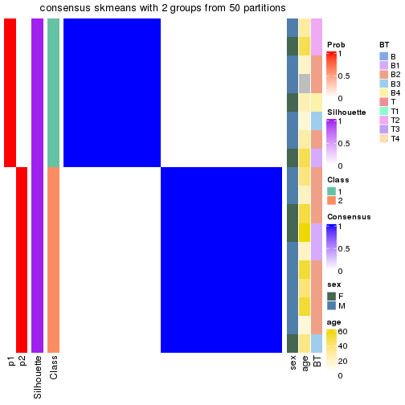</p>

</div>
<div id='tab-node-022-consensus-heatmap-2'>
<pre><code class="r">consensus_heatmap(res, k = 3)
</code></pre>

<p>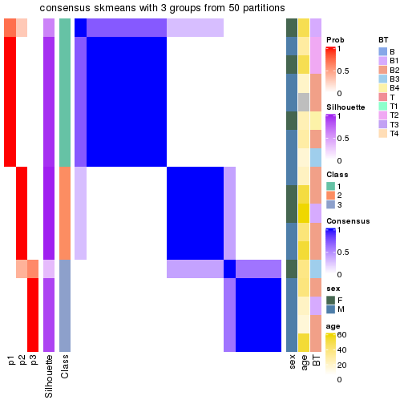</p>

</div>
<div id='tab-node-022-consensus-heatmap-3'>
<pre><code class="r">consensus_heatmap(res, k = 4)
</code></pre>

<p>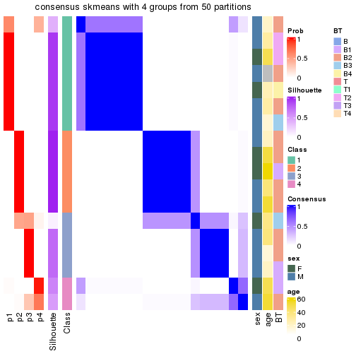</p>

</div>
</div>

Heatmaps for the membership of samples in all partitions to see how consistent they are:


<script>
$( function() {
	$( '#tabs-node-022-membership-heatmap' ).tabs();
} );
</script>
<div id='tabs-node-022-membership-heatmap'>
<ul>
<li><a href='#tab-node-022-membership-heatmap-1'>k = 2</a></li>
<li><a href='#tab-node-022-membership-heatmap-2'>k = 3</a></li>
<li><a href='#tab-node-022-membership-heatmap-3'>k = 4</a></li>
</ul>
<div id='tab-node-022-membership-heatmap-1'>
<pre><code class="r">membership_heatmap(res, k = 2)
</code></pre>

<p></p>

</div>
<div id='tab-node-022-membership-heatmap-2'>
<pre><code class="r">membership_heatmap(res, k = 3)
</code></pre>

<p>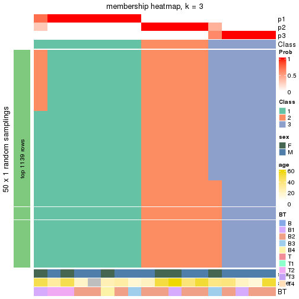</p>

</div>
<div id='tab-node-022-membership-heatmap-3'>
<pre><code class="r">membership_heatmap(res, k = 4)
</code></pre>

<p>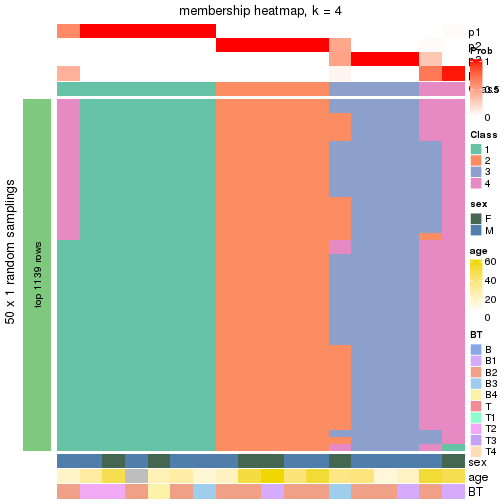</p>

</div>
</div>

As soon as the classes for columns are determined, the signatures
that are significantly different between subgroups can be looked for. 
Following are the heatmaps for signatures.


Signature heatmaps where rows are scaled:


<script>
$( function() {
	$( '#tabs-node-022-get-signatures' ).tabs();
} );
</script>
<div id='tabs-node-022-get-signatures'>
<ul>
<li><a href='#tab-node-022-get-signatures-1'>k = 2</a></li>
<li><a href='#tab-node-022-get-signatures-2'>k = 3</a></li>
<li><a href='#tab-node-022-get-signatures-3'>k = 4</a></li>
</ul>
<div id='tab-node-022-get-signatures-1'>
<pre><code class="r">get_signatures(res, k = 2)
</code></pre>

<p>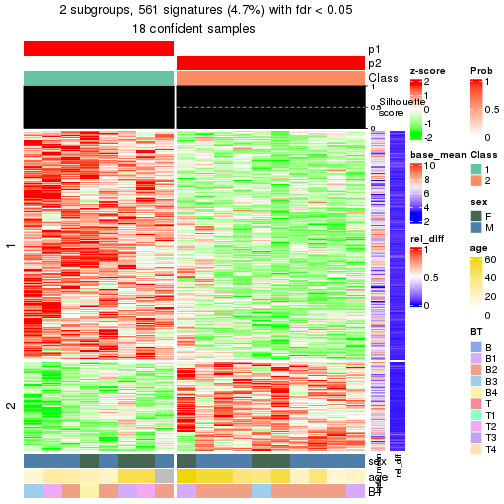</p>

</div>
<div id='tab-node-022-get-signatures-2'>
<pre><code class="r">get_signatures(res, k = 3)
</code></pre>

<p>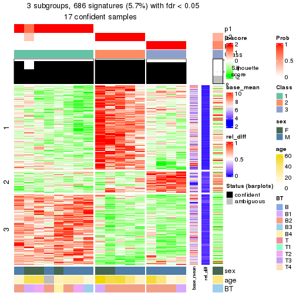</p>

</div>
<div id='tab-node-022-get-signatures-3'>
<pre><code class="r">get_signatures(res, k = 4)
</code></pre>

<p>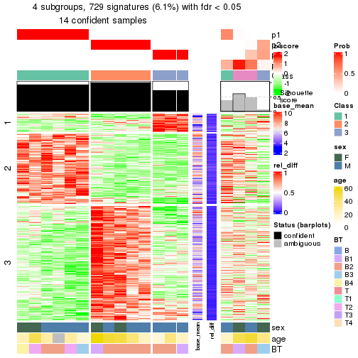</p>

</div>
</div>


Signature heatmaps where rows are not scaled:


<script>
$( function() {
	$( '#tabs-node-022-get-signatures-no-scale' ).tabs();
} );
</script>
<div id='tabs-node-022-get-signatures-no-scale'>
<ul>
<li><a href='#tab-node-022-get-signatures-no-scale-1'>k = 2</a></li>
<li><a href='#tab-node-022-get-signatures-no-scale-2'>k = 3</a></li>
<li><a href='#tab-node-022-get-signatures-no-scale-3'>k = 4</a></li>
</ul>
<div id='tab-node-022-get-signatures-no-scale-1'>
<pre><code class="r">get_signatures(res, k = 2, scale_rows = FALSE)
</code></pre>

<p>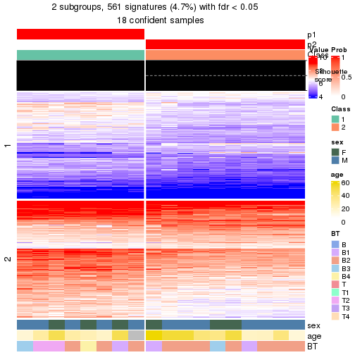</p>

</div>
<div id='tab-node-022-get-signatures-no-scale-2'>
<pre><code class="r">get_signatures(res, k = 3, scale_rows = FALSE)
</code></pre>

<p>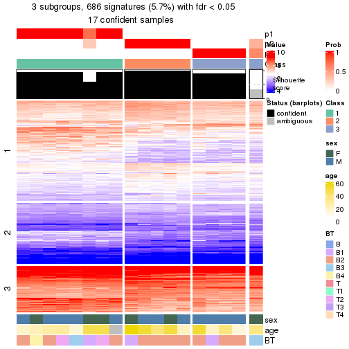</p>

</div>
<div id='tab-node-022-get-signatures-no-scale-3'>
<pre><code class="r">get_signatures(res, k = 4, scale_rows = FALSE)
</code></pre>

<p>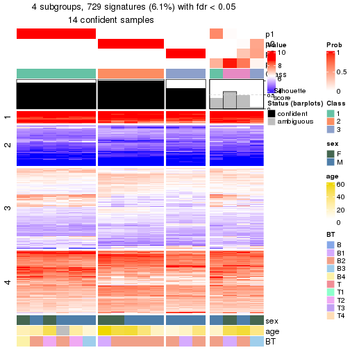</p>

</div>
</div>


Compare the overlap of signatures from different k:

```r
compare_signatures(res)
```


`get_signature()` returns a data frame invisibly. To get the list of signatures, the function
call should be assigned to a variable explicitly. In following code, if `plot` argument is set
to `FALSE`, no heatmap is plotted while only the differential analysis is performed.

```r
# code only for demonstration
tb = get_signature(res, k = ..., plot = FALSE)
```

An example of the output of `tb` is:

```
#>   which_row         fdr    mean_1    mean_2 scaled_mean_1 scaled_mean_2 km
#> 1        38 0.042760348  8.373488  9.131774    -0.5533452     0.5164555  1
#> 2        40 0.018707592  7.106213  8.469186    -0.6173731     0.5762149  1
#> 3        55 0.019134737 10.221463 11.207825    -0.6159697     0.5749050  1
#> 4        59 0.006059896  5.921854  7.869574    -0.6899429     0.6439467  1
#> 5        60 0.018055526  8.928898 10.211722    -0.6204761     0.5791110  1
#> 6        98 0.009384629 15.714769 14.887706     0.6635654    -0.6193277  2
...
```

The columns in `tb` are:

1. `which_row`: row indices corresponding to the input matrix.
2. `fdr`: FDR for the differential test. 
3. `mean_x`: The mean value in group x.
4. `scaled_mean_x`: The mean value in group x after rows are scaled.
5. `km`: Row groups if k-means clustering is applied to rows (which is done by automatically selecting number of clusters).

If there are too many signatures, `top_signatures = ...` can be set to only show the 
signatures with the highest FDRs:

```r
# code only for demonstration
# e.g. to show the top 500 most significant rows
tb = get_signature(res, k = ..., top_signatures = 500)
```

If the signatures are defined as these which are uniquely high in current group, `diff_method` argument
can be set to `"uniquely_high_in_one_group"`:

```r
# code only for demonstration
tb = get_signature(res, k = ..., diff_method = "uniquely_high_in_one_group")
```


UMAP plot which shows how samples are separated.


<script>
$( function() {
	$( '#tabs-node-022-dimension-reduction' ).tabs();
} );
</script>
<div id='tabs-node-022-dimension-reduction'>
<ul>
<li><a href='#tab-node-022-dimension-reduction-1'>k = 2</a></li>
<li><a href='#tab-node-022-dimension-reduction-2'>k = 3</a></li>
<li><a href='#tab-node-022-dimension-reduction-3'>k = 4</a></li>
</ul>
<div id='tab-node-022-dimension-reduction-1'>
<pre><code class="r">dimension_reduction(res, k = 2, method = &quot;UMAP&quot;)
</code></pre>

<p>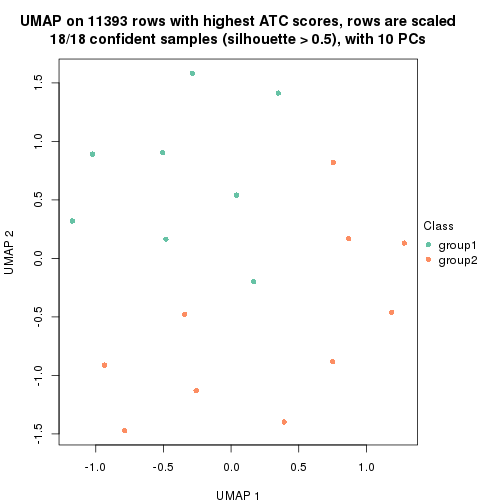</p>

</div>
<div id='tab-node-022-dimension-reduction-2'>
<pre><code class="r">dimension_reduction(res, k = 3, method = &quot;UMAP&quot;)
</code></pre>

<p>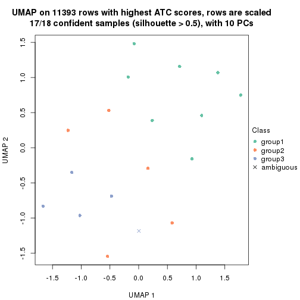</p>

</div>
<div id='tab-node-022-dimension-reduction-3'>
<pre><code class="r">dimension_reduction(res, k = 4, method = &quot;UMAP&quot;)
</code></pre>

<p>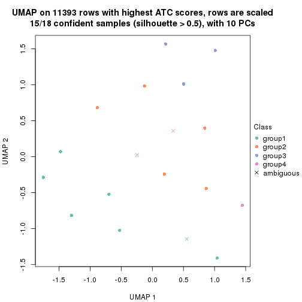</p>

</div>
</div>


Following heatmap shows how subgroups are split when increasing `k`:

```r
collect_classes(res)
```

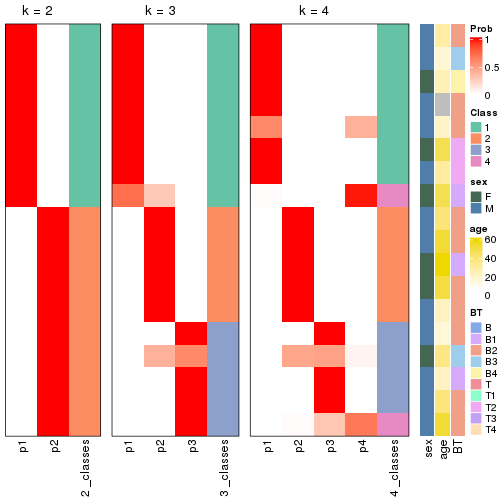


Test correlation between subgroups and known annotations. If the known
annotation is numeric, one-way ANOVA test is applied, and if the known
annotation is discrete, chi-squared contingency table test is applied.

```r
test_to_known_factors(res)
```

```
#>             n_sample sex(p-value) age(p-value) BT(p-value) k
#> ATC:skmeans       18        1.000        0.260       0.312 2
#> ATC:skmeans       17        0.335        0.308       0.654 3
#> ATC:skmeans       15        0.308        0.192       0.413 4
```


If matrix rows can be associated to genes, consider to use `functional_enrichment(res,
...)` to perform function enrichment for the signature genes. See [this vignette](https://jokergoo.github.io/cola_vignettes/functional_enrichment.html) for more detailed explanations.


 

---------------------------------------------------


### Node03


Parent node: [Node0](#Node0).
Child nodes: 
                [Node011](#Node011)
        ,
                [Node012](#Node012)
        ,
                Node013-leaf
        ,
                Node021-leaf
        ,
                [Node022](#Node022)
        ,
                Node023-leaf
        ,
                Node031-leaf
        ,
                Node032-leaf
        ,
                Node033-leaf
        .


The object with results only for a single top-value method and a single partitioning method 
can be extracted as:

```r
res = res_rh["03"]
```

A summary of `res` and all the functions that can be applied to it:

```r
res
```

```
#> A 'ConsensusPartition' object with k = 2, 3, 4.
#>   On a matrix with 11393 rows and 31 columns.
#>   Top rows (1139) are extracted by 'ATC' method.
#>   Subgroups are detected by 'skmeans' method.
#>   Performed in total 150 partitions by row resampling.
#>   Best k for subgroups seems to be 3.
#> 
#> Following methods can be applied to this 'ConsensusPartition' object:
#>  [1] "cola_report"             "collect_classes"         "collect_plots"          
#>  [4] "collect_stats"           "colnames"                "compare_partitions"     
#>  [7] "compare_signatures"      "consensus_heatmap"       "dimension_reduction"    
#> [10] "functional_enrichment"   "get_anno_col"            "get_anno"               
#> [13] "get_classes"             "get_consensus"           "get_matrix"             
#> [16] "get_membership"          "get_param"               "get_signatures"         
#> [19] "get_stats"               "is_best_k"               "is_stable_k"            
#> [22] "membership_heatmap"      "ncol"                    "nrow"                   
#> [25] "plot_ecdf"               "predict_classes"         "rownames"               
#> [28] "select_partition_number" "show"                    "suggest_best_k"         
#> [31] "test_to_known_factors"   "top_rows_heatmap"
```

`collect_plots()` function collects all the plots made from `res` for all `k` (number of subgroups)
into one single page to provide an easy and fast comparison between different `k`.

```r
collect_plots(res)
```

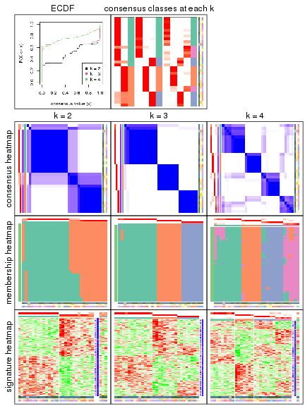

The plots are:

- The first row: a plot of the eCDF (empirical cumulative distribution
  function) curves of the consensus matrix for each `k` and the heatmap of
  predicted classes for each `k`.
- The second row: heatmaps of the consensus matrix for each `k`.
- The third row: heatmaps of the membership matrix for each `k`.
- The fouth row: heatmaps of the signatures for each `k`.

All the plots in panels can be made by individual functions and they are
plotted later in this section.

`select_partition_number()` produces several plots showing different
statistics for choosing "optimized" `k`. There are following statistics:

- eCDF curves of the consensus matrix for each `k`;
- 1-PAC. [The PAC score](https://en.wikipedia.org/wiki/Consensus_clustering#Over-interpretation_potential_of_consensus_clustering)
  measures the proportion of the ambiguous subgrouping.
- Mean silhouette score.
- Concordance. The mean probability of fiting the consensus subgroup labels in all
  partitions.
- Area increased. Denote $A_k$ as the area under the eCDF curve for current
  `k`, the area increased is defined as $A_k - A_{k-1}$.
- Rand index. The percent of pairs of samples that are both in a same cluster
  or both are not in a same cluster in the partition of k and k-1.
- Jaccard index. The ratio of pairs of samples are both in a same cluster in
  the partition of k and k-1 and the pairs of samples are both in a same
  cluster in the partition k or k-1.

The detailed explanations of these statistics can be found in [the _cola_
vignette](https://jokergoo.github.io/cola_vignettes/cola.html#toc_13).

Generally speaking, higher 1-PAC score, higher mean silhouette score or higher
concordance corresponds to better partition. Rand index and Jaccard index
measure how similar the current partition is compared to partition with `k-1`.
If they are too similar, we won't accept `k` is better than `k-1`.

```r
select_partition_number(res)
```

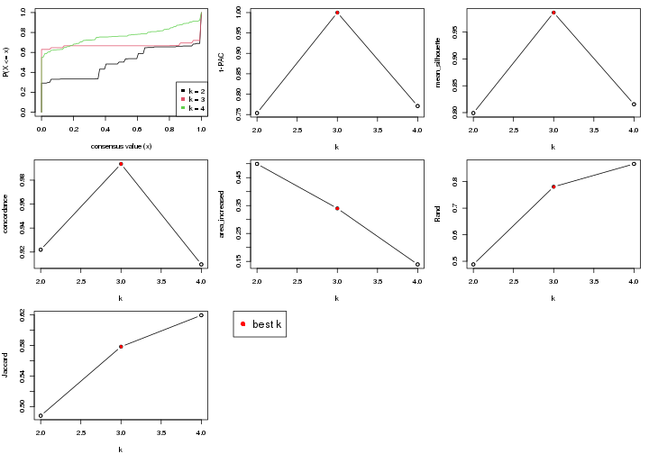

The numeric values for all these statistics can be obtained by `get_stats()`.

```r
get_stats(res)
```

```
#>   k 1-PAC mean_silhouette concordance area_increased  Rand Jaccard
#> 2 2 0.754           0.799       0.922          0.499 0.488   0.488
#> 3 3 1.000           0.986       0.994          0.340 0.781   0.579
#> 4 4 0.771           0.816       0.910          0.139 0.867   0.620
```

`suggest_best_k()` suggests the best $k$ based on these statistics. The rules are as follows:

- All $k$ with Jaccard index larger than 0.95 are removed because increasing
  $k$ does not provide enough extra information. If all $k$ are removed, it is
  marked as no subgroup is detected.
- For all $k$ with 1-PAC score larger than 0.9, the maximal $k$ is taken as
  the best $k$, and other $k$ are marked as optional $k$.
- If it does not fit the second rule. The $k$ with the maximal vote of the
  highest 1-PAC score, highest mean silhouette, and highest concordance is
  taken as the best $k$.

```r
suggest_best_k(res)
```

```
#> [1] 3
```


Following is the table of the partitions (You need to click the **show/hide
code output** link to see it). The membership matrix (columns with name `p*`)
is inferred by
[`clue::cl_consensus()`](https://www.rdocumentation.org/link/cl_consensus?package=clue)
function with the `SE` method. Basically the value in the membership matrix
represents the probability to belong to a certain group. The finall subgroup
label for an item is determined with the group with highest probability it
belongs to.

In `get_classes()` function, the entropy is calculated from the membership
matrix and the silhouette score is calculated from the consensus matrix.


<script>
$( function() {
	$( '#tabs-node-03-get-classes' ).tabs();
} );
</script>
<div id='tabs-node-03-get-classes'>
<ul>
<li><a href='#tab-node-03-get-classes-1'>k = 2</a></li>
<li><a href='#tab-node-03-get-classes-2'>k = 3</a></li>
<li><a href='#tab-node-03-get-classes-3'>k = 4</a></li>
</ul>

<div id='tab-node-03-get-classes-1'>
<p><a id='tab-node-03-get-classes-1-a' style='color:#0366d6' href='#'>show/hide code output</a></p>
<pre><code class="r">cbind(get_classes(res, k = 2), get_membership(res, k = 2))
</code></pre>

<pre><code>#&gt;       class entropy silhouette   p1   p2
#&gt; 08024     2   0.000      0.864 0.00 1.00
#&gt; 09017     1   0.000      0.933 1.00 0.00
#&gt; 12006     2   0.000      0.864 0.00 1.00
#&gt; 15004     2   0.000      0.864 0.00 1.00
#&gt; 22009     1   0.999     -0.193 0.52 0.48
#&gt; 22010     1   0.000      0.933 1.00 0.00
#&gt; 22013     2   0.943      0.537 0.36 0.64
#&gt; 24018     2   0.971      0.453 0.40 0.60
#&gt; 25003     2   0.943      0.537 0.36 0.64
#&gt; 27003     2   0.000      0.864 0.00 1.00
#&gt; 28001     2   0.000      0.864 0.00 1.00
#&gt; 28003     1   0.000      0.933 1.00 0.00
#&gt; 28031     2   0.000      0.864 0.00 1.00
#&gt; 28042     1   0.971      0.297 0.60 0.40
#&gt; 31007     2   0.000      0.864 0.00 1.00
#&gt; 43001     2   0.000      0.864 0.00 1.00
#&gt; 43004     1   0.000      0.933 1.00 0.00
#&gt; 43012     1   0.000      0.933 1.00 0.00
#&gt; 62003     2   0.943      0.537 0.36 0.64
#&gt; 01003     1   0.000      0.933 1.00 0.00
#&gt; 01007     1   0.000      0.933 1.00 0.00
#&gt; 12008     2   0.327      0.832 0.06 0.94
#&gt; 17003     2   0.000      0.864 0.00 1.00
#&gt; 19002     1   0.000      0.933 1.00 0.00
#&gt; 19014     1   0.000      0.933 1.00 0.00
#&gt; 24006     1   0.000      0.933 1.00 0.00
#&gt; 28009     1   0.000      0.933 1.00 0.00
#&gt; 37001     1   0.000      0.933 1.00 0.00
#&gt; 64005     1   0.000      0.933 1.00 0.00
#&gt; 65003     1   0.000      0.933 1.00 0.00
#&gt; LAL4      1   0.000      0.933 1.00 0.00
</code></pre>

<script>
$('#tab-node-03-get-classes-1-a').parent().next().next().hide();
$('#tab-node-03-get-classes-1-a').click(function(){
  $('#tab-node-03-get-classes-1-a').parent().next().next().toggle();
  return(false);
});
</script>
</div>

<div id='tab-node-03-get-classes-2'>
<p><a id='tab-node-03-get-classes-2-a' style='color:#0366d6' href='#'>show/hide code output</a></p>
<pre><code class="r">cbind(get_classes(res, k = 3), get_membership(res, k = 3))
</code></pre>

<pre><code>#&gt;       class entropy silhouette   p1   p2   p3
#&gt; 08024     2   0.000      1.000 0.00 1.00 0.00
#&gt; 09017     3   0.000      1.000 0.00 0.00 1.00
#&gt; 12006     2   0.000      1.000 0.00 1.00 0.00
#&gt; 15004     2   0.000      1.000 0.00 1.00 0.00
#&gt; 22009     3   0.000      1.000 0.00 0.00 1.00
#&gt; 22010     1   0.000      0.984 1.00 0.00 0.00
#&gt; 22013     3   0.000      1.000 0.00 0.00 1.00
#&gt; 24018     3   0.000      1.000 0.00 0.00 1.00
#&gt; 25003     3   0.000      1.000 0.00 0.00 1.00
#&gt; 27003     2   0.000      1.000 0.00 1.00 0.00
#&gt; 28001     2   0.000      1.000 0.00 1.00 0.00
#&gt; 28003     1   0.000      0.984 1.00 0.00 0.00
#&gt; 28031     2   0.000      1.000 0.00 1.00 0.00
#&gt; 28042     1   0.369      0.838 0.86 0.14 0.00
#&gt; 31007     2   0.000      1.000 0.00 1.00 0.00
#&gt; 43001     2   0.000      1.000 0.00 1.00 0.00
#&gt; 43004     3   0.000      1.000 0.00 0.00 1.00
#&gt; 43012     1   0.000      0.984 1.00 0.00 0.00
#&gt; 62003     3   0.000      1.000 0.00 0.00 1.00
#&gt; 01003     1   0.000      0.984 1.00 0.00 0.00
#&gt; 01007     1   0.000      0.984 1.00 0.00 0.00
#&gt; 12008     3   0.000      1.000 0.00 0.00 1.00
#&gt; 17003     2   0.000      1.000 0.00 1.00 0.00
#&gt; 19002     1   0.000      0.984 1.00 0.00 0.00
#&gt; 19014     1   0.000      0.984 1.00 0.00 0.00
#&gt; 24006     1   0.000      0.984 1.00 0.00 0.00
#&gt; 28009     1   0.000      0.984 1.00 0.00 0.00
#&gt; 37001     1   0.000      0.984 1.00 0.00 0.00
#&gt; 64005     1   0.207      0.930 0.94 0.00 0.06
#&gt; 65003     1   0.000      0.984 1.00 0.00 0.00
#&gt; LAL4      1   0.000      0.984 1.00 0.00 0.00
</code></pre>

<script>
$('#tab-node-03-get-classes-2-a').parent().next().next().hide();
$('#tab-node-03-get-classes-2-a').click(function(){
  $('#tab-node-03-get-classes-2-a').parent().next().next().toggle();
  return(false);
});
</script>
</div>

<div id='tab-node-03-get-classes-3'>
<p><a id='tab-node-03-get-classes-3-a' style='color:#0366d6' href='#'>show/hide code output</a></p>
<pre><code class="r">cbind(get_classes(res, k = 4), get_membership(res, k = 4))
</code></pre>

<pre><code>#&gt;       class entropy silhouette   p1   p2   p3   p4
#&gt; 08024     2  0.0000      0.971 0.00 1.00 0.00 0.00
#&gt; 09017     3  0.3975      0.723 0.24 0.00 0.76 0.00
#&gt; 12006     2  0.0000      0.971 0.00 1.00 0.00 0.00
#&gt; 15004     4  0.4134      0.611 0.00 0.26 0.00 0.74
#&gt; 22009     3  0.0000      0.895 0.00 0.00 1.00 0.00
#&gt; 22010     1  0.0000      0.880 1.00 0.00 0.00 0.00
#&gt; 22013     3  0.0000      0.895 0.00 0.00 1.00 0.00
#&gt; 24018     3  0.0000      0.895 0.00 0.00 1.00 0.00
#&gt; 25003     3  0.0000      0.895 0.00 0.00 1.00 0.00
#&gt; 27003     2  0.3172      0.797 0.00 0.84 0.00 0.16
#&gt; 28001     2  0.0000      0.971 0.00 1.00 0.00 0.00
#&gt; 28003     1  0.0707      0.872 0.98 0.00 0.00 0.02
#&gt; 28031     4  0.3610      0.685 0.00 0.20 0.00 0.80
#&gt; 28042     4  0.0000      0.776 0.00 0.00 0.00 1.00
#&gt; 31007     2  0.0000      0.971 0.00 1.00 0.00 0.00
#&gt; 43001     2  0.0000      0.971 0.00 1.00 0.00 0.00
#&gt; 43004     3  0.4624      0.578 0.34 0.00 0.66 0.00
#&gt; 43012     4  0.1637      0.780 0.06 0.00 0.00 0.94
#&gt; 62003     3  0.0000      0.895 0.00 0.00 1.00 0.00
#&gt; 01003     1  0.0000      0.880 1.00 0.00 0.00 0.00
#&gt; 01007     4  0.4624      0.532 0.34 0.00 0.00 0.66
#&gt; 12008     3  0.2611      0.849 0.02 0.04 0.92 0.02
#&gt; 17003     2  0.0000      0.971 0.00 1.00 0.00 0.00
#&gt; 19002     1  0.0000      0.880 1.00 0.00 0.00 0.00
#&gt; 19014     1  0.2647      0.832 0.88 0.00 0.00 0.12
#&gt; 24006     1  0.0000      0.880 1.00 0.00 0.00 0.00
#&gt; 28009     4  0.2921      0.709 0.14 0.00 0.00 0.86
#&gt; 37001     1  0.3400      0.795 0.82 0.00 0.00 0.18
#&gt; 64005     1  0.0000      0.880 1.00 0.00 0.00 0.00
#&gt; 65003     1  0.4977      0.267 0.54 0.00 0.00 0.46
#&gt; LAL4      1  0.4079      0.781 0.80 0.00 0.02 0.18
</code></pre>

<script>
$('#tab-node-03-get-classes-3-a').parent().next().next().hide();
$('#tab-node-03-get-classes-3-a').click(function(){
  $('#tab-node-03-get-classes-3-a').parent().next().next().toggle();
  return(false);
});
</script>
</div>
</div>

Heatmaps for the consensus matrix. It visualizes the probability of two
samples to be in a same group.


<script>
$( function() {
	$( '#tabs-node-03-consensus-heatmap' ).tabs();
} );
</script>
<div id='tabs-node-03-consensus-heatmap'>
<ul>
<li><a href='#tab-node-03-consensus-heatmap-1'>k = 2</a></li>
<li><a href='#tab-node-03-consensus-heatmap-2'>k = 3</a></li>
<li><a href='#tab-node-03-consensus-heatmap-3'>k = 4</a></li>
</ul>
<div id='tab-node-03-consensus-heatmap-1'>
<pre><code class="r">consensus_heatmap(res, k = 2)
</code></pre>

<p>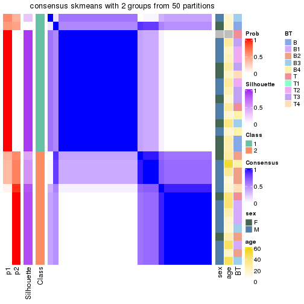</p>

</div>
<div id='tab-node-03-consensus-heatmap-2'>
<pre><code class="r">consensus_heatmap(res, k = 3)
</code></pre>

<p>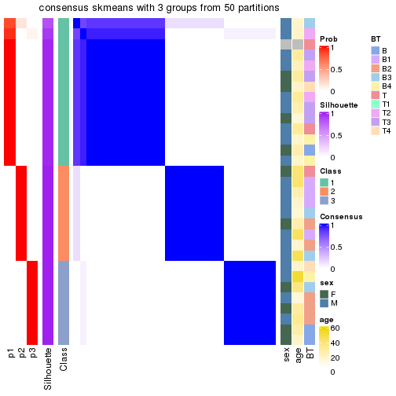</p>

</div>
<div id='tab-node-03-consensus-heatmap-3'>
<pre><code class="r">consensus_heatmap(res, k = 4)
</code></pre>

<p>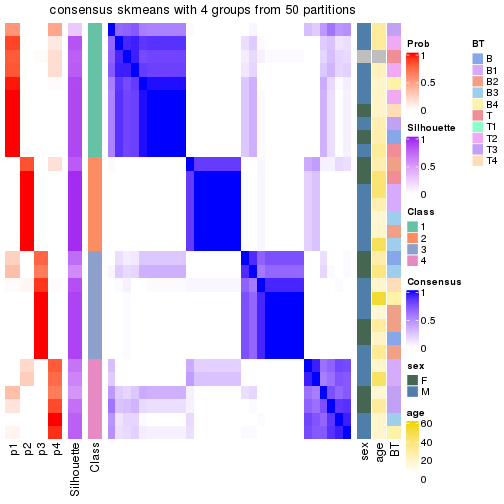</p>

</div>
</div>

Heatmaps for the membership of samples in all partitions to see how consistent they are:


<script>
$( function() {
	$( '#tabs-node-03-membership-heatmap' ).tabs();
} );
</script>
<div id='tabs-node-03-membership-heatmap'>
<ul>
<li><a href='#tab-node-03-membership-heatmap-1'>k = 2</a></li>
<li><a href='#tab-node-03-membership-heatmap-2'>k = 3</a></li>
<li><a href='#tab-node-03-membership-heatmap-3'>k = 4</a></li>
</ul>
<div id='tab-node-03-membership-heatmap-1'>
<pre><code class="r">membership_heatmap(res, k = 2)
</code></pre>

<p>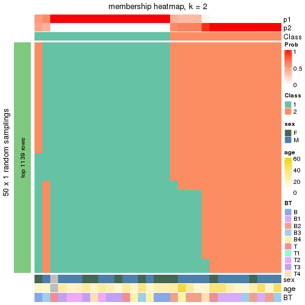</p>

</div>
<div id='tab-node-03-membership-heatmap-2'>
<pre><code class="r">membership_heatmap(res, k = 3)
</code></pre>

<p>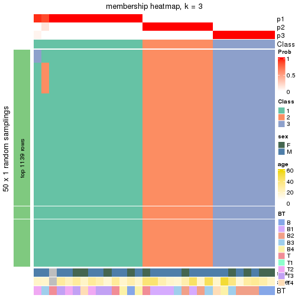</p>

</div>
<div id='tab-node-03-membership-heatmap-3'>
<pre><code class="r">membership_heatmap(res, k = 4)
</code></pre>

<p>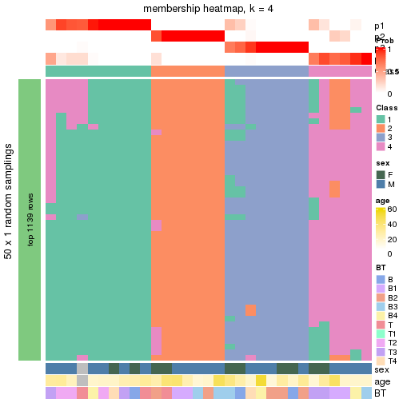</p>

</div>
</div>

As soon as the classes for columns are determined, the signatures
that are significantly different between subgroups can be looked for. 
Following are the heatmaps for signatures.


Signature heatmaps where rows are scaled:


<script>
$( function() {
	$( '#tabs-node-03-get-signatures' ).tabs();
} );
</script>
<div id='tabs-node-03-get-signatures'>
<ul>
<li><a href='#tab-node-03-get-signatures-1'>k = 2</a></li>
<li><a href='#tab-node-03-get-signatures-2'>k = 3</a></li>
<li><a href='#tab-node-03-get-signatures-3'>k = 4</a></li>
</ul>
<div id='tab-node-03-get-signatures-1'>
<pre><code class="r">get_signatures(res, k = 2)
</code></pre>

<p>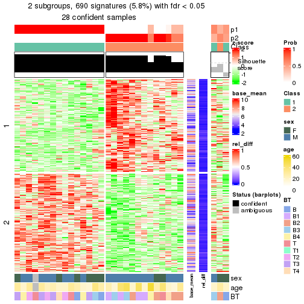</p>

</div>
<div id='tab-node-03-get-signatures-2'>
<pre><code class="r">get_signatures(res, k = 3)
</code></pre>

<p></p>

</div>
<div id='tab-node-03-get-signatures-3'>
<pre><code class="r">get_signatures(res, k = 4)
</code></pre>

<p>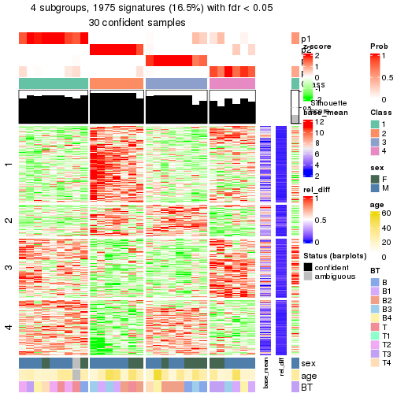</p>

</div>
</div>


Signature heatmaps where rows are not scaled:


<script>
$( function() {
	$( '#tabs-node-03-get-signatures-no-scale' ).tabs();
} );
</script>
<div id='tabs-node-03-get-signatures-no-scale'>
<ul>
<li><a href='#tab-node-03-get-signatures-no-scale-1'>k = 2</a></li>
<li><a href='#tab-node-03-get-signatures-no-scale-2'>k = 3</a></li>
<li><a href='#tab-node-03-get-signatures-no-scale-3'>k = 4</a></li>
</ul>
<div id='tab-node-03-get-signatures-no-scale-1'>
<pre><code class="r">get_signatures(res, k = 2, scale_rows = FALSE)
</code></pre>

<p>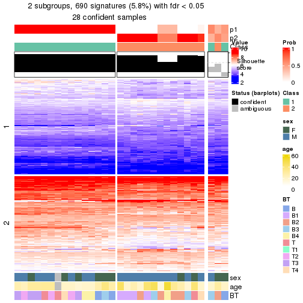</p>

</div>
<div id='tab-node-03-get-signatures-no-scale-2'>
<pre><code class="r">get_signatures(res, k = 3, scale_rows = FALSE)
</code></pre>

<p>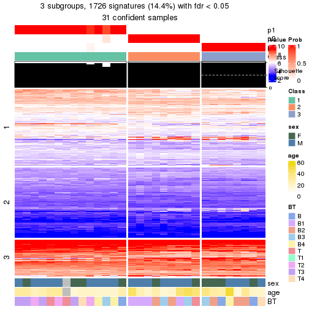</p>

</div>
<div id='tab-node-03-get-signatures-no-scale-3'>
<pre><code class="r">get_signatures(res, k = 4, scale_rows = FALSE)
</code></pre>

<p>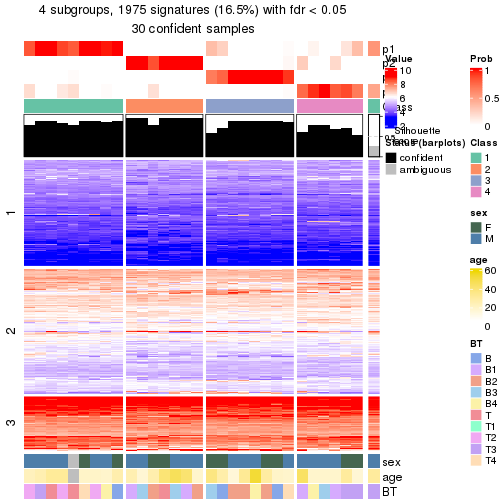</p>

</div>
</div>


Compare the overlap of signatures from different k:

```r
compare_signatures(res)
```

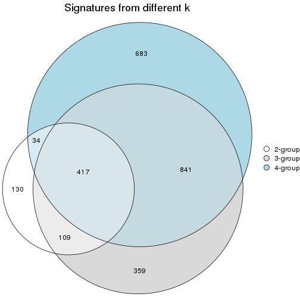

`get_signature()` returns a data frame invisibly. To get the list of signatures, the function
call should be assigned to a variable explicitly. In following code, if `plot` argument is set
to `FALSE`, no heatmap is plotted while only the differential analysis is performed.

```r
# code only for demonstration
tb = get_signature(res, k = ..., plot = FALSE)
```

An example of the output of `tb` is:

```
#>   which_row         fdr    mean_1    mean_2 scaled_mean_1 scaled_mean_2 km
#> 1        38 0.042760348  8.373488  9.131774    -0.5533452     0.5164555  1
#> 2        40 0.018707592  7.106213  8.469186    -0.6173731     0.5762149  1
#> 3        55 0.019134737 10.221463 11.207825    -0.6159697     0.5749050  1
#> 4        59 0.006059896  5.921854  7.869574    -0.6899429     0.6439467  1
#> 5        60 0.018055526  8.928898 10.211722    -0.6204761     0.5791110  1
#> 6        98 0.009384629 15.714769 14.887706     0.6635654    -0.6193277  2
...
```

The columns in `tb` are:

1. `which_row`: row indices corresponding to the input matrix.
2. `fdr`: FDR for the differential test. 
3. `mean_x`: The mean value in group x.
4. `scaled_mean_x`: The mean value in group x after rows are scaled.
5. `km`: Row groups if k-means clustering is applied to rows (which is done by automatically selecting number of clusters).

If there are too many signatures, `top_signatures = ...` can be set to only show the 
signatures with the highest FDRs:

```r
# code only for demonstration
# e.g. to show the top 500 most significant rows
tb = get_signature(res, k = ..., top_signatures = 500)
```

If the signatures are defined as these which are uniquely high in current group, `diff_method` argument
can be set to `"uniquely_high_in_one_group"`:

```r
# code only for demonstration
tb = get_signature(res, k = ..., diff_method = "uniquely_high_in_one_group")
```


UMAP plot which shows how samples are separated.


<script>
$( function() {
	$( '#tabs-node-03-dimension-reduction' ).tabs();
} );
</script>
<div id='tabs-node-03-dimension-reduction'>
<ul>
<li><a href='#tab-node-03-dimension-reduction-1'>k = 2</a></li>
<li><a href='#tab-node-03-dimension-reduction-2'>k = 3</a></li>
<li><a href='#tab-node-03-dimension-reduction-3'>k = 4</a></li>
</ul>
<div id='tab-node-03-dimension-reduction-1'>
<pre><code class="r">dimension_reduction(res, k = 2, method = &quot;UMAP&quot;)
</code></pre>

<p>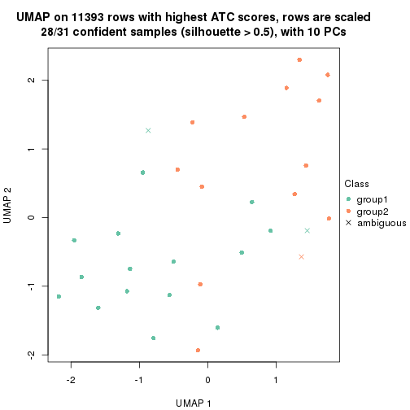</p>

</div>
<div id='tab-node-03-dimension-reduction-2'>
<pre><code class="r">dimension_reduction(res, k = 3, method = &quot;UMAP&quot;)
</code></pre>

<p>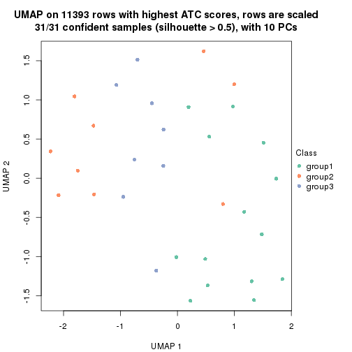</p>

</div>
<div id='tab-node-03-dimension-reduction-3'>
<pre><code class="r">dimension_reduction(res, k = 4, method = &quot;UMAP&quot;)
</code></pre>

<p>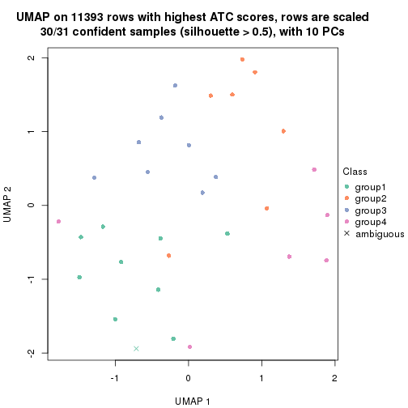</p>

</div>
</div>


Following heatmap shows how subgroups are split when increasing `k`:

```r
collect_classes(res)
```

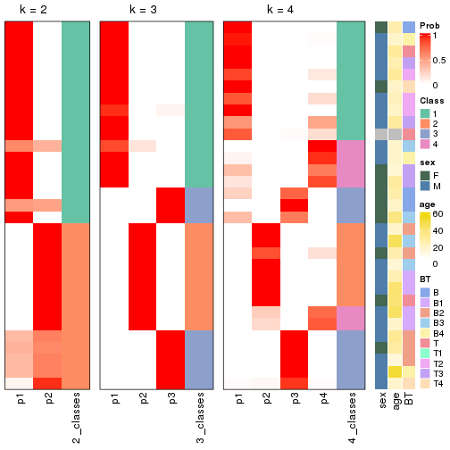


Test correlation between subgroups and known annotations. If the known
annotation is numeric, one-way ANOVA test is applied, and if the known
annotation is discrete, chi-squared contingency table test is applied.

```r
test_to_known_factors(res)
```

```
#>             n_sample sex(p-value) age(p-value) BT(p-value) k
#> ATC:skmeans       28        0.254        0.214      0.0216 2
#> ATC:skmeans       31        0.463        0.221      0.0167 3
#> ATC:skmeans       30        0.733        0.542      0.0985 4
```


If matrix rows can be associated to genes, consider to use `functional_enrichment(res,
...)` to perform function enrichment for the signature genes. See [this vignette](https://jokergoo.github.io/cola_vignettes/functional_enrichment.html) for more detailed explanations.


 

## Session info


```r
sessionInfo()
```

```
#> R version 4.1.0 (2021-05-18)
#> Platform: x86_64-pc-linux-gnu (64-bit)
#> Running under: CentOS Linux 7 (Core)
#> 
#> Matrix products: default
#> BLAS/LAPACK: /usr/lib64/libopenblas-r0.3.3.so
#> 
#> locale:
#>  [1] LC_CTYPE=en_US.UTF-8       LC_NUMERIC=C               LC_TIME=en_US.UTF-8       
#>  [4] LC_COLLATE=en_US.UTF-8     LC_MONETARY=en_US.UTF-8    LC_MESSAGES=en_US.UTF-8   
#>  [7] LC_PAPER=en_US.UTF-8       LC_NAME=C                  LC_ADDRESS=C              
#> [10] LC_TELEPHONE=C             LC_MEASUREMENT=en_US.UTF-8 LC_IDENTIFICATION=C       
#> 
#> attached base packages:
#> [1] grid      parallel  stats     graphics  grDevices utils     datasets  methods   base     
#> 
#> other attached packages:
#> [1] genefilter_1.74.0     ComplexHeatmap_2.8.0  markdown_1.1          knitr_1.33           
#> [5] preprocessCore_1.54.0 ALL_1.34.0            Biobase_2.52.0        BiocGenerics_0.38.0  
#> [9] cola_1.9.4           
#> 
#> loaded via a namespace (and not attached):
#>   [1] colorspace_2.0-2       rjson_0.2.20           ellipsis_0.3.2         mclust_5.4.7          
#>   [5] circlize_0.4.13        XVector_0.32.0         GlobalOptions_0.1.2    clue_0.3-59           
#>   [9] rstudioapi_0.13        bit64_4.0.5            AnnotationDbi_1.54.1   Polychrome_1.3.1      
#>  [13] RSpectra_0.16-0        fansi_0.5.0            xml2_1.3.2             codetools_0.2-18      
#>  [17] splines_4.1.0          doParallel_1.0.16      cachem_1.0.5           impute_1.66.0         
#>  [21] polyclip_1.10-0        jsonlite_1.7.2         Cairo_1.5-12.2         umap_0.2.7.0          
#>  [25] annotate_1.70.0        cluster_2.1.2          png_0.1-7              data.tree_1.0.0       
#>  [29] compiler_4.1.0         httr_1.4.2             assertthat_0.2.1       Matrix_1.3-4          
#>  [33] fastmap_1.1.0          tools_4.1.0            gtable_0.3.0           glue_1.4.2            
#>  [37] GenomeInfoDbData_1.2.6 dplyr_1.0.7            Rcpp_1.0.7             slam_0.1-48           
#>  [41] eulerr_6.1.0           vctrs_0.3.8            Biostrings_2.60.1      iterators_1.0.13      
#>  [45] polylabelr_0.2.0       xfun_0.24              stringr_1.4.0          lifecycle_1.0.0       
#>  [49] irlba_2.3.3            XML_3.99-0.6           dendextend_1.15.1      zlibbioc_1.38.0       
#>  [53] scales_1.1.1           microbenchmark_1.4-7   RColorBrewer_1.1-2     memoise_2.0.0         
#>  [57] reticulate_1.20        gridExtra_2.3          ggplot2_3.3.5          stringi_1.7.3         
#>  [61] RSQLite_2.2.7          highr_0.9              S4Vectors_0.30.0       foreach_1.5.1         
#>  [65] shape_1.4.6            GenomeInfoDb_1.28.1    rlang_0.4.11           pkgconfig_2.0.3       
#>  [69] matrixStats_0.59.0     bitops_1.0-7           evaluate_0.14          lattice_0.20-44       
#>  [73] purrr_0.3.4            bit_4.0.4              tidyselect_1.1.1       magrittr_2.0.1        
#>  [77] R6_2.5.0               IRanges_2.26.0         generics_0.1.0         DBI_1.1.1             
#>  [81] pillar_1.6.1           survival_3.2-11        KEGGREST_1.32.0        scatterplot3d_0.3-41  
#>  [85] RCurl_1.98-1.3         tibble_3.1.2           crayon_1.4.1           utf8_1.2.1            
#>  [89] skmeans_0.2-13         viridis_0.6.1          GetoptLong_1.0.5       blob_1.2.1            
#>  [93] digest_0.6.27          xtable_1.8-4           brew_1.0-6             openssl_1.4.4         
#>  [97] stats4_4.1.0           munsell_0.5.0          viridisLite_0.4.0      askpass_1.1
```


